# WOS — Woobe Outcome Server

**Design técnico e planejamento de implementação — revisão 2**  
**Data:** 1 de outubro de 2026  
**Situação:** arquitetura proposta para implementação; não representa funcionalidades já desenvolvidas.

> O WOS mantém o estado compartilhado necessário para perseguir resultados ao longo do tempo. Humanos, agentes e aplicações decidem e executam; o WOS valida, persiste, relaciona, consulta e coordena esse estado.

Este documento substitui o brief anterior por decisões de arquitetura, contratos, invariantes, exemplos e uma sequência de implementação verificável. Os nomes de pacotes, comandos e endpoints são a proposta de contrato do projeto. Trechos de Go ilustram interfaces; o SQL apresenta uma base executável de schema, que deverá ser transformada em migrations e validada nos dois bancos.

## Sumário

1. [Direção e decisões principais](#1-direção-e-decisões-principais)
2. [Responsabilidades e limites](#2-responsabilidades-e-limites)
3. [Arquitetura e integração](#3-arquitetura-e-integração)
4. [Ontologia e referências](#4-ontologia-e-referências)
5. [Outcome e Objective](#5-outcome-e-objective)
6. [Critérios, avaliações e comprovação](#6-critérios-avaliações-e-comprovação)
7. [WorkItem e coordenação de execução](#7-workitem-e-coordenação-de-execução)
8. [Dependências e readiness](#8-dependências-e-readiness)
9. [Roadmaps e revisões](#9-roadmaps-e-revisões)
10. [Issue e Blocker](#10-issue-e-blocker)
11. [Evidence, Artifact e Decision](#11-evidence-artifact-e-decision)
12. [Relations e integridade do grafo](#12-relations-e-integridade-do-grafo)
13. [Eventos, histórico e outbox](#13-eventos-histórico-e-outbox)
14. [Triggers e sinais de integração](#14-triggers-e-sinais-de-integração)
15. [Namespace, contexto externo e identidade](#15-namespace-contexto-externo-e-identidade)
16. [Agregados, transações e concorrência](#16-agregados-transações-e-concorrência)
17. [Idempotência e retries](#17-idempotência-e-retries)
18. [Queries, snapshots e progresso](#18-queries-snapshots-e-progresso)
19. [Organização do código e interfaces](#19-organização-do-código-e-interfaces)
20. [Persistência e schema SQL](#20-persistência-e-schema-sql)
21. [API HTTP](#21-api-http)
22. [MCP](#22-mcp)
23. [Casos de uso e transações](#23-casos-de-uso-e-transações)
24. [Diagramas de interação](#24-diagramas-de-interação)
25. [Exemplos completos de uso](#25-exemplos-completos-de-uso)
26. [Standalone, embedded e distribuição](#26-standalone-embedded-e-distribuição)
27. [Observabilidade e metas de validação](#27-observabilidade-e-metas-de-validação)
28. [Estratégia de testes](#28-estratégia-de-testes)
29. [MVP e evolução](#29-mvp-e-evolução)
30. [Ondas de implementação e commits](#30-ondas-de-implementação-e-commits)
31. [ADRs](#31-adrs)
32. [Respostas às questões do brief](#32-respostas-às-questões-do-brief)
33. [Referências técnicas](#33-referências-técnicas)
34. [Resumo dos componentes e resultado esperado](#34-resumo-dos-componentes-e-resultado-esperado)

## 1. Direção e decisões principais

### 1.1 Tese do produto

O WOS é uma infraestrutura independente de estado e coordenação orientada a resultados. Sua unidade semântica principal é o **Outcome**, um estado desejado verificável. O sistema preserva objetivos, trabalho, planos, problemas, impedimentos, decisões, evidências e entregáveis associados a esse resultado.

Uma tarefa concluída registra trabalho realizado. Um objetivo alcançado registra uma avaliação sobre uma condição desejada. Um Outcome alcançado registra uma conclusão sobre o resultado final. Essas três coisas possuem contratos e transições diferentes.

O estado pertence ao contexto de trabalho, não ao agente que começou a execução. Uma nova sessão, outro agente ou um humano pode consultar o mesmo Outcome e continuar a partir de informações persistentes.

### 1.2 Decisões de arquitetura

| Tema | Decisão nesta revisão | Consequência prática |
| --- | --- | --- |
| Linguagem | Go para Core, Server e transports | Um binário; Core incorporável por aplicações Go |
| Organização | Um repositório e um módulo Go inicialmente | Core, HTTP e MCP compartilham versão e testes |
| Core | Pacotes públicos `core/domain`, `core/application` e `core/ports` | Embedded mode funciona fora do repositório |
| Implantação | Monólito modular, standalone | Sem microservices ou dependências da Woobe |
| Persistência | Estado atual relacional, event log imutável e outbox | Auditoria sem Event Sourcing integral |
| Bancos | SQLite e PostgreSQL com o mesmo contrato funcional | Uso local e implantação com múltiplas réplicas |
| Agregados | Outcome e entidades operacionais separados | Nenhuma escrita precisa carregar todo o grafo |
| Consistência | Transações curtas e um guard por Outcome no MVP | Validação do grafo e decisões de transição observam um estado coerente |
| Estado | Lifecycle persistido; bloqueio e disponibilidade derivados | `blocked` e `ready` não competem com a fonte de verdade |
| Comprovação | Critério tipado, EvidenceLink e avaliação explícita | Evidência anexada não conclui objetivos automaticamente |
| Roadmap | Plano versionado, sem duplicar entidades operacionais | Replanejar não apaga execução ou histórico |
| Dependências | Uma única representação operacional canônica | Roadmap não cria um segundo grafo de execução |
| Namespace | Boundary explícito de isolamento e autorização | `tenant_id` enviado em JSON não concede acesso |
| Identidade | Principal autenticado separado de ActorRef | Autoria declarada não vira autorização |
| Concorrência | `expected_version` por agregado e `outcome_revision` por comando | Conflitos são detectáveis e snapshots têm marcador coerente |
| Execução colaborativa | Lease explícito de WorkItem com fencing token | Dois consumidores não adquirem o mesmo trabalho simultaneamente |
| Triggers | Regras declarativas sobre eventos, emitindo sinais | WOS pode avisar consumidores sem escolher nem executar trabalho |
| HTTP e MCP | Adapters para os mesmos application services | Regras e erros idênticos em ambas as interfaces |
| Busca | Filtros e busca textual básica primeiro | FTS otimizada é extensão de adapter, não requisito semântico |
| Licença | WOS como projeto Open Source, separado da licença da Woobe | A licença concreta será registrada antes do primeiro release público |

### 1.3 Correções essenciais do brief

1. **`ready` e `blocked` deixam de ser estados graváveis.** São projeções sobre lifecycle, dependências, Blockers, calendário e leases.
2. **Objective recebe critérios estruturados.** `success_criteria[]` como strings não oferece identidade estável para avaliações ou Evidence.
3. **Roadmap não possui os Objectives.** Outcome possui o escopo; Roadmap referencia entidades e organiza o plano.
4. **`version`, `revision_number` e `outcome_revision` têm funções distintas.** Versão de agregado, revisão de conteúdo do plano e sequência transacional não são intercambiáveis.
5. **Locks otimistas por entidade não bastam para validar ciclos.** Escritas concorrentes no grafo precisam de coordenação transacional.
6. **ExternalContext não é tenancy.** Namespace é o boundary interno; contexto externo é informação fornecida pelo consumidor.
7. **ActorRef não autentica.** Um ator externo pode ser registrado sem criar um usuário interno, mas sua credencial continua sendo verificada.
8. **Core público não pode ficar inteiramente em `internal/`.** A versão anterior contrariava embedded mode em Go.
9. **Issue resolvida não resolve Blockers automaticamente.** Problema e impedimento possuem confirmações próprias.
10. **Triggers entram no design.** A ausência de autonomia não impede regras determinísticas de integração.
11. **Event log não promete reconstrução temporal completa.** Histórico auditável e consulta `as_of` são capacidades diferentes.
12. **Snapshot informa limites e omissões.** Uma resposta compacta não pode se apresentar como todo o estado existente.

## 2. Responsabilidades e limites

### 2.1 Responsabilidades

O WOS deve:

- criar e manter Outcomes e Objectives verificáveis;
- organizar WorkItems e seus vínculos;
- preservar Roadmaps publicados e suas revisões;
- validar transições, referências, critérios e dependências;
- representar Issues e Blockers separadamente;
- registrar Evidence, Artifacts e Decisions com procedência;
- oferecer queries determinísticas de estado, grafo, trabalho disponível e histórico;
- controlar concorrência, idempotência e aquisição explícita de trabalho;
- registrar mutações confirmadas e emitir Integration Events;
- emitir sinais de triggers configurados;
- isolar namespaces e aplicar autorização;
- funcionar com humanos, agentes e sistemas tradicionais.

### 2.2 Limites do produto

O WOS não contém um planner autônomo, runtime de agentes, inferência de LLM, execução de Tools, scheduler de trabalho agentic ou regras específicas de um produto consumidor.

Uma consulta de trabalho disponível pode ordenar resultados por prioridade e data. Essa ordenação não autoriza execução. Um trigger pode informar que um Blocker foi resolvido. Esse sinal não escolhe um agente nem determina uma Run.

Regras determinísticas de domínio continuam existindo: negar uma transição inválida, verificar critérios avaliados e resolver referências são validações. A avaliação semântica de que uma evidência comprova uma condição pertence ao ator ou serviço externo autorizado.

### 2.3 Produto independente e ecossistema

WOS deve ter repositório, módulo, releases, documentação e licença próprios. A Woobe pode distribuir ou hospedar o WOS, mas não pode ser um requisito de execução.

A evolução anterior que colocava WOS dentro do WKS pode ser preservada como **opção de composição**: WKS incorpora ou integra WOS por contrato. Nesta especificação, o domínio WOS e seu servidor standalone continuam independentes. Incorporar um componente a outro produto não transfere seu boundary semântico.

Conhecimento generalizável e memória de aprendizado pertencem ao WKS/WOSIS ou a outro serviço. Estado de um Outcome específico pertence ao WOS. Evidence pode referenciar conhecimento externo sem transformar o WOS em uma base universal de conhecimento.

## 3. Arquitetura e integração

### 3.1 Contexto do sistema

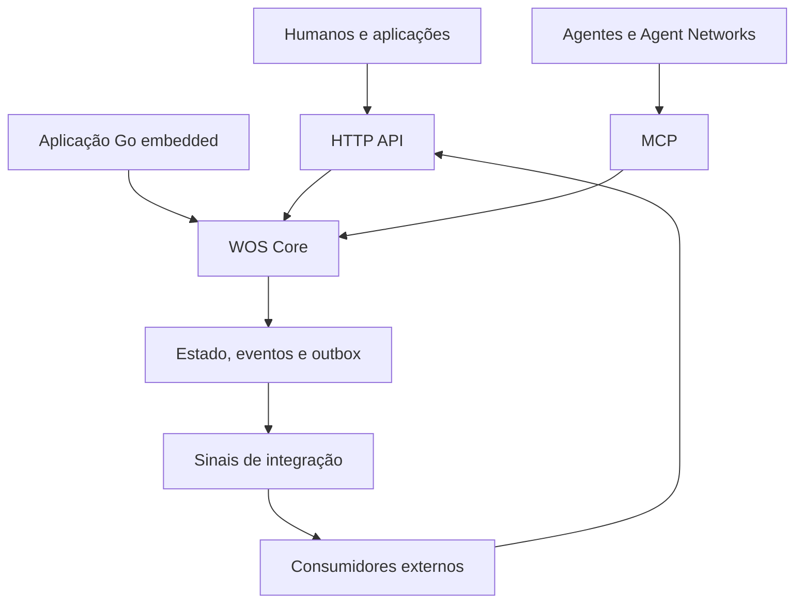

### 3.2 Componentes e dependências

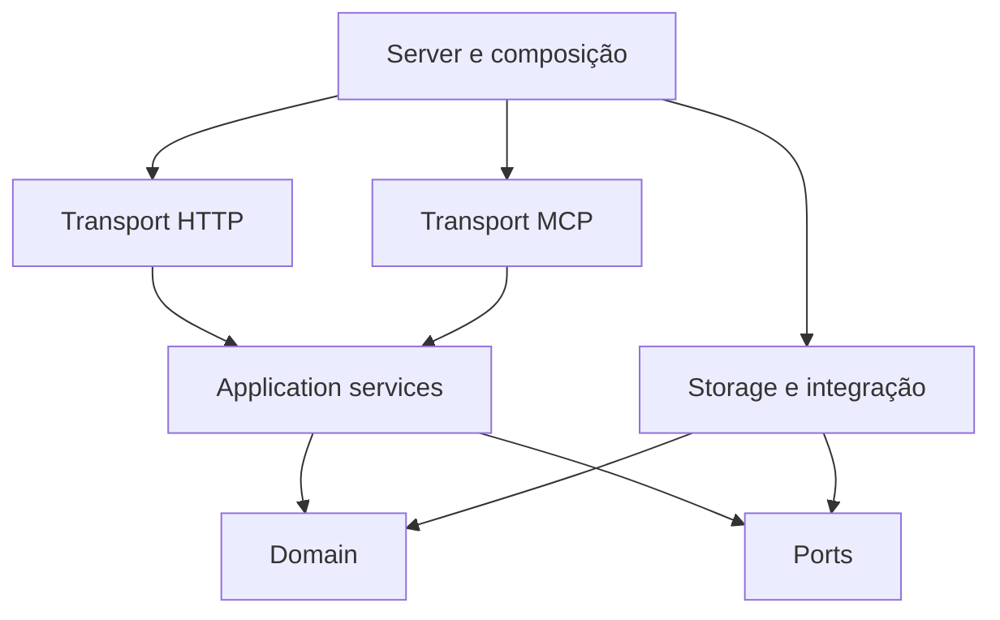

As setas representam dependências de código. Application depende dos contratos em Ports; o adapter implementa esses contratos. Domain não importa Application, Server, HTTP, MCP ou storage.

`wos-core` e `wos-api` são os dois pacotes de produto. HTTP, MCP e Server/composição permanecem componentes lógicos internos de `wos-api`, não serviços ou release units separados.

### 3.3 Integração com Woobe e produtos

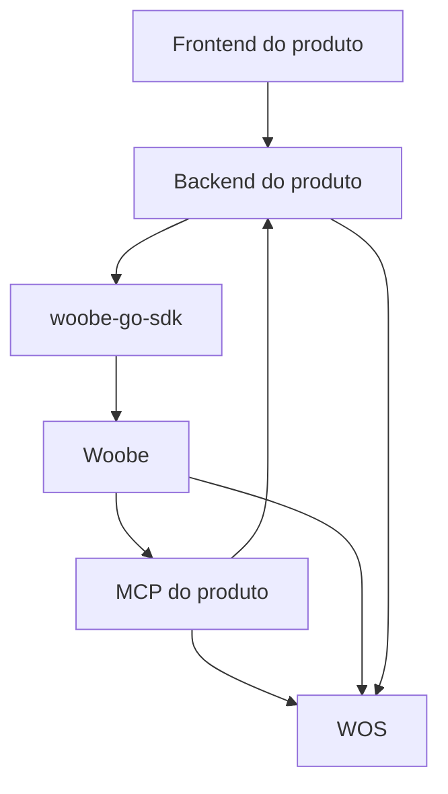

O MCP do produto pode chamar tanto seu backend quanto o WOS. Na Lipo, por exemplo, o backend mantém as regras pedagógicas e os dados do aluno; a Woobe executa as Agent Networks; o WOS organiza a continuidade dos Outcomes quando essa integração for adotada.

O frontend pode visualizar WOS através do backend ou de uma API WOS autenticada para o usuário. A credencial de um backend não deve ser distribuída ao frontend. Uma futura UI do WOS pode consumir os mesmos endpoints.

O domínio do produto conserva sua fonte de verdade. Uma Evidence no WOS pode referenciar uma avaliação pedagógica, mas o WOS não passa a determinar domínio de aprendizagem. Woobe conserva Sessions, Runs e traces; WOS conserva estado orientado ao Outcome.

## 4. Ontologia e referências

### 4.1 Conceitos centrais

| Conceito | Pergunta que responde | Natureza |
| --- | --- | --- |
| Outcome | Qual resultado final queremos alcançar? | Agregado |
| Objective | Qual condição verificável queremos alcançar dentro desse resultado? | Agregado |
| SuccessCriterion | Como a conclusão será verificada? | Entidade interna de um agregado |
| CriterionAssessment | Quem avaliou o critério, com quais evidências e conclusão? | Registro imutável |
| WorkItem | Qual unidade de trabalho será realizada? | Agregado |
| Roadmap | Como o plano organiza a progressão? | Agregado |
| RoadmapRevision | Qual versão do plano foi registrada? | Entidade interna versionada |
| RoadmapNode | Como um elemento aparece nessa revisão? | Entidade interna da revisão |
| Issue | Qual problema foi identificado? | Agregado |
| Blocker | Qual alvo está impedido e por quê? | Agregado |
| Evidence | Qual observação ou informação está disponível? | Agregado com conteúdo imutável |
| EvidenceLink | O que essa Evidence sustenta ou contradiz? | Vínculo tipado e auditável |
| Artifact | Qual entregável ou referência material existe? | Agregado com conteúdo imutável |
| Decision | Qual decisão foi explicitamente tomada? | Agregado |
| Relation | Como duas entidades estão relacionadas? | Vínculo tipado |
| Event | Qual fato confirmado ocorreu? | Registro imutável |
| Trigger | Qual sinal emitir quando ocorrer um evento compatível? | Configuração de integração |
| ActorRef | Quem foi declarado como autor? | Value object |
| ExternalContext | Em qual contexto externo isso aconteceu? | Value object |
| Namespace | Em qual boundary interno o estado está isolado? | Agregado administrativo |

SuccessCriterion, CriterionAssessment e EvidenceLink tornam explícita a comprovação que o brief anterior representava por campos livres. Eles não exigem um motor de avaliação por IA.

### 4.2 Endereçamento

Uma entidade local é endereçada por:

```json
{
  "namespace_id": "0199e100-0000-7000-8000-000000000001",
  "outcome_id": "0199e100-0000-7000-8000-000000000010",
  "kind": "objective",
  "id": "0199e100-0000-7000-8000-000000000020"
}
```

Decisões:

- UUIDv7 textual, normalizado em lowercase, gerado pela aplicação;
- ID globalmente único, com namespace e Outcome obrigatórios na autorização e nas queries;
- kind conhecido pelo Core, sem interpretação baseada em prefixos do ID;
- referências operacionais locais limitadas ao mesmo Outcome no MVP;
- relações entre Outcomes diferentes e referências externas são informativas, sem criar dependências executáveis locais.

Ordenação temporal de UUID não substitui ordem de commit nem cursor de eventos.

### 4.3 Campos comuns

Agregados mutáveis usam `id`, `namespace_id`, `outcome_id`, `version`, `created_at`, `updated_at`, `created_by`, `metadata` e labels quando aplicável.

Todos os timestamps de contrato usam UTC em RFC 3339. No schema portátil deste documento, timestamps são representados como microssegundos desde Unix epoch. Isso evita comparar strings de precisões distintas nos adapters.

`metadata` aceita JSON válido e possui limite de tamanho. Campos que afetam conclusão, autorização, dependências, lease ou readiness são tipados. Não é válido esconder uma regra central em `metadata`.

### 4.4 Limites iniciais de contrato

Estes são limites propostos para o MVP, configuráveis pelo administrador e cobertos por testes de fronteira:

| Campo ou operação | Padrão proposto |
| --- | --- |
| Title | 1 a 240 caracteres Unicode |
| Description | Até 64 KiB em UTF-8 |
| Metadata por agregado | Até 16 KiB de JSON canonicalizado |
| ExternalContext persistente | Até 8 KiB, no máximo 64 chaves |
| Labels por entidade | Até 32; cada uma até 64 caracteres |
| Critérios por agregado | Até 100 |
| Dependências diretas por entidade | Até 256 |
| Nós por revisão de Roadmap | Até 2.000 |
| Lote transacional específico | Até 100 operações de vínculo |
| Payload de Domain Event | Até 256 KiB; conteúdo histórico maior usa referência imutável |
| Página | 50 itens por padrão; máximo 200 |
| Graph Query | Profundidade padrão 2; máximo 5; máximo 1.000 nós por resposta |
| Snapshot compacto | Até 64 KiB, incluindo JSON; contadores de omissão obrigatórios |

Limites de resposta não impedem um Outcome de possuir mais entidades. Eles exigem paginação. O limite de revisão de Roadmap deve ser renegociado apenas depois de medir validação e tempo de publicação.

## 5. Outcome e Objective

### 5.1 Outcome

Outcome representa um estado desejado, não apenas uma descrição de projeto ou uma tese. Exemplos: disponibilizar uma capacidade, diagnosticar uma causa, obter uma melhora mensurável ou completar uma jornada de aprendizagem.

Campos próprios:

| Campo | Tipo e semântica |
| --- | --- |
| `title` | Nome curto do resultado |
| `description` | Contexto e escopo |
| `desired_state` | Condição desejada em texto estruturado pelo consumidor |
| `lifecycle` | `draft`, `active`, `achieved`, `failed`, `abandoned` |
| `priority` | `critical`, `high`, `normal`, `low` |
| `owner_refs` | Responsabilidade declarada; não concede permissão |
| `external_context` | Contexto persistente de endereçamento externo |
| `archived_at` | Indicador de arquivamento, separado do lifecycle |
| `conclusion` | Registro da transição terminal: autor, razão e assessments |

`archived` deixa de substituir `achieved` ou `failed`. Um Outcome pode estar alcançado e arquivado ao mesmo tempo. A API expõe `is_archived` e o lifecycle original.

Transições:

| Origem | Comando | Destino | Pré-condições |
| --- | --- | --- | --- |
| draft | ActivateOutcome | active | Ao menos um critério obrigatório ativo |
| active | AchieveOutcome | achieved | Critérios obrigatórios atendidos; sem Blockers aplicáveis |
| active | FailOutcome | failed | Razão explícita e autorização de conclusão |
| draft ou active | AbandonOutcome | abandoned | Razão explícita |
| achieved, failed ou abandoned | ReopenOutcome | active | Razão; invalidar a conclusão vigente sem apagar a anterior |
| Qualquer lifecycle | ArchiveOutcome | Mesmo lifecycle | Pausar triggers de domínio na mesma transação |
| Arquivado | UnarchiveOutcome | Mesmo lifecycle | Permissão específica e razão |

Nenhuma contagem de tarefas ou objetivos chama `AchieveOutcome` automaticamente.

### 5.2 Política de edição após conclusão

Um Outcome terminal aceita novos registros documentais: Artifact, Evidence, avaliação contraditória e Issue sobre a conclusão. Criar trabalho operacional, alterar critérios, mudar dependências ou publicar um plano ativo exige `ReopenOutcome`.

Uma Evidence contraditória pode tornar a conclusão **contestada** na projeção. Ela não muda silenciosamente `achieved` para `active`. O consumidor autorizado decide pela reabertura.

Arquivamento bloqueia mutações comuns de domínio, inclusive acréscimos documentais. Operações de entrega já persistidas e manutenção administrativa não alteram o domínio arquivado.

### 5.3 Objective

Objective representa uma condição verificável dentro de um Outcome.

Campos próprios: `title`, `description`, `parent_objective_id?`, `lifecycle`, `priority`, `owner_refs`, `due_at?`, `required_for_outcome`, `conclusion`.

Lifecycle persistido: `planned`, `in_progress`, `achieved`, `cancelled`. Readiness e bloqueio são projeções. `planned` com dependências satisfeitas pode ser exibido como `ready`; `in_progress` com um Blocker continua em progresso no lifecycle, mas aparece bloqueado operacionalmente.

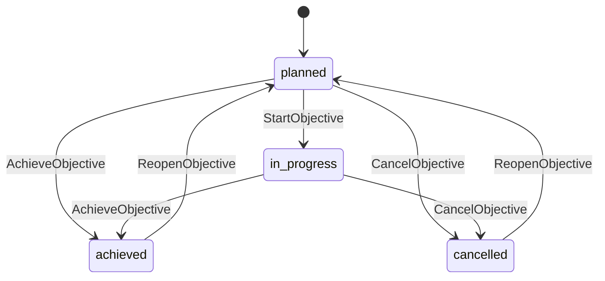

`AchieveObjective` direto a partir de `planned` é permitido quando uma condição já foi comprovada sem trabalho operacional local. Todos os gates de conclusão continuam sendo verificados.

### 5.4 Hierarquia e conclusão

- Cada Objective pertence a exatamente um Outcome.
- `parent_objective_id` aponta para outro Objective do mesmo Outcome.
- O grafo de parentesco é uma árvore por ramo, sem ciclos.
- Parentesco organiza decomposição; não cria dependência de execução nem conclusão implícita.
- Se um Objective pai depende da conclusão dos filhos, isso deve aparecer em um critério ou regra de avaliação explícita do consumidor.
- `required_for_outcome=true` acrescenta um gate estrutural a `AchieveOutcome`: o Objective precisa estar `achieved`.
- O default de `required_for_outcome` é `false`; o consumidor escolhe o conjunto obrigatório ao definir o plano.
- Objective cancelado não satisfaz `required_for_outcome`. Para dispensá-lo, o ator autorizado altera essa obrigação com razão auditável.
- Critérios do Outcome continuam necessários mesmo quando todos os Objectives obrigatórios foram alcançados.
- Cancelar um Objective não cancela seus filhos ou WorkItems automaticamente. Essas mudanças exigem comandos explícitos; referências ao contexto cancelado tornam o trabalho diretamente associado indisponível.

Critérios e obrigações estruturais não podem ser alterados em uma entidade concluída sem reabertura. Renomear uma entidade não altera sua comprovação; alterar sua condição desejada altera.

## 6. Critérios, avaliações e comprovação

### 6.1 SuccessCriterion

SuccessCriterion pertence a Outcome, Objective ou WorkItem. Seus identificadores permanecem estáveis enquanto o critério existir; mudanças semânticas incrementam `criterion_revision`.

| Campo | Significado |
| --- | --- |
| `id` | Identidade referenciável por EvidenceLink e Assessment |
| `owner_ref` | Entidade cuja conclusão está sendo verificada |
| `title`, `description` | Afirmação verificável e instrução de verificação |
| `required` | Participa dos gates obrigatórios |
| `criterion_revision` | Versão semântica do critério |
| `verification_mode` | `attestation`, `evidence_review` ou `external_evaluation` |
| `expected_measurement` | JSON tipado opcional com unidade, operador e valor-alvo |
| `status` | `active` ou `retired` |

`expected_measurement` descreve o alvo. O WOS não consulta sistemas externos nem infere que uma medição satisfaz esse alvo. Um serviço externo pode aplicar a regra e registrar uma avaliação.

`attestation` permite uma declaração humana ou de serviço autorizado. `evidence_review` exige pelo menos uma Evidence vinculada. `external_evaluation` exige referência e versão do avaliador externo, além das evidências indicadas pelo contrato do consumidor.

### 6.2 CriterionAssessment

Uma avaliação é imutável e contém `criterion_id`, `criterion_revision`, `result`, `rationale`, `evidence_ids`, `principal_id`, `actor_ref`, `assessed_at`, `evaluator_ref?` e `supersedes_assessment_id?`.

Resultados: `met`, `not_met`, `inconclusive`, `waived`. Dispensa (`waived`) exige permissão `assessment:waive`, motivo e fica explícita na conclusão; não é apresentada como critério comprovado.

A entidade proprietária conserva um vínculo para a avaliação corrente de cada critério. Alterar a avaliação corrente é uma mutação do agregado proprietário, exige `expected_version` e gera Event. Duas avaliações simultâneas não substituem uma à outra sem detectar conflito.

Atualizar a revisão de um critério invalida a aplicabilidade de avaliações antigas. Elas continuam no histórico. Uma avaliação da revisão 1 nunca satisfaz automaticamente a revisão 2.

`ReviseCriterion` limpa o vínculo corrente daquele critério e grava a nova definição/revisão na mesma transação, incrementando a versão do proprietário. As avaliações anteriores permanecem consultáveis.

### 6.3 Gates de conclusão

`AchieveOutcome`, `AchieveObjective` e `CompleteWorkItem` validam:

1. entidade autorizada, não arquivada e lifecycle elegível;
2. `expected_version` e lease/fencing token quando aplicável;
3. ausência de Blockers ativos aplicáveis;
4. dependências hard satisfeitas;
5. assessments correntes dos critérios obrigatórios ativos;
6. compatibilidade de Evidence: existente, do mesmo Outcome e não retratada;
7. regras adicionais tipadas, como Objectives obrigatórios do Outcome;
8. razão e referência à avaliação usadas na conclusão.

Critério obrigatório sem avaliação bloqueia a conclusão. `inconclusive` e `not_met` também bloqueiam. `waived` pode satisfazer o gate apenas com a permissão específica.

### 6.4 Quantidade mínima de critérios

Outcome e Objective exigem pelo menos um critério obrigatório ativo para ativação/conclusão. WorkItem pode ser uma tarefa simples sem critérios formais; nesse caso, sua conclusão exige uma declaração de resultado. Se tiver critérios obrigatórios, todos são validados.

Essa assimetria é intencional: WorkItem registra execução; Outcome e Objective afirmam condições alcançadas.

### 6.5 Contestação posterior

Retrair Evidence ou registrar avaliação `not_met` após conclusão gera fatos adicionais. A projeção inclui `conclusion_contested=true` e suas causas quando avaliações/evidências correntes contradizem a conclusão registrada. Não apaga assessments históricos e não muda lifecycle automaticamente.

O assessment e a conclusão armazenam IDs e revisões efetivamente utilizados. Consultar a conclusão mostra a comprovação no momento em que ela foi registrada e as contestações posteriores.

## 7. WorkItem e coordenação de execução

### 7.1 Modelo

WorkItem é uma unidade operacional pertencente a um Outcome, vinculada opcionalmente a um Objective. Um WorkItem ligado diretamente ao Outcome é válido para trabalho transversal.

Campos próprios: `title`, `description`, `objective_id?`, `lifecycle`, `priority`, `assignee_refs`, `due_at?`, `not_before?`, `result_summary?`, `current_lease`, `last_fencing_token`.

`assignee_refs` representa responsabilidade ou intenção de alocação. Não é um lock de execução. O lease representa a aquisição temporária efetiva.

Lifecycle persistido: `backlog`, `todo`, `in_progress`, `done`, `cancelled`.

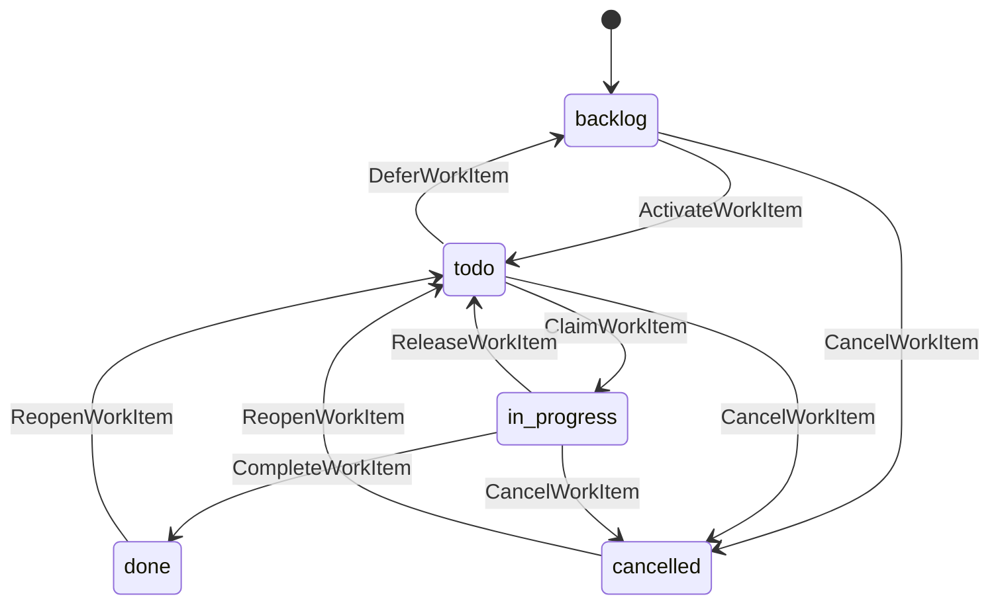

Criar uma tarefa não significa disponibilizá-la imediatamente: o default é `backlog`. O consumidor pode criar com lifecycle `todo` quando já tiver decidido ativá-la.

### 7.2 Estado de apresentação

| Lifecycle | Condição operacional | `display_state` |
| --- | --- | --- |
| backlog | Qualquer condição | backlog |
| todo | Outcome inativo/arquivado ou Objective associado terminal | waiting_scope |
| todo | Blocker direto ou herdado | blocked |
| todo | Dependência hard não satisfeita | waiting_dependencies |
| todo | `not_before` futuro | scheduled |
| todo | Todos os gates de início satisfeitos | ready |
| in_progress | Blocker direto ou herdado | blocked |
| in_progress | Outcome inativo/arquivado ou Objective associado terminal | attention_needed |
| in_progress | Lease expirado ou dependência deixou de estar satisfeita | attention_needed |
| in_progress | Lease válido e sem impedimentos | in_progress |
| done | Qualquer condição | done |
| cancelled | Qualquer condição | cancelled |

A resposta conserva `lifecycle`, `is_blocked`, `readiness_reasons` e `lease_status`. `display_state` é apenas uma leitura conveniente. Razões adicionais não desaparecem quando uma delas tem precedência de exibição.

### 7.3 Lease de execução

O lease contém:

```json
{
  "claim_id": "0199e100-0000-7000-8000-000000000090",
  "principal_id": "principal-ci-01",
  "actor_ref": {"kind": "agent", "provider": "woobe", "id": "agent-reviewer"},
  "fencing_token": 7,
  "acquired_at": "2026-10-01T19:20:00Z",
  "expires_at": "2026-10-01T19:25:00Z"
}
```

Política inicial:

- TTL default de 5 minutos; faixa configurável de 30 segundos a 60 minutos;
- `ClaimWorkItem` verifica readiness dentro da transação, incrementa fencing token e muda `todo` para `in_progress`;
- quem adquiriu pode renovar com `RenewWorkItemLease`;
- a conclusão exige lease vigente, mesmo principal, claim ID e fencing token corrente;
- uma delegação de autoria muda ActorRef, mas não troca o principal proprietário do lease;
- `ReleaseWorkItem` encerra o lease e retorna o item a `todo`, mediante comando explícito;
- lease expirado torna o trabalho recuperável, sem voltar sozinho a `todo`;
- `ReclaimWorkItem` permite a outro principal adquirir um item `in_progress` com lease expirado, incrementando o fencing token;
- um proprietário anterior não conclui com um token antigo;
- cancelamento administrativo ou conclusão por override exigem permissão específica e motivo auditável.

O lease coordena consumidores do WOS. Ele não impede um processo externo de continuar trabalhando após expirar. Quando o efeito externo precisa dessa garantia, o receptor externo também valida o fencing token ou adota sua própria idempotência.

### 7.4 Trabalho humano e execução breve

Humano pode adquirir trabalho por meio de UI ou CLI. Não é obrigatório existir um agente ou Run.

Um adapter pode oferecer uma ação explícita de execução breve que faça claim e complete em uma transação quando o trabalho já tiver sido realizado externamente, com permissão `work:record_external_completion`, declaração de autoria e os mesmos gates. Essa conveniência não permite ignorar um lease válido de outro principal.

### 7.5 WorkItem concluído e objetivo alcançado

`CompleteWorkItem` registra o resultado operacional, critérios atendidos quando existentes, Artifacts e Evidence explicitamente fornecidos. Ele não chama `AchieveObjective`.

Reabrir uma tarefa concluída exige razão e invalida sua conclusão corrente. Dependentes ainda não iniciados deixam de aparecer como ready; dependentes em andamento recebem `attention_needed`; dependentes concluídos conservam a conclusão e recebem indicação de dependência alterada. Nenhuma execução externa é cancelada automaticamente.

## 8. Dependências e readiness

### 8.1 Dependência canônica

Dependência operacional é uma Relation tipada `depends_on`, administrada por comandos próprios. A direção é: **source depende de target**.

```json
{
  "source_ref": {"kind": "work_item", "id": "W2"},
  "relation_type": "depends_on",
  "target_ref": {"kind": "objective", "id": "O1"},
  "strength": "hard",
  "satisfaction": "target_completed"
}
```

`W2` só pode começar quando `O1.lifecycle=achieved`. IDs curtos como `W2` são aliases didáticos; os contratos reais usam UUIDs.

Permitido no MVP:

| Source | Target | Condição `target_completed` |
| --- | --- | --- |
| WorkItem | WorkItem | Target `done` |
| WorkItem | Objective | Target `achieved` |
| Objective | Objective | Target `achieved` |
| Objective | WorkItem | Target `done` |

Todas as dependências operacionais pertencem ao mesmo Outcome. Dependência externa é representada por Blocker com descrição e referência externa até que um consumidor confirme sua resolução.

### 8.2 Hard e advisory

- `hard`: participa de readiness e dos gates de conclusão;
- `advisory`: aparece no grafo e snapshot, mas não impede uma transição;
- `cancelled` não equivale a concluído;
- não existe dispensa escondida em metadata: remover uma dependência hard exige comando auditável e motivo;
- uma dependência não pode apontar para a própria entidade;
- não pode existir ciclo no grafo `depends_on`, independentemente de strength, para manter a semântica inequívoca;
- adicionar uma dependência a uma entidade em andamento é permitido com motivo, mas pode colocá-la em `attention_needed`;
- alterar dependências de uma entidade terminal exige reabertura.

### 8.3 Detecção de ciclos

Antes de adicionar `A -> B`, procurar um caminho `B -> ... -> A`. Se existir, retornar `dependency_cycle` com um caminho limitado e identificável.

Algoritmo inicial: consulta das adjacências do Outcome em lote, seguida de DFS em memória, ou CTE recursiva no adapter. A regra de domínio é a mesma. Usar limite de trabalho e retornar `graph_limit_exceeded` se a validação não puder ser concluída; não aceitar o vínculo sem validar.

Duas transações podem adicionar `A -> B` e `B -> A` e validar isoladamente um estado anterior. Por isso a Application adquire o guard do Outcome antes de ler e modificar o grafo. O lock otimista apenas de A e B não protege esse caso.

### 8.4 Função determinística de readiness

Para WorkItem:

```text
ready(item, snapshot_time) =
    item.lifecycle == todo
    AND outcome.lifecycle == active
    AND outcome não arquivado
    AND objective associado não cancelado/concluído
    AND nenhum Blocker ativo aplicável
    AND todas as dependências hard satisfeitas
    AND (not_before ausente OR not_before <= snapshot_time)
    AND nenhum lease vigente
```

Para Objective, substituir lifecycle por `planned`; exigir que o Outcome esteja ativo, sem Blockers aplicáveis e com dependências hard satisfeitas. Objective pai em andamento não é pré-requisito implícito do filho.

`snapshot_time` vem de Clock, fixado uma vez por query/comando. O lease usa um instante obtido após adquirir o guard, para não expirar incorretamente durante espera pelo lock.

No deployment PostgreSQL, o adapter fornece o instante de avaliação a partir do relógio do banco após adquirir o guard. Todas as réplicas usam essa autoridade comum para leases; relógios locais servem à instrumentação, não à arbitragem de expiração. No SQLite local e no adapter de memória, utiliza-se o Clock da implantação/teste.

### 8.5 Calendário e eventos

`not_before` pode tornar um item ready apenas pela passagem do tempo. Essa mudança não produz um Domain Event se nenhum comando ocorreu. Portanto o MVP não promete um webhook `work_item.ready` para todos os casos.

Consumidores podem consultar ready-work periodicamente. Uma extensão de monitoramento de readiness poderá emitir Integration Signals derivados, com deduplicação própria, sem transformá-los em fatos de mutação.

## 9. Roadmaps e revisões

### 9.1 Ownership

Outcome é o escopo operacional. Roadmap é um plano persistente que referencia Objectives e WorkItems desse escopo.

Um Roadmap possui `scope_kind = outcome | objective`, `scope_id`, título e lifecycle `open | archived`. Um Objective não é obrigado a ter um Roadmap próprio.

Por escopo, existe no máximo um vínculo ativo `(roadmap_id, revision_number)`. O Outcome tem seu plano principal; cada Objective complexo pode ter seu plano local. A ativação do plano local não substitui o plano principal.

### 9.2 Modelo de revisão

Separar:

| Conceito | Campo | Exemplo |
| --- | --- | --- |
| Versão mutável do agregado | `roadmap.version` | 12 |
| Revisão de conteúdo | `revision_number` | 3 |
| Versão de edição do draft | `draft_version` | 8 |
| Ordem do estado do Outcome | `outcome_revision` | 142 |

Fluxo:

1. criar Roadmap;
2. abrir draft a partir de revisão anterior ou vazio;
3. editar nós e links com `expected_draft_version` e `expected_roadmap_version`;
4. validar referências, scope, ordem e grafo de parentesco dos nós;
5. publicar a revisão, congelando conteúdo e registrando hash;
6. ativar a revisão publicada no slot do escopo;
7. consultar revisões antigas pelo número e conteúdo original.

Revisão publicada permanece imutável. `active` e `superseded` são projeções do histórico de ativações, não alterações do conteúdo publicado.

### 9.3 RoadmapNode

Tipos: `reference`, `phase`, `milestone`.

| Campo | Semântica |
| --- | --- |
| `node_key` | Identidade lógica do nó preservada entre revisões |
| `revision_number` | Revisão à qual o registro físico pertence |
| `parent_node_key?` | Agrupamento dentro da mesma revisão |
| `node_type` | reference, phase ou milestone |
| `target_ref?` | Objective ou WorkItem para reference |
| `title` | Rótulo da versão publicada |
| `position` | Ordenação de apresentação dentro do grupo |
| `criterion_refs[]` | Critérios existentes usados por um milestone |
| `planned_start?`, `planned_end?` | Expectativa de calendário; não dispara execução |

Phase é agrupamento. Milestone é um marco de plano cujos critérios referenciados permitem consultar cumprimento. Nenhum deles possui lifecycle operacional independente no MVP.

RoadmapNode não é alvo de Blocker. Para impedir trabalho, bloquear Objective ou WorkItem referenciado. Isso evita que congelar uma revisão congele ou duplique um impedimento vivo.

### 9.4 Ordem de apresentação e dependência de execução

`position` e links de plano `after` organizam leitura. Não são dependências hard.

O grafo operacional canônico vive em Relations `depends_on`. Uma revisão publicada armazena um snapshot informativo das dependências entre os alvos presentes, com IDs e condições daquela publicação. A Graph Query distingue `plan_edges` de `live_dependencies`.

Se o consumidor quer alterar plano e dependências juntos, utiliza `PublishRoadmapRevision` com um lote específico de mudanças de dependência. O comando valida o grafo final e aplica tudo atomicamente. Não é um endpoint genérico de comandos arbitrários.

Ausência de dependência permite considerar trabalhos paralelos. Não criar `can_run_parallel_with` como obrigação de registrar todas as combinações possíveis.

### 9.5 Referências históricas

Revisão histórica aponta para IDs estáveis e inclui título/scope capturados. A entidade viva pode ter mudado de nome ou lifecycle. A resposta histórica distingue `published_reference_snapshot` de `current_entity_state`.

Excluir um nó de um draft não apaga Objective ou WorkItem. Retirar trabalho do plano não cancela esse trabalho. Cancelar exige comando explícito.

### 9.6 Invariantes

- um target deve existir no mesmo Outcome;
- um Roadmap de Objective só referencia esse Objective, seus descendentes e os WorkItems desse subconjunto;
- uma entidade aparece no máximo uma vez como reference por revisão;
- grouping por parent node não admite ciclos;
- links `after` não admitem ciclos;
- milestones referenciam critérios existentes do escopo permitido;
- revisão publicada não recebe update de conteúdo;
- um draft descartado não pode ser publicado;
- slots ativos só apontam para revisão publicada do escopo correspondente;
- arquivar Roadmap remove seu slot ativo na mesma transação;
- reabrir Roadmap não reativa uma revisão silenciosamente.

## 10. Issue e Blocker

### 10.1 Issue

Issue identifica um problema. Pode ser uma anomalia, dúvida investigável, incompatibilidade ou resultado inesperado, sem necessariamente impedir execução.

Campos: `title`, `description`, `severity`, `lifecycle`, `affected_refs`, `reported_by`, `resolution_summary?`, `duplicate_of_issue_id?`.

Severidades: `critical`, `major`, `minor`, `informational`. Não reutilizar prioridade como severidade: impacto do problema e ordem de trabalho são conceitos diferentes.

Lifecycle: `open`, `investigating`, `resolved`, `wont_fix`, `duplicate`.

`ResolveIssue` exige resumo da resolução. `MarkIssueDuplicate` exige outra Issue existente, sem ciclos na cadeia de duplicatas. `ReopenIssue` conserva resoluções anteriores nos Events.

### 10.2 Blocker

Blocker identifica um impedimento efetivo sobre exatamente um alvo. Campos: `blocked_ref`, `cause_ref?`, `external_cause?`, `description`, `lifecycle`, `propagation`, `resolved_at?`, `resolution_summary?`.

Alvos no MVP: Outcome, Objective e WorkItem. Lifecycle: `active`, `resolved`, `cancelled`. Cancelled significa que o registro foi invalidado; resolved significa que o impedimento foi removido.

Cause pode ser Issue, WorkItem, Objective ou Decision do mesmo Outcome. Condição externa utiliza `external_cause` com provider, ID/URI e descrição. Pelo menos uma causa referenciada ou descrição concreta é obrigatória.

Um alvo terminal não recebe um novo Blocker operacional: precisa ser reaberto antes. Problema identificado após conclusão pode ser registrado como Issue e fundamentar essa reabertura. Isso evita um impedimento "ativo" sobre trabalho que o domínio ainda considera concluído.

### 10.3 Propagação de bloqueio

| Alvo | Propagação permitida | Efeito |
| --- | --- | --- |
| WorkItem | direct | Bloqueia esse item |
| Objective | direct | Bloqueia o Objective, sem propagar automaticamente |
| Objective | subtree | Bloqueia o Objective, seus descendentes e WorkItems associados |
| Outcome | subtree | Bloqueia operações de início/conclusão do Outcome e seu trabalho |

`subtree` é default para Outcome e Objective; `direct` para WorkItem. A escolha fica persistida e exposta nas respostas.

Entidade pode possuir vários Blockers ativos. Resolver um não remove os demais. `is_blocked` é calculado considerando Blockers diretos e herdados.

Uma Issue resolvida pode continuar sendo a causa histórica de um Blocker ativo. Isso significa que a resolução do problema ainda não foi confirmada como suficiente para liberar aquele alvo.

### 10.4 Operações combinadas

`ReportIssueWithBlocker` cria problema e impedimento atomicamente. `ResolveIssueAndBlockers` recebe uma lista explícita de Blocker IDs, versões esperadas e confirmação de liberação de cada alvo.

O comando combinado não resolve todos os Blockers ligados a uma Issue por inferência. O ator precisa indicar quais impedimentos deixou de considerar ativos.

### 10.5 Efeito sobre trabalho em andamento

Criar um Blocker não revoga lease nem cancela efeito externo automaticamente. A projeção informa bloqueio, e concluir/iniciar fica impedido. O consumidor decide pausar ou interromper sua execução externa.

Não criar um Event artificial `work_item.status_changed` para cada descendente bloqueado. O fato persistido é `blocker.created`. Descendentes bloqueados são uma projeção desse fato.

## 11. Evidence, Artifact e Decision

### 11.1 Evidence

Evidence registra uma observação, medição, validação, fonte ou declaração. Campos:

| Campo | Semântica |
| --- | --- |
| `evidence_type` | measurement, test_result, inspection, attestation, source ou external_evaluation |
| `description` | O que foi observado |
| `source_ref` | Provider/ID/URI de origem |
| `producer_ref` | Quem produziu a informação |
| `captured_at` | Quando a observação ocorreu |
| `registered_at` | Quando WOS a registrou |
| `artifact_id?` | Entregável material relacionado |
| `measurement?` | Valor, unidade, método e condições de medição |
| `source_version?`, `checksum?` | Referência à versão observada |
| `lifecycle` | registered ou retracted |
| `retraction_reason?` | Motivo da invalidação posterior |

Conteúdo observado é imutável. Corrigir uma medição produz nova Evidence, vinculada por `derived_from` ou por referência à anterior. Retrair altera lifecycle e gera Event, sem reescrever a observação original.

O WOS valida procedência presente, formato e integridade de referência. Não atesta autenticidade de um documento externo nem verdade de uma afirmação.

### 11.2 EvidenceLink

`stance` pertence ao vínculo, não à Evidence inteira. A mesma informação pode sustentar uma afirmação e contradizer outra.

EvidenceLink contém `evidence_id`, `target_ref`, `criterion_id?`, `stance`, `rationale`, `version` e `lifecycle=active|retracted`. Stances: `supports`, `contradicts`, `context`.

Targets: Outcome, Objective, WorkItem, Issue ou Decision. Quando o target é um critério, `criterion_id` identifica o critério e `target_ref` identifica seu proprietário. Isso mantém a integridade de escopo.

EvidenceLink não marca critérios como `met`. Assessment faz essa avaliação e registra as evidências usadas.

### 11.3 Artifact

Artifact identifica entregável ou objeto material. Campos: `artifact_type`, `name`, `uri`, `media_type?`, `checksum?`, `source_version?`, `producer_ref`, `produced_at?`, `registered_at`, `lifecycle=registered|withdrawn`.

Exemplos: PR, commit, documento, relatório, dataset, imagem, release, deployment ou arquivo externo.

MVP armazena referência e metadata, sem buscar automaticamente a URI e sem armazenar bytes. `RegisterArtifact` não abre uma URL nem executa código associado. URI é tratada como dado.

URI mutável deve conservar `source_version` ou checksum quando a reprodução daquela versão for relevante. Alterar bytes em uma origem externa não atualiza automaticamente o Artifact registrado.

Exemplo:

```text
Artifact: relatório de benchmark, commit 9f0d2a.
Evidence: p95 = 180 ms em 10.000 solicitações, cenário C1.
EvidenceLink: supports critério C1 "p95 menor que 200 ms".
Assessment: C1 revision 2 = met, por serviço benchmark-ci.
Conclusion: Objective alcançado, referenciando esse Assessment.
```

### 11.4 Decision

Decision registra uma escolha explícita, suas alternativas, justificativa e autoria. Campos: `title`, `proposal`, `chosen_alternative?`, `rationale`, `alternatives[]`, `lifecycle`, `decided_by?`, `decided_at?`, `supersedes_decision_id?`.

Lifecycle: `proposed`, `accepted`, `rejected`, `superseded`.

- proposta pode ser editada com versão esperada;
- aceitar congela conteúdo decisório;
- rejeitar exige motivo;
- substituir decisão aceita cria outra Decision e marca a anterior como superseded na mesma transação;
- uma decisão pode ter no máximo um sucessor direto aceito;
- não há ciclos de supersession;
- apenas outra Decision aceita substitui uma decisão aceita;
- Evidence adicional pode ser vinculada posteriormente sem reescrever rationale histórica.

Uma Decision proposta pode ser causa de um Blocker, por exemplo "aguardando decisão sobre contrato". Aceitá-la não resolve esse Blocker por inferência.

### 11.5 Imutabilidade e administração

Evidence e Artifact têm conteúdo imutável, mas lifecycle auditável. Decision aceita tem conteúdo imutável, mas pode ser superseded. Essa distinção evita a falsa premissa de que uma entidade com histórico precisa ser inteiramente impossível de alterar.

Retenção ou expurgo administrativo constitui operação separada. O MVP não expõe `DELETE` público para esses registros. Uma edição de metadata permitida nunca modifica a observação, o conteúdo do entregável ou a decisão histórica.

## 12. Relations e integridade do grafo

### 12.1 Tipos e comportamento

Relation é um vínculo local tipado. O Core usa um registry fechado de tipos no MVP.

| Tipo | Direção | Comportamento |
| --- | --- | --- |
| depends_on | Dependente → pré-requisito | Readiness e gates; DAG obrigatório |
| relates_to | Semântica simétrica | Informação; par ordenado canonicamente |
| produces | Produtor lógico → Artifact | Informação; target Artifact obrigatório |
| derived_from | Derivado → origem | Procedência; ciclos proibidos |

Tipos com comportamento próprio possuem fonte de verdade própria:

| Semântica | Fonte canônica |
| --- | --- |
| blocked by | Blocker |
| supports/contradicts | EvidenceLink |
| assessment validates criterion | CriterionAssessment |
| decision supersedes decision | `supersedes_decision_id` de Decision |
| objective part of objective | `parent_objective_id` |
| issue duplicates issue | `duplicate_of_issue_id` |
| roadmap contains node | Conteúdo da revisão de Roadmap |

Graph Query pode apresentar essas estruturas como edges, mas não persiste uma segunda cópia em Relations genéricas.

### 12.2 Validação de referências

Referências locais exigem:

1. namespace do comando autorizado;
2. Outcome do comando;
3. ID existente;
4. kind compatível com a operação;
5. entidade não retirada quando a operação exige uma referência válida;
6. restrições de ciclo, unicidade e lifecycle próprias do vínculo.

Campos como `(kind, id)` sem integridade não bastam. A persistência utiliza um registry de referências locais e foreign keys de escopo. Tipos específicos também usam referências para suas tabelas quando possível.

### 12.3 Relações externas

Uma referência externa contém `provider`, `id`, `uri?` e `display_name?`. Ela não implica que a entidade foi consultada nem que exista no WOS.

Cross-Outcome informativo e cross-namespace com autorização bilateral são extensões posteriores. No MVP, todos os links locais pertencem ao mesmo Outcome e referências externas não afetam readiness.

### 12.4 Unicidade e remoção

Vínculos ativos semanticamente iguais não podem ser duplicados. `relates_to(A,B)` e `relates_to(B,A)` são o mesmo vínculo, normalizado pela ordem dos IDs.

Remover um vínculo muda lifecycle para `removed`, conserva histórico e exige versão esperada e motivo quando altera execução. Reativar o mesmo vínculo usa comando explícito; o índice parcial aplica unicidade apenas às relações ativas.

## 13. Eventos, histórico e outbox

### 13.1 Estratégia

Fonte de verdade: tabelas do estado atual. Toda mutação de domínio confirmada registra Domain Event imutável na mesma transação. Eventos de integração são derivados por mapper explícito, também persistidos atomicamente.

Não utilizar Event Sourcing integral no MVP. Auditoria é obrigatória; replay integral de qualquer versão de domínio não é uma promessa.

### 13.2 Envelope

```json
{
  "event_id": "0199e100-0000-7000-8000-000000000100",
  "event_type": "work_item.completed",
  "schema_version": 1,
  "namespace_id": "0199e100-0000-7000-8000-000000000001",
  "outcome_id": "0199e100-0000-7000-8000-000000000010",
  "outcome_revision": 42,
  "event_index": 0,
  "aggregate_ref": {"kind": "work_item", "id": "0199e100-0000-7000-8000-000000000030"},
  "aggregate_version_before": 4,
  "aggregate_version_after": 5,
  "principal_id": "principal-ci-01",
  "actor_ref": {"kind": "service", "provider": "ci", "id": "build-123"},
  "recorded_at": "2026-10-01T19:30:00Z",
  "command_id": "0199e100-0000-7000-8000-000000000101",
  "correlation_id": "request-42",
  "causation_id": null,
  "execution_context": {"session_id": "session-123", "run_id": "run-999"},
  "payload": {"from": "in_progress", "to": "done", "result_summary": "Contrato revisado"}
}
```

IDs de Session/Run são contexto opcional. Domain Event não é um evento do runtime da Woobe.

### 13.3 Ordem e cursor

Cada comando confirmado recebe um `outcome_revision` crescente dentro do Outcome. Eventos do comando usam `event_index=0..N-1`.

O guard do Outcome serializa a atribuição e permanece adquirido até commit. Assim, a timeline desse Outcome pode usar `(outcome_revision, event_index)` sem ignorar uma transação que ainda não havia feito commit.

Sequence SQL global ou UUID temporal não garantem ordem de commit. O MVP não oferece timeline global com a mesma garantia entre Outcomes diferentes.

### 13.4 Nome e payload

Padrão: substantivo singular em snake_case + fato no passado lógico, como `objective.achieved`, `blocker.resolved`, `roadmap.revision_published`.

Eventos mínimos:

| Família | Eventos principais |
| --- | --- |
| Outcome | created, updated, activated, achieved, failed, abandoned, reopened, archived, unarchived |
| Objective | created, updated, started, achieved, cancelled, reopened |
| WorkItem | created, updated, activated, claimed, lease_renewed, released, reclaimed, completed, cancelled, reopened |
| Criteria | criterion_added, criterion_revised, criterion_retired, assessment_recorded |
| Issue | reported, investigation_started, resolved, reopened, marked_duplicate, marked_wont_fix |
| Blocker | created, resolved, cancelled |
| Roadmap | created, draft_created, draft_updated, revision_published, revision_activated, draft_discarded, archived |
| Decision | proposed, updated, accepted, rejected, superseded |
| Evidence | registered, retracted, link_created, link_retracted |
| Artifact | registered, withdrawn |
| Relation | created, removed, reactivated |
| Trigger | configured, updated, enabled, disabled |

Eventos de atualização de dados auditáveis registram campos alterados com valores anteriores e novos, dentro do limite de payload. Não incluir secrets. Conteúdos grandes utilizam referência/hash e um registro documental apropriado.

### 13.5 Domain Event e Integration Event

Domain Event conserva detalhes de auditoria. Integration Event utiliza whitelist de campos, schema público versionado e redaction de dados sensíveis do contexto.

Um Event pode gerar zero ou um Integration Event de domínio. Um trigger compatível pode gerar um sinal adicional `trigger.fired`. Este é um Integration Event, não uma nova mutação que alimente triggers recursivamente.

### 13.6 Outbox

Estado, Domain Events, Integration Events, trigger firings, destinos de entrega e resultado idempotente são confirmados juntos.

Um worker de integração lê entregas pendentes, adquire lease operacional curto, transmite e registra resultado. Não mantém uma transação de domínio aberta durante chamadas HTTP.

Semântica de entrega: **at-least-once**. O mesmo `integration_event_id` e `delivery_id` acompanham retries. O receptor deduplica. Não prometer exatamente uma execução externa.

Configuração proposta: timeout de 10 s por entrega; retry exponencial com jitter; teto de 30 min entre tentativas; até 20 tentativas ou 72 h. Esgotamento marca entrega como `exhausted`; operador pode solicitar redelivery preservando identidade do sinal.

### 13.7 Auditoria administrativa

Namespaces, credenciais, grants e endpoints não pertencem a um Outcome. Suas mutações geram `administrative_audit_records`, sem consumir a sequência de um Outcome inexistente.

Updates internos de tentativa de webhook, cleanup de idempotência e métricas não geram Domain Events. A regra "toda mutação gera Event" aplica-se a comandos de domínio; administração possui trilha própria; housekeeping operacional possui registros operacionais.

## 14. Triggers e sinais de integração

### 14.1 Função

Trigger é uma configuração declarativa: **quando um evento compatível ocorrer, persistir e entregar um sinal a destinos configurados**.

Exemplo: `blocker.resolved` pode emitir um sinal para o backend consumidor. O backend pode abrir uma nova Run na Woobe, criar uma notificação ou apenas atualizar uma tela. Essa decisão e sua execução continuam externas.

### 14.2 Modelo inicial

```json
{
  "name": "Avisar backend quando impedimento for resolvido",
  "enabled": true,
  "event_types": ["blocker.resolved"],
  "predicate": {
    "all": [
      {"field": "aggregate.kind", "op": "eq", "value": "blocker"}
    ]
  },
  "target_endpoint_ids": ["endpoint-product-backend"],
  "signal_type": "product.blocker_resolution_available"
}
```

Trigger pertence a um Outcome. A configuração tem versão, autoria, lifecycle e Events próprios. Endpoint pertence ao namespace e é administrado separadamente.

### 14.3 Predicados

MVP admite `eq`, `neq`, `in`, `exists` e composição `all`/`any` em profundidade máxima 3, até 20 cláusulas. Campos filtráveis são whitelist do envelope público e payloads de Integration Events.

Sem scripts, `eval`, SQL fornecido pelo cliente, chamadas remotas ou leitura arbitrária de metadata. Comparação possui tipos e regras explícitos; campo ausente não é igual a null, exceto se o operador definir isso.

Limites iniciais: até 100 triggers ativos por Outcome e até 5 destinos por trigger. A avaliação ocorre sobre o evento produzido pelo comando e a versão de configuração disponível na mesma transação.

### 14.4 Atomicidade e deduplicação

Para cada match, persistir `TriggerFiring` com chave única `(trigger_id, trigger_version, source_event_id)`. Gerar o sinal e as entregas na mesma transação da mutação original.

Atualizar trigger não altera retrospectivamente firings. Desabilitar trigger interrompe novos firings; entregas existentes permanecem, salvo cancelamento administrativo explícito.

Uma falha de validação de configuração deve impedir sua ativação. Um erro transitório de webhook não desfaz a mutação original nem perde o sinal.

### 14.5 Webhooks

Entregas usam HTTPS em implantação remota, assinatura HMAC do corpo bruto, timestamp, event ID e key ID. Secrets são referências à configuração segura do Server ou secret manager; não estão no payload de domínio.

Receptor verifica assinatura, tolerância temporal e deduplica por `integration_event_id`. Acesso de saída usa política de destinos; redirects são desabilitados por padrão. A URL configurada não autoriza acesso arbitrário à rede interna.

Não haverá adapters específicos de Slack, redes sociais, CRM, ERP ou scheduler proprietário no core. O destino é HTTP genérico ou um consumidor de eventos.

### 14.6 Triggers temporais

Primeira release: triggers por evento. Design de evolução: one-shot `fire_at` e intervalo fixo, com ocorrência persistida e chave única `(trigger_id, schedule_version, occurrence_at)`.

Um timer do Server ou um scheduler externo chama `EvaluateDueTriggers`; o resultado é um sinal, nunca execução de WorkItem. Cron avançado, calendário de negócios e tratamento de horário de verão ficam para uma extensão específica.

Persistir `not_before` e consultar readiness não exige esse timer. Core permanece utilizável sem background workers.

## 15. Namespace, contexto externo e identidade

### 15.1 Namespace

Namespace é um boundary interno identificado por UUID e nome. Todas as entidades de domínio, idempotency records, endpoints e grants possuem namespace explícito.

Em modo local pode existir um namespace default. Esse default é configuração do Server, não uma escolha silenciosa a partir do corpo de uma requisição remota.

Namespace não é necessariamente um tenant comercial. Uma instalação pode usar um namespace por empresa, usuário, ambiente ou workspace, conforme sua política. Esse mapeamento é definido pelo administrador.

### 15.2 ExternalContext persistente

Exemplo:

```json
{
  "product": "lipo",
  "tenant_id": "acme",
  "user_id": "student-42",
  "learning_journey_id": "journey-81",
  "environment": "production"
}
```

Esse contexto pertence ao Outcome e é herdado nas queries por suas entidades. Evitar copiar todo o JSON para cada tabela filha.

MVP usa mapa plano de valores escalares: string, boolean, número ou null. Objetos arbitrários e listas continuam possíveis em metadata, mas não são campos de endereçamento indexados.

Chaves que começam por `wos.` são reservadas. Chaves como `tenant_id` pertencem ao consumidor e não têm privilégio interno.

### 15.3 ExecutionContext

Session, Run, trace, request e correlation IDs pertencem ao comando/evento, não ao contexto persistente do Outcome:

```json
{
  "provider": "woobe",
  "project_id": "project-01",
  "network_id": "network-02",
  "agent_id": "agent-03",
  "session_id": "session-04",
  "run_id": "run-05",
  "trace_id": "trace-06"
}
```

Essa separação evita sobrescrever o endereço do Outcome sempre que outra sessão assume o trabalho.

### 15.4 Índices de contexto

Persistir JSON do Outcome e uma tabela normalizada de pares contextuais, atualizados na mesma transação. Filtro exato preserva tipo: número `42` é diferente de string `"42"`.

Chave de índice: `(namespace_id, context_key, value_type, canonical_value, outcome_id)`. Consultas combinam pares com AND ou OR explícito, sem interpretar expressões fornecidas pelo cliente.

Contexto não define unicidade de Outcome por default. Se um produto precisa exatamente um Outcome por jornada, utiliza `external_ref(provider, key)` único no namespace. Atualizar esse vínculo exige autorização e Event.

### 15.5 Principal e ActorRef

Principal é a identidade autenticada: usuário, service account, credencial local ou credencial delegada. ActorRef é a autoria declarada de uma ação.

```json
{
  "principal_id": "service-account-product",
  "actor_ref": {
    "kind": "agent",
    "provider": "woobe",
    "id": "architecture-agent",
    "display_name": "Architecture Agent"
  }
}
```

Kinds de ActorRef: `human`, `agent`, `service`, `automation`, `external_system`. Provider e ID são obrigatórios; display name é informativo. Não existe dependência de um cadastro interno de agentes.

Delegação exige grant `actor:delegate` ou binding configurado que delimite quais atores a credencial pode declarar. Sem delegação, Server deriva ActorRef do principal. Evidence preserva separadamente seu produtor, que pode ser distinto do autor do registro.

### 15.6 Autenticação e autorização

MVP:

- local confiável: bind em loopback, identidade local explícita;
- remoto de serviço: API token opaco associado a principal e grants;
- grants por namespace e conjunto de permissões;
- HTTP e MCP aplicam a mesma autorização na Application;
- publicações MCP remotas que exigem OAuth implementam o perfil de autorização MCP, utilizando um authorization server externo.

Roles convenientes: `viewer`, `contributor`, `reviewer`, `administrator`. Roles expandem permissões; o Core trabalha com ações, não com strings de role espalhadas pelo domínio.

| Permissão | Exemplo de ação |
| --- | --- |
| state:read | Consultar estado, grafo e timeline |
| outcome:write | Editar/ativar Outcome |
| work:write | Criar e adquirir WorkItem |
| assessment:write | Registrar avaliação |
| assessment:waive | Dispensar critério com razão |
| conclusion:write | Concluir ou reabrir Objective/Outcome |
| coordination:override | Override de lease, com motivo |
| integration:write | Configurar triggers e endpoints |
| actor:delegate | Declarar autoria externa autorizada |
| namespace:admin | Administrar grants e namespace |

O Server não é um identity provider. JWT/OIDC, reverse proxy e ABAC avançado são adapters posteriores ou integrações de implantação.

### 15.7 Isolamento verificável

Repository recebe Scope tipado e não oferece consultas remotas sem namespace. IDs válidos em outro namespace retornam `not_found` para o consumidor sem acesso. Foreign keys compostas impedem vínculos locais entre namespaces.

PostgreSQL RLS pode adicionar uma proteção de infraestrutura posteriormente, mas a correção funcional do MVP não depende exclusivamente dele.

## 16. Agregados, transações e concorrência

### 16.1 Boundaries

| Agregado | Entidades internas | Unidade de versão |
| --- | --- | --- |
| Outcome | Critérios e vínculos para avaliações correntes | outcome.version |
| Objective | Critérios e vínculos para avaliações correntes | objective.version |
| WorkItem | Critérios, lease e conclusão | work_item.version |
| Roadmap | Drafts, revisões, nós e histórico de ativação | roadmap.version e draft_version |
| Issue | Resolução corrente e vínculos de entidades afetadas | issue.version |
| Blocker | Causa e resolução | blocker.version |
| Decision | Alternativas e conteúdo decisório | decision.version |
| Evidence | Observação imutável e lifecycle | evidence.version |
| Artifact | Referência material imutável e lifecycle | artifact.version |
| Relation | Vínculo e lifecycle | relation.version |
| EvidenceLink | Stance, alvo e lifecycle | evidence_link.version |
| Trigger | Regra e destinos configurados | trigger.version |

CriterionAssessment, Domain Event, Integration Event e TriggerFiring são registros imutáveis. Não são agregados editáveis com CRUD genérico.

Outcome é raiz semântica e boundary de coordenação, mas não um objeto que carrega todo o grafo em memória. Uma atualização de WorkItem lê WorkItem, critérios/dependências relevantes, escopo e guard, não todos os Artifacts e Events do Outcome.

### 16.2 Guard por Outcome

Cada Outcome possui uma linha de coordenação com `state_revision`. No MVP, **toda mutação de domínio pertencente ao Outcome** adquire essa linha antes de ler o estado usado para validar a operação.

PostgreSQL: `SELECT ... FOR UPDATE` na linha de coordenação, em transação READ COMMITTED. SQLite: transação de escrita que adquire a capacidade de escrever antes da validação, normalmente `BEGIN IMMEDIATE` no adapter.

Esse guard resolve:

- criação concorrente de ciclos;
- conclusão concorrente com criação de Blocker;
- mudança de critério concorrente com avaliação/conclusão;
- disputa de lease;
- publicação/ativação concorrente de Roadmap;
- sequência de eventos sem inversão de commit dentro do Outcome;
- alteração de gatilhos enquanto o mesmo comando produz eventos.

Escritas de Outcomes diferentes podem ocorrer paralelamente no PostgreSQL. Escritas do mesmo Outcome são serializadas em transações curtas. SQLite continua tendo um escritor por banco; WAL permite melhor coexistência com leitores, não múltiplos escritores simultâneos [T06].

Não ocultar essa escolha sob a expressão "escala horizontal": réplicas HTTP ampliam capacidade entre Outcomes, mas não eliminam contenção sobre um Outcome muito ativo. Locking mais fino é evolução condicionada a benchmarks e testes de invariantes.

### 16.3 Versionamento otimista

Todo agregado mutável inicia em `version=1`. Um comando que altera esse agregado incrementa sua versão uma vez, mesmo que gere vários Events ou modifique entidades internas.

Updates usam:

```sql
UPDATE work_items
SET lifecycle = :new_lifecycle,
    version = version + 1,
    updated_at = :now
WHERE namespace_id = :namespace_id
  AND outcome_id = :outcome_id
  AND id = :id
  AND version = :expected_version;
```

Se não houve linha alterada, distinguir ausência de recurso de versão diferente por query autorizada no mesmo escopo. Não executar update sem comparação de versão.

O guard protege invariantes entre agregados. `expected_version` protege a intenção do cliente sobre a entidade que ele leu. Um não substitui o outro.

### 16.4 Três revisões distintas

- alterar WorkItem não incrementa `Outcome.version`;
- esse comando incrementa `outcome_revision`, marcador do estado do grafo;
- alterar critérios do Outcome incrementa `Outcome.version` e `outcome_revision`;
- editar draft incrementa `roadmap.version`, `draft_version` e `outcome_revision`;
- publicação cria/congela uma revisão de conteúdo; o número da revisão não é o lock de edição.

Cliente que exige operar sobre todo o estado observado pode enviar `expected_outcome_revision`, além das versões dos agregados. O MVP utiliza esse campo em operações de plano e conclusão quando o consumidor desejar uma precondição global mais estrita.

### 16.5 Limite transacional

Dentro da transação: idempotência, guard, leituras necessárias, validação, escrita, Events, Integration Events, firings, outbox e resultado idempotente.

Fora da transação: HTTP externo, LLM, execução de agentes, leitura de URL de Artifact, polling de outro serviço e entrega de webhook.

As operações na transação usam o mesmo handle transacional do adapter. Misturar `sql.DB` e `sql.Tx` dentro do mesmo comando pode ler outro snapshot ou causar espera indevida; os repositórios da UnitOfWork impedem esse uso [T01].

### 16.6 Leituras coerentes

Snapshot, Graph Query e readiness usam uma transação de leitura coerente:

- PostgreSQL: read-only REPEATABLE READ;
- SQLite: read transaction/snapshot no mesmo handle;
- uma leitura do revision marker e todas as entidades da resposta pertencem ao mesmo snapshot;
- o horário de avaliação é fixado para toda a resposta.

Uma sequência de queries READ COMMITTED independentes não é suficiente para afirmar que a resposta representa uma única revisão do Outcome [T07].

### 16.7 Ordem de locks

1. validar credencial e namespace;
2. iniciar transação;
3. reservar/verificar chave idempotente;
4. adquirir guard do Outcome;
5. revalidar permissões e estado do namespace dentro do boundary;
6. ler e validar entidades;
7. escrever agregados, registros e resultado;
8. commit.

Criação de Outcome insere a linha de coordenação e as entidades da raiz na mesma transação. Comandos administrativos adotam sua própria unidade de coordenação por namespace.

### 16.8 Conflitos

| Situação | Código | Ação correta do consumidor |
| --- | --- | --- |
| Entidade mudou desde a leitura | version_conflict | Reconsultar e decidir se sua intenção continua válida |
| Snapshot global ficou antigo | outcome_revision_conflict | Reconsultar estado antes de confirmar operação dependente do plano |
| Outro consumidor possui lease | work_already_claimed | Escolher outro item ou aguardar liberação |
| Lease expirou/token antigo | stale_execution_claim | Reclaim explícito ou intervenção autorizada |
| Grafo teria ciclo | dependency_cycle | Alterar a proposta de dependência |
| Critério não comprovado | criterion_not_satisfied | Registrar avaliação apropriada ou rever o objetivo |
| Bloqueio ativo | blocked | Resolver/dispensar impedimento explicitamente |

Server não realiza merge semântico automático de descrições, decisões, critérios ou planos. Pode repetir uma transação abortada por erro transitório do banco, mas não muda `expected_version` para fazer a operação passar.

## 17. Idempotência e retries

### 17.1 Contrato

Mutações remotas exigem `Idempotency-Key` no HTTP e `idempotency_key` no MCP. Embedded mode pode usar chave para integrações sujeitas a retry; o wrapper remoto sempre exige.

Chave: 16 a 128 caracteres ASCII seguros. Retenção default: 7 dias, configurável. Após expiração, a mesma chave pode ser reutilizada; portanto efeitos externos duráveis continuam exigindo deduplicação própria quando necessário.

Identidade do registro: `(namespace_id, principal_id, command_name, idempotency_key)`. HTTP e MCP usam o mesmo `command_name` da Application.

### 17.2 Fingerprint

Hash inclui comando, IDs de alvo, payload de domínio normalizado, versões esperadas e ActorRef efetivo. Exclui headers de transporte, request ID e IDs observacionais de retry.

ExecutionContext do primeiro comando confirmado permanece no Event original. Repetição por outra Session com a mesma chave não cria nova autoria, novo Event nem nova Run no WOS.

### 17.3 Execução

```text
iniciar transação
reservar chave com constraint UNIQUE
se registro confirmado já existir:
    se fingerprint diferente: idempotency_conflict
    se fingerprint igual: devolver resultado armazenado
adquirir guard
executar comando
persistir resultado completo e identidades criadas
commit
devolver resultado
```

Reservas ainda não confirmadas não são publicadas como sucesso. Uma disputa de chave aguarda o commit da primeira transação ou retorna erro transitório de timeout, sem executar uma segunda mutação.

Validação ou conflito que provoque rollback não consome a chave. Resultados de sucesso ficam armazenados; o MVP não persiste falhas sem efeito de domínio como se fossem comandos confirmados.

### 17.4 Replay

Replay retorna o resultado original, inclusive versões e IDs originais, com `idempotent_replay=true`. Esse resultado pode ser mais antigo que o estado atual da entidade. Cliente que quer estado corrente realiza nova query.

Autorização é verificada novamente antes de devolver o replay. Uma credencial revogada não recupera o conteúdo apenas porque antes teve acesso.

### 17.5 Retry interno e externo

- erro de rede após commit: repetir mesma chave e payload;
- transação abortada por erro transitório: Server pode repetir até 3 vezes com jitter e deadline total;
- `version_conflict`: sem retry automático de intenção; reconsultar;
- payload corrigido após validação: preferir nova chave;
- entrega de integração: repetir mesmo Event ID, independentemente da chave do comando;
- criação com referência externa única: constraint continua impedindo duplicatas mesmo após a retenção da chave idempotente.

IDs gerados para o resultado de um comando são conservados entre tentativas internas do mesmo comando quando isso simplificar correlação. Nenhum efeito externo ocorre em uma tentativa que ainda pode fazer rollback.

## 18. Queries, snapshots e progresso

### 18.1 Query models

| Query | Resultado e uso |
| --- | --- |
| GetOutcome | Representação persistida da raiz |
| GetEntity | Representação persistida do agregado solicitado |
| SearchOutcomes | Filtros, contexto externo e busca textual |
| ListEntities | Coleção tipada de um Outcome, com cursor |
| ListReadyWork | WorkItems disponíveis no instante da query |
| ListBlockedWork | WorkItems impedidos e suas causas |
| ListOpenIssues | Problemas ainda não encerrados |
| ListActiveBlockers | Impedimentos diretos/herdados |
| GetRoadmapRevision | Plano publicado ou draft autorizado |
| GetOutcomeGraph | Subgrafo limitado, com tipos de edges |
| GetOutcomeState | Projeção compacta para continuidade |
| GetTimeline | Eventos ordenados do Outcome |
| GetEntityHistory | Eventos filtrados por agregado |
| GetIntegrationSignals | Sinais persistentes disponíveis para um consumidor autorizado |

### 18.2 Snapshot de continuidade

Contrato recomendado:

```json
{
  "snapshot_schema_version": 1,
  "outcome_revision": 142,
  "evaluated_at": "2026-10-01T19:40:00Z",
  "consistency": "transactional",
  "outcome": {"id": "O", "version": 5, "lifecycle": "active"},
  "active_roadmaps": [],
  "objectives": [],
  "ready_work": [],
  "in_progress_work": [],
  "blocked_work": [],
  "attention_needed_work": [],
  "open_issues": [],
  "active_blockers": [],
  "current_decisions": [],
  "recent_evidence": [],
  "recent_artifacts": [],
  "conclusion_contestations": [],
  "counts": {"work_items_total": 187, "ready_work_total": 18},
  "omitted": {"ready_work": 8, "events": 950},
  "section_cursors": {"ready_work": "opaque-cursor"},
  "truncated": true
}
```

Aliases didáticos `O` não substituem UUIDs no contrato real.

Default: até 25 itens por seção operacional, 10 decisões recentes e 10 evidências/Artifacts recentes, respeitando o limite total de bytes. Ordenação de seções e itens é estável; empate usa ID.

Se faltar espaço, reduzir conteúdo descritivo antes de remover identidades, versões, causas de bloqueio ou cursores. Todo corte fica explícito. Nunca truncar JSON no meio de um campo.

### 18.3 Determinismo

Mesmo estado e mesmo `evaluated_at` produzem a mesma ordenação e conteúdo projetado. Não usar LLM, score opaco de relevância ou resumo inventado dentro do WOS.

Passagem do tempo pode alterar lease e readiness sem mudar `outcome_revision`. Por isso snapshot inclui `evaluated_at`, usa `Cache-Control: no-store` no MVP e não afirma que apenas o revision marker determina a resposta.

### 18.4 Graph Query

Retorna `nodes`, `edges`, `root_ref`, `outcome_revision`, `evaluated_at`, limites efetivos, `truncated` e `next_cursor`.

Edges têm `kind` e `source_of_truth`: Relation, Blocker, EvidenceLink, ownership, Decision supersession ou Roadmap snapshot. Esse campo impede confundir uma relação projetada com um registro gravável genérico.

Execução: autorizar scope, abrir read snapshot, carregar referências e edges em lotes, aplicar BFS limitada, montar resultado. Evitar query por nó. Graph Query não exige graph database.

### 18.5 Paginação

- keyset pagination; sem offset em coleções grandes;
- ordenação default por `created_at,id`, ou ordenação operacional por prioridade, calendário e ID;
- cursor opaco vinculado a namespace, Outcome, filtros e ordenação;
- um cursor usado com filtros diferentes retorna `invalid_cursor`;
- timeline usa `(outcome_revision,event_index)`;
- coleções mutáveis representam estado atual, sem prometer snapshot fixo entre várias chamadas;
- clientes que exigem uma exportação congelada utilizarão capacidade futura de export/snapshot materializado.

`updated_since` é filtro de conveniência. Para sincronização confiável, consumidor usa timeline/event cursor, pois timestamp isolado não representa todas as mudanças de relações ou exclusões lógicas.

### 18.6 Busca

Primeiro contrato: title/description contains com escaping correto, labels, lifecycle, priority, tipo, período e ExternalContext exato.

SQLite FTS5 e PostgreSQL text search podem acelerar e oferecer ranking no adapter. Ranking textual não deve ser usado como decisão de execução. O contrato básico de filtro permanece disponível nos dois bancos; não prometer rankings idênticos de motores diferentes.

Busca vetorial é extensão posterior, alimentada por eventos e sem embeddings obrigatórios no Core.

### 18.7 Progresso

Expor métricas separadas com denominadores explícitos:

| Métrica | Fórmula e interpretação |
| --- | --- |
| work_completion | done / (total − cancelled), mede execução |
| objective_completion | achieved / (total − cancelled), mede objetivos declarados |
| required_objectives_completion | achieved required / total required |
| required_criteria_met | met required / active required, distingue waived |
| roadmap_reference_completion | Targets concluídos / references ativas do plano |

Denominador zero produz `value=null`, `reason=no_applicable_items`, não 100%.

Mudança do escopo pode reduzir a porcentagem sem desfazer trabalho realizado. A resposta informa contagens, revisão e filtro usados. Não existe um campo universal `outcome.progress=83%` tratado como verdade de negócio.

Progresso customizado é uma medição externa registrada com unidade, período e procedência. Não transforma automaticamente o lifecycle do Outcome.

## 19. Organização do código e interfaces

### 19.1 Estrutura do repositório

Não existe obrigação idiomática de Go de criar `pkg/` ou `platform/`. Utilizar diretórios que expressem responsabilidades e preservar `internal/` para código que não pode ser importado por consumidores externos.

```text
cmd/
  wos/main.go
core/
  domain/
    refs.go
    actor.go
    context.go
    outcome.go
    objective.go
    criterion.go
    assessment.go
    workitem.go
    lease.go
    roadmap.go
    issue.go
    blocker.go
    evidence.go
    artifact.go
    decision.go
    relation.go
    event.go
    trigger.go
    errors.go
  application/
    service.go
    command/
    query/
    policy/
  ports/
    repositories.go
    transaction.go
    query_store.go
    event_log.go
    integration.go
    authorization.go
    id.go
    clock.go
storage/
  sqlite/
    adapter.go
    repositories.go
    queries.go
    migrations/
  postgres/
    adapter.go
    repositories.go
    queries.go
    migrations/
  memory/
    adapter.go
internal/
  server/
    config.go
    bootstrap.go
    lifecycle.go
  transport/
    http/
      routes.go
      middleware.go
      handlers.go
      errors.go
    mcp/
      catalog.go
      tools.go
      resources.go
      errors.go
    contracts/
      mapper.go
  authentication/
    local/
    apitoken/
    oauthresource/
  integration/
    outbox/
    webhook/
    endpointpolicy/
  observability/
client/
  go/
    client.go
    errors.go
    pagination.go
api/
  openapi.yaml
  jsonschema/
    commands/
    queries/
    events/
docs/
  architecture.md
  domain.md
  deployment.md
  mcp.md
  adr/
examples/
  embedded/
  standalone/
  woobe-integration/
  product-mcp/
tests/
  contract/
  integration/
  concurrency/
  fixtures/
deploy/
  Dockerfile
  compose.sqlite.yaml
  compose.postgres.yaml
go.mod
go.sum
LICENSE
README.md
```

Começar `core/domain` como um pacote coerente evita import cycles entre entidades relacionadas. Dividir em subpacotes quando existirem boundaries reais, não criar um pacote por substantivo automaticamente.

Interfaces de uso externo têm nomes públicos e documentação de estabilidade. Adapters SQL são públicos para permitir composição embedded; transports e bootstrap permanecem internos.

### 19.2 Stack proposta

| Componente | Escolha |
| --- | --- |
| HTTP | `net/http` e middleware pequeno |
| SQL | `database/sql`; adapters explícitos por dialeto |
| PostgreSQL | Driver Go compatível com `database/sql`, pinado no go.mod |
| SQLite | Driver Go com suporte a foreign keys, WAL e aquisição explícita de writer lock |
| MCP | SDK oficial Go, versão estável que implemente o perfil pinado |
| Migrations | Runner versionado, scripts por dialeto e checksum |
| Logs | `log/slog` |
| IDs | Biblioteca UUIDv7 validada contra o RFC correspondente |
| Métricas/traces | Instrumentação no Server; adapters OpenTelemetry opcionais |

Não pinamos números de bibliotecas fictícios neste documento. A onda inicial registra versões efetivamente disponíveis e aprovadas no `go.mod` e no ADR de dependências. Escolha de driver SQLite deve incluir teste de transação, cancelamento e inicialização de cada conexão; não basta verificar se conecta.

### 19.3 Value objects e command context

```go
type Scope struct {
    NamespaceID ID
    OutcomeID   ID
}

type EntityRef struct {
    Scope Scope
    Kind  EntityKind
    ID    ID
}

type CommandContext struct {
    PrincipalID   string
    Actor         ActorRef
    Execution     ExternalExecutionContext
    CorrelationID string
    CommandID     ID
    IdempotencyKey string
}

type Clock interface { Now() time.Time }
type IDGenerator interface { NewID() (ID, error) }
```

CommandContext é montado pelo adapter autenticado ou pela aplicação embedded que assume essa responsabilidade. Transporte não permite substituir `PrincipalID` por um campo arbitrário do payload.

### 19.4 Repositórios e UnitOfWork

```go
type WorkItemRepository interface {
    Get(ctx context.Context, scope Scope, id ID) (WorkItem, error)
    Insert(ctx context.Context, item WorkItem) error
    Save(ctx context.Context, item WorkItem, expected Version) error
}

type CoordinationStore interface {
    LockOutcome(ctx context.Context, scope Scope) (OutcomeCoordination, error)
    AdvanceOutcome(ctx context.Context, scope Scope) (OutcomeRevision, error)
}

type DomainEventLog interface {
    Append(ctx context.Context, events []DomainEvent) error
}

type IdempotencyStore interface {
    Reserve(ctx context.Context, key IdempotencyIdentity, hash string) (Reservation, error)
    Complete(ctx context.Context, reservation Reservation, result StoredCommandResult) error
}

type UnitOfWork interface {
    Coordination() CoordinationStore
    Idempotency() IdempotencyStore
    Outcomes() OutcomeRepository
    Objectives() ObjectiveRepository
    WorkItems() WorkItemRepository
    Criteria() CriterionRepository
    Assessments() AssessmentRepository
    Relations() RelationRepository
    Blockers() BlockerRepository
    Records() DocumentaryRepositories
    Roadmaps() RoadmapRepository
    Triggers() TriggerRepository
    Events() DomainEventLog
    Integration() IntegrationStore
}

type TransactionManager interface {
    Within(ctx context.Context, fn func(UnitOfWork) error) error
}
```

Todos os repositórios retornados por UnitOfWork usam a mesma transação. `DocumentaryRepositories` agrupa interfaces específicas de Issue, Evidence, EvidenceLink, Artifact e Decision; não oferece `Save(any)`.

Não retornar `*sql.Tx` pelo port público. O banco pertence ao adapter.

`OutcomeCoordination` contém `StateRevision` e `EvaluatedAt`, observado depois da aquisição do guard. O PostgreSQL adapter obtém esse instante com um relógio de statement/tempo corrente, não com o timestamp congelado no início de uma transação que ficou aguardando lock.

### 19.5 Queries

```go
type OutcomeQueryStore interface {
    ReadSnapshot(ctx context.Context, scope Scope, opts SnapshotOptions) (OutcomeState, error)
    ReadGraph(ctx context.Context, scope Scope, opts GraphOptions) (OutcomeGraph, error)
    ListReadyWork(ctx context.Context, scope Scope, opts ReadyWorkOptions) (WorkPage, error)
    ReadTimeline(ctx context.Context, scope Scope, opts TimelineOptions) (EventPage, error)
}

type Authorizer interface {
    Check(ctx context.Context, principal string, action Action, scope AuthorizationScope) error
}
```

Queries podem usar joins e read models específicos do adapter. Não precisam remontar agregados completos para cada card de uma lista. Invariantes de readiness ficam em policies compartilhadas ou em uma especificação executável comparada por contract tests.

### 19.6 Command handler

```text
validar formato e contexto autenticado
abrir UnitOfWork
verificar/reservar idempotência
adquirir guard
carregar versão e dependências necessárias
verificar autorização e invariantes
aplicar método de domínio
persistir alterações com expected_version
incrementar outcome_revision uma vez
anexar Events
mapear Integration Events e avaliar triggers
persistir sinais e entregas
gravar resposta idempotente
commit
retornar resultado
```

HTTP e MCP apenas convertem DTOs, chamam esse handler e traduzem o resultado. Nenhum transport atualiza banco diretamente.

## 20. Persistência e schema SQL

### 20.1 Estratégia relacional

Modelo normalizado para campos operacionais; JSON para conteúdo documental/extensível; foreign keys para referências locais; event log e outbox append-first.

Um registry `entity_refs` conserva identidade, kind e escopo imutáveis. O estado mutável pertence à tabela tipada. Registry não é uma tabela EAV de atributos nem uma segunda versão dos agregados.

`outcome_coordination` permite criar o boundary antes do registry da raiz e fornece o guard/revision marker. Outcome, registry e coordenação são criados na mesma transação.

Critérios possuem histórico de definições (`criterion_revisions`). Assessments apontam para uma revisão histórica existente. A avaliação corrente é um vínculo separado. Conclusions conservam as avaliações efetivamente usadas.

### 20.2 Contrato entre SQLite e PostgreSQL

| Aspecto | Base comum | Especificidade do adapter |
| --- | --- | --- |
| ID | TEXT com UUID validado pela aplicação | PostgreSQL pode otimizar para UUID em versão posterior |
| Timestamp | BIGINT em microssegundos UTC | Conversão para RFC 3339 nos transports |
| JSON | TEXT validado/canonicalizado pela aplicação | JSONB e seus índices são otimização opcional do PostgreSQL |
| Boolean | INTEGER com CHECK 0/1 | Mesmo resultado de domínio |
| Writer lock | Port de coordenação | Row lock PostgreSQL; writer acquisition SQLite |
| Índices parciais | `WHERE` em estado ativo | Mesma semântica; migrations testadas por dialeto |
| Placeholders | Contrato de repositório | `?` SQLite; `$1` etc. PostgreSQL |
| Full text | Filtro básico comum | FTS5/text search opcionais |

Não compartilhar SQL de locks ou de inicialização de conexões só porque o DDL é parecido. Os dois adapters devem executar a mesma suíte funcional.

### 20.3 Schema inicial

O SQL abaixo utiliza a base portátil. Regras semânticas que exigem grafo, permissões ou interpretação de critérios ficam na Application/Domain. Constraints protegem identidade, escopo, unicidade e estados simples.

Datas são BIGINT; campos terminados em `_json` contêm JSON, não código executável. Toda inserção de entidade tipada exige antes sua entrada correspondente no registry, na mesma transação.


```sql
CREATE TABLE namespaces (
    id TEXT PRIMARY KEY,
    name TEXT NOT NULL UNIQUE,
    lifecycle TEXT NOT NULL CHECK (lifecycle IN ('active','suspended')),
    version BIGINT NOT NULL CHECK (version >= 1),
    created_at BIGINT NOT NULL,
    updated_at BIGINT NOT NULL
);

CREATE TABLE principals (
    id TEXT PRIMARY KEY,
    display_name TEXT NOT NULL,
    kind TEXT NOT NULL CHECK (kind IN ('human','service','local')),
    lifecycle TEXT NOT NULL CHECK (lifecycle IN ('active','revoked')),
    created_at BIGINT NOT NULL
);

CREATE TABLE credentials (
    id TEXT PRIMARY KEY,
    principal_id TEXT NOT NULL REFERENCES principals(id),
    token_digest TEXT NOT NULL UNIQUE,
    created_at BIGINT NOT NULL,
    expires_at BIGINT,
    revoked_at BIGINT
);

CREATE TABLE namespace_grants (
    namespace_id TEXT NOT NULL REFERENCES namespaces(id),
    principal_id TEXT NOT NULL REFERENCES principals(id),
    permissions_json TEXT NOT NULL,
    version BIGINT NOT NULL CHECK (version >= 1),
    PRIMARY KEY (namespace_id, principal_id)
);

CREATE TABLE administrative_audit_records (
    id TEXT PRIMARY KEY,
    namespace_id TEXT REFERENCES namespaces(id),
    principal_id TEXT NOT NULL REFERENCES principals(id),
    operation TEXT NOT NULL,
    recorded_at BIGINT NOT NULL,
    payload_json TEXT NOT NULL
);

CREATE TABLE outcome_coordination (
    namespace_id TEXT NOT NULL REFERENCES namespaces(id),
    outcome_id TEXT NOT NULL,
    state_revision BIGINT NOT NULL CHECK (state_revision >= 0),
    PRIMARY KEY (namespace_id, outcome_id)
);

CREATE TABLE entity_refs (
    id TEXT PRIMARY KEY,
    namespace_id TEXT NOT NULL,
    outcome_id TEXT NOT NULL,
    kind TEXT NOT NULL CHECK (kind IN ('outcome','objective','work_item','issue','blocker','artifact','evidence','decision','relation','evidence_link','roadmap','trigger')),
    UNIQUE (namespace_id, outcome_id, id),
    UNIQUE (namespace_id, outcome_id, id, kind),
    FOREIGN KEY (namespace_id, outcome_id) REFERENCES outcome_coordination(namespace_id, outcome_id)
);

CREATE TABLE outcomes (
    id TEXT PRIMARY KEY,
    namespace_id TEXT NOT NULL,
    outcome_id TEXT NOT NULL,
    kind TEXT NOT NULL DEFAULT 'outcome' CHECK (kind = 'outcome'),
    version BIGINT NOT NULL CHECK (version >= 1),
    created_at BIGINT NOT NULL,
    updated_at BIGINT NOT NULL,
    created_by_json TEXT NOT NULL,
    metadata_json TEXT NOT NULL DEFAULT '{}',
    title TEXT NOT NULL,
    description TEXT NOT NULL,
    priority TEXT NOT NULL CHECK (priority IN ('critical','high','normal','low')),
    desired_state TEXT NOT NULL,
    lifecycle TEXT NOT NULL CHECK (lifecycle IN ('draft','active','achieved','failed','abandoned')),
    external_context_json TEXT NOT NULL DEFAULT '{}',
    archived_at BIGINT,
    UNIQUE (namespace_id, outcome_id, id),
    FOREIGN KEY (namespace_id, outcome_id, id, kind) REFERENCES entity_refs(namespace_id, outcome_id, id, kind),
    UNIQUE (namespace_id, id),
    CHECK (id = outcome_id)
);

CREATE TABLE objectives (
    id TEXT PRIMARY KEY,
    namespace_id TEXT NOT NULL,
    outcome_id TEXT NOT NULL,
    kind TEXT NOT NULL DEFAULT 'objective' CHECK (kind = 'objective'),
    version BIGINT NOT NULL CHECK (version >= 1),
    created_at BIGINT NOT NULL,
    updated_at BIGINT NOT NULL,
    created_by_json TEXT NOT NULL,
    metadata_json TEXT NOT NULL DEFAULT '{}',
    title TEXT NOT NULL,
    description TEXT NOT NULL,
    priority TEXT NOT NULL CHECK (priority IN ('critical','high','normal','low')),
    parent_objective_id TEXT,
    lifecycle TEXT NOT NULL CHECK (lifecycle IN ('planned','in_progress','achieved','cancelled')),
    required_for_outcome INTEGER NOT NULL DEFAULT 0 CHECK (required_for_outcome IN (0,1)),
    due_at BIGINT,
    FOREIGN KEY (namespace_id, outcome_id, parent_objective_id) REFERENCES objectives(namespace_id, outcome_id, id),
    CHECK (parent_objective_id IS NULL OR parent_objective_id <> id),
    UNIQUE (namespace_id, outcome_id, id),
    FOREIGN KEY (namespace_id, outcome_id, id, kind) REFERENCES entity_refs(namespace_id, outcome_id, id, kind),
    FOREIGN KEY (namespace_id, outcome_id) REFERENCES outcomes(namespace_id, id)
);

CREATE TABLE work_items (
    id TEXT PRIMARY KEY,
    namespace_id TEXT NOT NULL,
    outcome_id TEXT NOT NULL,
    kind TEXT NOT NULL DEFAULT 'work_item' CHECK (kind = 'work_item'),
    version BIGINT NOT NULL CHECK (version >= 1),
    created_at BIGINT NOT NULL,
    updated_at BIGINT NOT NULL,
    created_by_json TEXT NOT NULL,
    metadata_json TEXT NOT NULL DEFAULT '{}',
    title TEXT NOT NULL,
    description TEXT NOT NULL,
    priority TEXT NOT NULL CHECK (priority IN ('critical','high','normal','low')),
    objective_id TEXT,
    lifecycle TEXT NOT NULL CHECK (lifecycle IN ('backlog','todo','in_progress','done','cancelled')),
    due_at BIGINT,
    not_before BIGINT,
    result_summary TEXT,
    last_fencing_token BIGINT NOT NULL DEFAULT 0 CHECK (last_fencing_token >= 0),
    lease_claim_id TEXT,
    lease_principal_id TEXT REFERENCES principals(id),
    lease_actor_json TEXT,
    lease_acquired_at BIGINT,
    lease_expires_at BIGINT,
    FOREIGN KEY (namespace_id, outcome_id, objective_id) REFERENCES objectives(namespace_id, outcome_id, id),
    CHECK ((lease_claim_id IS NULL AND lease_principal_id IS NULL AND lease_actor_json IS NULL AND lease_acquired_at IS NULL AND lease_expires_at IS NULL) OR (lease_claim_id IS NOT NULL AND lease_principal_id IS NOT NULL AND lease_actor_json IS NOT NULL AND lease_acquired_at IS NOT NULL AND lease_expires_at IS NOT NULL AND lease_expires_at > lease_acquired_at)),
    UNIQUE (namespace_id, outcome_id, id),
    FOREIGN KEY (namespace_id, outcome_id, id, kind) REFERENCES entity_refs(namespace_id, outcome_id, id, kind),
    FOREIGN KEY (namespace_id, outcome_id) REFERENCES outcomes(namespace_id, id)
);

CREATE TABLE issues (
    id TEXT PRIMARY KEY,
    namespace_id TEXT NOT NULL,
    outcome_id TEXT NOT NULL,
    kind TEXT NOT NULL DEFAULT 'issue' CHECK (kind = 'issue'),
    version BIGINT NOT NULL CHECK (version >= 1),
    created_at BIGINT NOT NULL,
    updated_at BIGINT NOT NULL,
    created_by_json TEXT NOT NULL,
    metadata_json TEXT NOT NULL DEFAULT '{}',
    title TEXT NOT NULL,
    description TEXT NOT NULL,
    severity TEXT NOT NULL CHECK (severity IN ('critical','major','minor','informational')),
    lifecycle TEXT NOT NULL CHECK (lifecycle IN ('open','investigating','resolved','wont_fix','duplicate')),
    reported_by_json TEXT NOT NULL,
    resolution_summary TEXT,
    resolved_at BIGINT,
    duplicate_of_issue_id TEXT,
    FOREIGN KEY (namespace_id, outcome_id, duplicate_of_issue_id) REFERENCES issues(namespace_id, outcome_id, id),
    CHECK (duplicate_of_issue_id IS NULL OR duplicate_of_issue_id <> id),
    UNIQUE (namespace_id, outcome_id, id),
    FOREIGN KEY (namespace_id, outcome_id, id, kind) REFERENCES entity_refs(namespace_id, outcome_id, id, kind),
    FOREIGN KEY (namespace_id, outcome_id) REFERENCES outcomes(namespace_id, id)
);

CREATE TABLE blockers (
    id TEXT PRIMARY KEY,
    namespace_id TEXT NOT NULL,
    outcome_id TEXT NOT NULL,
    kind TEXT NOT NULL DEFAULT 'blocker' CHECK (kind = 'blocker'),
    version BIGINT NOT NULL CHECK (version >= 1),
    created_at BIGINT NOT NULL,
    updated_at BIGINT NOT NULL,
    created_by_json TEXT NOT NULL,
    metadata_json TEXT NOT NULL DEFAULT '{}',
    description TEXT NOT NULL,
    blocked_id TEXT NOT NULL,
    blocked_kind TEXT NOT NULL CHECK (blocked_kind IN ('outcome','objective','work_item')),
    cause_id TEXT,
    cause_kind TEXT,
    external_cause_json TEXT,
    lifecycle TEXT NOT NULL CHECK (lifecycle IN ('active','resolved','cancelled')),
    propagation TEXT NOT NULL CHECK (propagation IN ('direct','subtree')),
    resolution_summary TEXT,
    resolved_at BIGINT,
    FOREIGN KEY (namespace_id, outcome_id, blocked_id, blocked_kind) REFERENCES entity_refs(namespace_id, outcome_id, id, kind),
    FOREIGN KEY (namespace_id, outcome_id, cause_id, cause_kind) REFERENCES entity_refs(namespace_id, outcome_id, id, kind),
    CHECK ((cause_id IS NULL AND cause_kind IS NULL) OR (cause_id IS NOT NULL AND cause_kind IS NOT NULL)),
    CHECK (cause_kind IS NULL OR cause_kind IN ('issue','objective','work_item','decision')),
    CHECK ((blocked_kind = 'work_item' AND propagation = 'direct') OR blocked_kind = 'objective' OR (blocked_kind = 'outcome' AND propagation = 'subtree')),
    UNIQUE (namespace_id, outcome_id, id),
    FOREIGN KEY (namespace_id, outcome_id, id, kind) REFERENCES entity_refs(namespace_id, outcome_id, id, kind),
    FOREIGN KEY (namespace_id, outcome_id) REFERENCES outcomes(namespace_id, id)
);

CREATE TABLE artifacts (
    id TEXT PRIMARY KEY,
    namespace_id TEXT NOT NULL,
    outcome_id TEXT NOT NULL,
    kind TEXT NOT NULL DEFAULT 'artifact' CHECK (kind = 'artifact'),
    version BIGINT NOT NULL CHECK (version >= 1),
    created_at BIGINT NOT NULL,
    updated_at BIGINT NOT NULL,
    created_by_json TEXT NOT NULL,
    metadata_json TEXT NOT NULL DEFAULT '{}',
    artifact_type TEXT NOT NULL,
    name TEXT NOT NULL,
    uri TEXT NOT NULL,
    media_type TEXT,
    checksum TEXT,
    source_version TEXT,
    producer_json TEXT NOT NULL,
    produced_at BIGINT,
    lifecycle TEXT NOT NULL CHECK (lifecycle IN ('registered','withdrawn')),
    withdrawal_reason TEXT,
    UNIQUE (namespace_id, outcome_id, id),
    FOREIGN KEY (namespace_id, outcome_id, id, kind) REFERENCES entity_refs(namespace_id, outcome_id, id, kind),
    FOREIGN KEY (namespace_id, outcome_id) REFERENCES outcomes(namespace_id, id)
);

CREATE TABLE evidence (
    id TEXT PRIMARY KEY,
    namespace_id TEXT NOT NULL,
    outcome_id TEXT NOT NULL,
    kind TEXT NOT NULL DEFAULT 'evidence' CHECK (kind = 'evidence'),
    version BIGINT NOT NULL CHECK (version >= 1),
    created_at BIGINT NOT NULL,
    updated_at BIGINT NOT NULL,
    created_by_json TEXT NOT NULL,
    metadata_json TEXT NOT NULL DEFAULT '{}',
    evidence_type TEXT NOT NULL,
    description TEXT NOT NULL,
    source_ref_json TEXT NOT NULL,
    producer_json TEXT NOT NULL,
    captured_at BIGINT NOT NULL,
    artifact_id TEXT,
    measurement_json TEXT,
    source_version TEXT,
    checksum TEXT,
    lifecycle TEXT NOT NULL CHECK (lifecycle IN ('registered','retracted')),
    retraction_reason TEXT,
    FOREIGN KEY (namespace_id, outcome_id, artifact_id) REFERENCES artifacts(namespace_id, outcome_id, id),
    UNIQUE (namespace_id, outcome_id, id),
    FOREIGN KEY (namespace_id, outcome_id, id, kind) REFERENCES entity_refs(namespace_id, outcome_id, id, kind),
    FOREIGN KEY (namespace_id, outcome_id) REFERENCES outcomes(namespace_id, id)
);

CREATE TABLE decisions (
    id TEXT PRIMARY KEY,
    namespace_id TEXT NOT NULL,
    outcome_id TEXT NOT NULL,
    kind TEXT NOT NULL DEFAULT 'decision' CHECK (kind = 'decision'),
    version BIGINT NOT NULL CHECK (version >= 1),
    created_at BIGINT NOT NULL,
    updated_at BIGINT NOT NULL,
    created_by_json TEXT NOT NULL,
    metadata_json TEXT NOT NULL DEFAULT '{}',
    title TEXT NOT NULL,
    proposal TEXT NOT NULL,
    chosen_alternative TEXT,
    rationale TEXT NOT NULL,
    alternatives_json TEXT NOT NULL,
    lifecycle TEXT NOT NULL CHECK (lifecycle IN ('proposed','accepted','rejected','superseded')),
    decided_by_json TEXT,
    decided_at BIGINT,
    supersedes_decision_id TEXT,
    FOREIGN KEY (namespace_id, outcome_id, supersedes_decision_id) REFERENCES decisions(namespace_id, outcome_id, id),
    CHECK (supersedes_decision_id IS NULL OR supersedes_decision_id <> id),
    UNIQUE (namespace_id, outcome_id, id),
    FOREIGN KEY (namespace_id, outcome_id, id, kind) REFERENCES entity_refs(namespace_id, outcome_id, id, kind),
    FOREIGN KEY (namespace_id, outcome_id) REFERENCES outcomes(namespace_id, id)
);

CREATE TABLE relations (
    id TEXT PRIMARY KEY,
    namespace_id TEXT NOT NULL,
    outcome_id TEXT NOT NULL,
    kind TEXT NOT NULL DEFAULT 'relation' CHECK (kind = 'relation'),
    version BIGINT NOT NULL CHECK (version >= 1),
    created_at BIGINT NOT NULL,
    updated_at BIGINT NOT NULL,
    created_by_json TEXT NOT NULL,
    metadata_json TEXT NOT NULL DEFAULT '{}',
    source_id TEXT NOT NULL,
    source_kind TEXT NOT NULL,
    target_id TEXT NOT NULL,
    target_kind TEXT NOT NULL,
    relation_type TEXT NOT NULL CHECK (relation_type IN ('depends_on','relates_to','produces','derived_from')),
    strength TEXT CHECK (strength IN ('hard','advisory')),
    satisfaction TEXT,
    lifecycle TEXT NOT NULL CHECK (lifecycle IN ('active','removed')),
    reason TEXT NOT NULL,
    FOREIGN KEY (namespace_id, outcome_id, source_id, source_kind) REFERENCES entity_refs(namespace_id, outcome_id, id, kind),
    FOREIGN KEY (namespace_id, outcome_id, target_id, target_kind) REFERENCES entity_refs(namespace_id, outcome_id, id, kind),
    CHECK (source_id <> target_id),
    CHECK ((relation_type = 'depends_on' AND strength IS NOT NULL AND satisfaction = 'target_completed' AND source_kind IN ('objective','work_item') AND target_kind IN ('objective','work_item')) OR (relation_type <> 'depends_on' AND strength IS NULL AND satisfaction IS NULL)),
    CHECK (relation_type <> 'produces' OR target_kind = 'artifact'),
    UNIQUE (namespace_id, outcome_id, id),
    FOREIGN KEY (namespace_id, outcome_id, id, kind) REFERENCES entity_refs(namespace_id, outcome_id, id, kind),
    FOREIGN KEY (namespace_id, outcome_id) REFERENCES outcomes(namespace_id, id)
);

CREATE TABLE success_criteria (
    id TEXT PRIMARY KEY,
    namespace_id TEXT NOT NULL,
    outcome_id TEXT NOT NULL,
    owner_id TEXT NOT NULL,
    owner_kind TEXT NOT NULL CHECK (owner_kind IN ('outcome','objective','work_item')),
    criterion_revision BIGINT NOT NULL CHECK (criterion_revision >= 1),
    status TEXT NOT NULL CHECK (status IN ('active','retired')),
    created_at BIGINT NOT NULL,
    FOREIGN KEY (namespace_id, outcome_id, owner_id, owner_kind) REFERENCES entity_refs(namespace_id, outcome_id, id, kind),
    UNIQUE (namespace_id, outcome_id, id, owner_id),
    UNIQUE (namespace_id, outcome_id, id),
    FOREIGN KEY (namespace_id, outcome_id) REFERENCES outcomes(namespace_id, id)
);

CREATE TABLE criterion_revisions (
    namespace_id TEXT NOT NULL,
    outcome_id TEXT NOT NULL,
    criterion_id TEXT NOT NULL,
    criterion_revision BIGINT NOT NULL,
    definition_json TEXT NOT NULL,
    required INTEGER NOT NULL CHECK (required IN (0,1)),
    verification_mode TEXT NOT NULL CHECK (verification_mode IN ('attestation','evidence_review','external_evaluation')),
    created_at BIGINT NOT NULL,
    created_by_json TEXT NOT NULL,
    PRIMARY KEY (namespace_id, outcome_id, criterion_id, criterion_revision),
    FOREIGN KEY (namespace_id, outcome_id, criterion_id) REFERENCES success_criteria(namespace_id, outcome_id, id)
);

CREATE TABLE criterion_assessments (
    id TEXT PRIMARY KEY,
    namespace_id TEXT NOT NULL,
    outcome_id TEXT NOT NULL,
    criterion_id TEXT NOT NULL,
    criterion_revision BIGINT NOT NULL,
    result TEXT NOT NULL CHECK (result IN ('met','not_met','inconclusive','waived')),
    rationale TEXT NOT NULL,
    principal_id TEXT NOT NULL REFERENCES principals(id),
    actor_json TEXT NOT NULL,
    assessed_at BIGINT NOT NULL,
    evaluator_ref_json TEXT,
    supersedes_assessment_id TEXT,
    FOREIGN KEY (namespace_id, outcome_id, criterion_id, criterion_revision) REFERENCES criterion_revisions(namespace_id, outcome_id, criterion_id, criterion_revision),
    FOREIGN KEY (namespace_id, outcome_id, supersedes_assessment_id) REFERENCES criterion_assessments(namespace_id, outcome_id, id),
    UNIQUE (namespace_id, outcome_id, id, criterion_id),
    UNIQUE (namespace_id, outcome_id, id),
    FOREIGN KEY (namespace_id, outcome_id) REFERENCES outcomes(namespace_id, id)
);

CREATE TABLE criterion_current_assessments (
    namespace_id TEXT NOT NULL,
    outcome_id TEXT NOT NULL,
    criterion_id TEXT NOT NULL,
    assessment_id TEXT NOT NULL,
    PRIMARY KEY (namespace_id, outcome_id, criterion_id),
    FOREIGN KEY (namespace_id, outcome_id, criterion_id) REFERENCES success_criteria(namespace_id, outcome_id, id),
    FOREIGN KEY (namespace_id, outcome_id, assessment_id, criterion_id) REFERENCES criterion_assessments(namespace_id, outcome_id, id, criterion_id)
);

CREATE TABLE assessment_evidence (
    namespace_id TEXT NOT NULL,
    outcome_id TEXT NOT NULL,
    assessment_id TEXT NOT NULL,
    evidence_id TEXT NOT NULL,
    PRIMARY KEY (assessment_id, evidence_id),
    FOREIGN KEY (namespace_id, outcome_id, assessment_id) REFERENCES criterion_assessments(namespace_id, outcome_id, id),
    FOREIGN KEY (namespace_id, outcome_id, evidence_id) REFERENCES evidence(namespace_id, outcome_id, id)
);

CREATE TABLE evidence_links (
    id TEXT PRIMARY KEY,
    namespace_id TEXT NOT NULL,
    outcome_id TEXT NOT NULL,
    kind TEXT NOT NULL DEFAULT 'evidence_link' CHECK (kind = 'evidence_link'),
    version BIGINT NOT NULL CHECK (version >= 1),
    created_at BIGINT NOT NULL,
    updated_at BIGINT NOT NULL,
    created_by_json TEXT NOT NULL,
    metadata_json TEXT NOT NULL DEFAULT '{}',
    evidence_id TEXT NOT NULL,
    target_id TEXT NOT NULL,
    target_kind TEXT NOT NULL,
    criterion_id TEXT,
    stance TEXT NOT NULL CHECK (stance IN ('supports','contradicts','context')),
    rationale TEXT NOT NULL,
    lifecycle TEXT NOT NULL CHECK (lifecycle IN ('active','retracted')),
    FOREIGN KEY (namespace_id, outcome_id, evidence_id) REFERENCES evidence(namespace_id, outcome_id, id),
    FOREIGN KEY (namespace_id, outcome_id, target_id, target_kind) REFERENCES entity_refs(namespace_id, outcome_id, id, kind),
    CHECK (target_kind IN ('outcome','objective','work_item','issue','decision')),
    FOREIGN KEY (namespace_id, outcome_id, criterion_id, target_id) REFERENCES success_criteria(namespace_id, outcome_id, id, owner_id),
    UNIQUE (namespace_id, outcome_id, id),
    FOREIGN KEY (namespace_id, outcome_id, id, kind) REFERENCES entity_refs(namespace_id, outcome_id, id, kind),
    FOREIGN KEY (namespace_id, outcome_id) REFERENCES outcomes(namespace_id, id)
);

CREATE TABLE conclusions (
    id TEXT PRIMARY KEY,
    namespace_id TEXT NOT NULL,
    outcome_id TEXT NOT NULL,
    owner_id TEXT NOT NULL,
    owner_version BIGINT NOT NULL,
    lifecycle_result TEXT NOT NULL,
    principal_id TEXT NOT NULL REFERENCES principals(id),
    actor_json TEXT NOT NULL,
    recorded_at BIGINT NOT NULL,
    rationale TEXT NOT NULL,
    obligations_snapshot_json TEXT NOT NULL,
    FOREIGN KEY (namespace_id, outcome_id, owner_id) REFERENCES entity_refs(namespace_id, outcome_id, id),
    UNIQUE (namespace_id, outcome_id, id, owner_id),
    UNIQUE (namespace_id, outcome_id, id),
    FOREIGN KEY (namespace_id, outcome_id) REFERENCES outcomes(namespace_id, id)
);

CREATE TABLE conclusion_assessments (
    namespace_id TEXT NOT NULL,
    outcome_id TEXT NOT NULL,
    conclusion_id TEXT NOT NULL,
    assessment_id TEXT NOT NULL,
    PRIMARY KEY (conclusion_id, assessment_id),
    FOREIGN KEY (namespace_id, outcome_id, conclusion_id) REFERENCES conclusions(namespace_id, outcome_id, id),
    FOREIGN KEY (namespace_id, outcome_id, assessment_id) REFERENCES criterion_assessments(namespace_id, outcome_id, id)
);

CREATE TABLE aggregate_current_conclusions (
    namespace_id TEXT NOT NULL,
    outcome_id TEXT NOT NULL,
    owner_id TEXT NOT NULL,
    conclusion_id TEXT NOT NULL,
    PRIMARY KEY (namespace_id, outcome_id, owner_id),
    FOREIGN KEY (namespace_id, outcome_id, owner_id) REFERENCES entity_refs(namespace_id, outcome_id, id),
    FOREIGN KEY (namespace_id, outcome_id, conclusion_id, owner_id) REFERENCES conclusions(namespace_id, outcome_id, id, owner_id)
);

CREATE TABLE entity_labels (
    namespace_id TEXT NOT NULL,
    outcome_id TEXT NOT NULL,
    entity_id TEXT NOT NULL,
    label TEXT NOT NULL,
    PRIMARY KEY (entity_id, label),
    FOREIGN KEY (namespace_id, outcome_id, entity_id) REFERENCES entity_refs(namespace_id, outcome_id, id)
);

CREATE TABLE entity_actor_links (
    namespace_id TEXT NOT NULL,
    outcome_id TEXT NOT NULL,
    entity_id TEXT NOT NULL,
    role TEXT NOT NULL CHECK (role IN ('owner','assignee')),
    actor_kind TEXT NOT NULL,
    actor_provider TEXT NOT NULL,
    actor_id TEXT NOT NULL,
    actor_json TEXT NOT NULL,
    PRIMARY KEY (entity_id, role, actor_kind, actor_provider, actor_id),
    FOREIGN KEY (namespace_id, outcome_id, entity_id) REFERENCES entity_refs(namespace_id, outcome_id, id)
);

CREATE TABLE issue_affected_refs (
    namespace_id TEXT NOT NULL,
    outcome_id TEXT NOT NULL,
    issue_id TEXT NOT NULL,
    affected_id TEXT NOT NULL,
    PRIMARY KEY (issue_id, affected_id),
    FOREIGN KEY (namespace_id, outcome_id, issue_id) REFERENCES issues(namespace_id, outcome_id, id),
    FOREIGN KEY (namespace_id, outcome_id, affected_id) REFERENCES entity_refs(namespace_id, outcome_id, id)
);

CREATE TABLE outcome_context_pairs (
    namespace_id TEXT NOT NULL,
    outcome_id TEXT NOT NULL,
    context_key TEXT NOT NULL,
    value_type TEXT NOT NULL,
    canonical_value TEXT NOT NULL,
    PRIMARY KEY (namespace_id, outcome_id, context_key),
    FOREIGN KEY (namespace_id, outcome_id) REFERENCES outcomes(namespace_id, id)
);

CREATE TABLE outcome_external_refs (
    namespace_id TEXT NOT NULL,
    outcome_id TEXT NOT NULL,
    provider TEXT NOT NULL,
    external_key TEXT NOT NULL,
    PRIMARY KEY (namespace_id, provider, external_key),
    FOREIGN KEY (namespace_id, outcome_id) REFERENCES outcomes(namespace_id, id)
);

CREATE TABLE roadmaps (
    id TEXT PRIMARY KEY,
    namespace_id TEXT NOT NULL,
    outcome_id TEXT NOT NULL,
    kind TEXT NOT NULL DEFAULT 'roadmap' CHECK (kind = 'roadmap'),
    version BIGINT NOT NULL CHECK (version >= 1),
    created_at BIGINT NOT NULL,
    updated_at BIGINT NOT NULL,
    created_by_json TEXT NOT NULL,
    metadata_json TEXT NOT NULL DEFAULT '{}',
    title TEXT NOT NULL,
    scope_id TEXT NOT NULL,
    scope_kind TEXT NOT NULL CHECK (scope_kind IN ('outcome','objective')),
    lifecycle TEXT NOT NULL CHECK (lifecycle IN ('open','archived')),
    FOREIGN KEY (namespace_id, outcome_id, scope_id, scope_kind) REFERENCES entity_refs(namespace_id, outcome_id, id, kind),
    UNIQUE (namespace_id, outcome_id, id, scope_kind, scope_id),
    UNIQUE (namespace_id, outcome_id, id),
    FOREIGN KEY (namespace_id, outcome_id, id, kind) REFERENCES entity_refs(namespace_id, outcome_id, id, kind),
    FOREIGN KEY (namespace_id, outcome_id) REFERENCES outcomes(namespace_id, id)
);

CREATE TABLE roadmap_revisions (
    namespace_id TEXT NOT NULL,
    outcome_id TEXT NOT NULL,
    roadmap_id TEXT NOT NULL,
    revision_number BIGINT NOT NULL CHECK (revision_number >= 1),
    draft_version BIGINT NOT NULL CHECK (draft_version >= 1),
    content_state TEXT NOT NULL CHECK (content_state IN ('draft','published','discarded')),
    based_on_revision BIGINT,
    reason TEXT NOT NULL,
    created_at BIGINT NOT NULL,
    created_by_json TEXT NOT NULL,
    published_at BIGINT,
    content_hash TEXT,
    dependencies_snapshot_json TEXT,
    PRIMARY KEY (namespace_id, outcome_id, roadmap_id, revision_number),
    FOREIGN KEY (namespace_id, outcome_id, roadmap_id) REFERENCES roadmaps(namespace_id, outcome_id, id)
);

CREATE TABLE roadmap_nodes (
    namespace_id TEXT NOT NULL,
    outcome_id TEXT NOT NULL,
    roadmap_id TEXT NOT NULL,
    revision_number BIGINT NOT NULL,
    node_key TEXT NOT NULL,
    parent_node_key TEXT,
    node_type TEXT NOT NULL CHECK (node_type IN ('reference','phase','milestone')),
    target_id TEXT,
    target_kind TEXT,
    title TEXT NOT NULL,
    position BIGINT NOT NULL,
    reference_snapshot_json TEXT,
    planned_start BIGINT,
    planned_end BIGINT,
    PRIMARY KEY (namespace_id, outcome_id, roadmap_id, revision_number, node_key),
    FOREIGN KEY (namespace_id, outcome_id, roadmap_id, revision_number) REFERENCES roadmap_revisions(namespace_id, outcome_id, roadmap_id, revision_number),
    FOREIGN KEY (namespace_id, outcome_id, roadmap_id, revision_number, parent_node_key) REFERENCES roadmap_nodes(namespace_id, outcome_id, roadmap_id, revision_number, node_key),
    FOREIGN KEY (namespace_id, outcome_id, target_id, target_kind) REFERENCES entity_refs(namespace_id, outcome_id, id, kind),
    CHECK ((node_type = 'reference' AND target_id IS NOT NULL AND target_kind IN ('objective','work_item')) OR (node_type <> 'reference' AND target_id IS NULL AND target_kind IS NULL))
);

CREATE TABLE roadmap_node_criteria (
    namespace_id TEXT NOT NULL,
    outcome_id TEXT NOT NULL,
    roadmap_id TEXT NOT NULL,
    revision_number BIGINT NOT NULL,
    node_key TEXT NOT NULL,
    criterion_id TEXT NOT NULL,
    criterion_revision BIGINT NOT NULL,
    PRIMARY KEY (roadmap_id, revision_number, node_key, criterion_id),
    FOREIGN KEY (namespace_id, outcome_id, roadmap_id, revision_number, node_key) REFERENCES roadmap_nodes(namespace_id, outcome_id, roadmap_id, revision_number, node_key),
    FOREIGN KEY (namespace_id, outcome_id, criterion_id, criterion_revision) REFERENCES criterion_revisions(namespace_id, outcome_id, criterion_id, criterion_revision)
);

CREATE TABLE roadmap_edges (
    namespace_id TEXT NOT NULL,
    outcome_id TEXT NOT NULL,
    roadmap_id TEXT NOT NULL,
    revision_number BIGINT NOT NULL,
    source_node_key TEXT NOT NULL,
    target_node_key TEXT NOT NULL,
    edge_type TEXT NOT NULL CHECK (edge_type = 'after'),
    PRIMARY KEY (roadmap_id, revision_number, source_node_key, target_node_key),
    FOREIGN KEY (namespace_id, outcome_id, roadmap_id, revision_number, source_node_key) REFERENCES roadmap_nodes(namespace_id, outcome_id, roadmap_id, revision_number, node_key),
    FOREIGN KEY (namespace_id, outcome_id, roadmap_id, revision_number, target_node_key) REFERENCES roadmap_nodes(namespace_id, outcome_id, roadmap_id, revision_number, node_key),
    CHECK (source_node_key <> target_node_key)
);

CREATE TABLE roadmap_slots (
    namespace_id TEXT NOT NULL,
    outcome_id TEXT NOT NULL,
    scope_kind TEXT NOT NULL,
    scope_id TEXT NOT NULL,
    roadmap_id TEXT NOT NULL,
    revision_number BIGINT NOT NULL,
    PRIMARY KEY (namespace_id, outcome_id, scope_kind, scope_id),
    FOREIGN KEY (namespace_id, outcome_id, roadmap_id, scope_kind, scope_id) REFERENCES roadmaps(namespace_id, outcome_id, id, scope_kind, scope_id),
    FOREIGN KEY (namespace_id, outcome_id, roadmap_id, revision_number) REFERENCES roadmap_revisions(namespace_id, outcome_id, roadmap_id, revision_number)
);

CREATE TABLE roadmap_activations (
    id TEXT PRIMARY KEY,
    namespace_id TEXT NOT NULL,
    outcome_id TEXT NOT NULL,
    scope_kind TEXT NOT NULL,
    scope_id TEXT NOT NULL,
    roadmap_id TEXT NOT NULL,
    revision_number BIGINT NOT NULL,
    outcome_revision BIGINT NOT NULL,
    actor_json TEXT NOT NULL,
    activated_at BIGINT NOT NULL,
    reason TEXT NOT NULL,
    FOREIGN KEY (namespace_id, outcome_id, roadmap_id, scope_kind, scope_id) REFERENCES roadmaps(namespace_id, outcome_id, id, scope_kind, scope_id),
    FOREIGN KEY (namespace_id, outcome_id, roadmap_id, revision_number) REFERENCES roadmap_revisions(namespace_id, outcome_id, roadmap_id, revision_number),
    UNIQUE (namespace_id, outcome_id, id),
    FOREIGN KEY (namespace_id, outcome_id) REFERENCES outcomes(namespace_id, id)
);

CREATE TABLE integration_endpoints (
    id TEXT PRIMARY KEY,
    namespace_id TEXT NOT NULL REFERENCES namespaces(id),
    name TEXT NOT NULL,
    url TEXT NOT NULL,
    secret_ref TEXT NOT NULL,
    enabled INTEGER NOT NULL CHECK (enabled IN (0,1)),
    version BIGINT NOT NULL CHECK (version >= 1),
    created_at BIGINT NOT NULL,
    UNIQUE (namespace_id, id)
);

CREATE TABLE triggers (
    id TEXT PRIMARY KEY,
    namespace_id TEXT NOT NULL,
    outcome_id TEXT NOT NULL,
    kind TEXT NOT NULL DEFAULT 'trigger' CHECK (kind = 'trigger'),
    version BIGINT NOT NULL CHECK (version >= 1),
    created_at BIGINT NOT NULL,
    updated_at BIGINT NOT NULL,
    created_by_json TEXT NOT NULL,
    metadata_json TEXT NOT NULL DEFAULT '{}',
    name TEXT NOT NULL,
    enabled INTEGER NOT NULL CHECK (enabled IN (0,1)),
    event_types_json TEXT NOT NULL,
    predicate_json TEXT NOT NULL,
    signal_type TEXT NOT NULL,
    UNIQUE (namespace_id, outcome_id, id),
    FOREIGN KEY (namespace_id, outcome_id, id, kind) REFERENCES entity_refs(namespace_id, outcome_id, id, kind),
    FOREIGN KEY (namespace_id, outcome_id) REFERENCES outcomes(namespace_id, id)
);

CREATE TABLE trigger_targets (
    namespace_id TEXT NOT NULL,
    outcome_id TEXT NOT NULL,
    trigger_id TEXT NOT NULL,
    endpoint_id TEXT NOT NULL,
    PRIMARY KEY (trigger_id, endpoint_id),
    FOREIGN KEY (namespace_id, outcome_id, trigger_id) REFERENCES triggers(namespace_id, outcome_id, id),
    FOREIGN KEY (namespace_id, endpoint_id) REFERENCES integration_endpoints(namespace_id, id)
);

CREATE TABLE domain_events (
    id TEXT PRIMARY KEY,
    namespace_id TEXT NOT NULL,
    outcome_id TEXT NOT NULL,
    event_type TEXT NOT NULL,
    schema_version BIGINT NOT NULL,
    outcome_revision BIGINT NOT NULL,
    event_index BIGINT NOT NULL,
    aggregate_id TEXT NOT NULL,
    aggregate_kind TEXT NOT NULL,
    aggregate_version_before BIGINT,
    aggregate_version_after BIGINT,
    command_id TEXT NOT NULL,
    principal_id TEXT NOT NULL REFERENCES principals(id),
    actor_json TEXT NOT NULL,
    recorded_at BIGINT NOT NULL,
    correlation_id TEXT,
    causation_id TEXT,
    execution_context_json TEXT NOT NULL,
    payload_json TEXT NOT NULL,
    UNIQUE (namespace_id, outcome_id, outcome_revision, event_index),
    FOREIGN KEY (namespace_id, outcome_id, aggregate_id, aggregate_kind) REFERENCES entity_refs(namespace_id, outcome_id, id, kind),
    UNIQUE (namespace_id, outcome_id, id),
    FOREIGN KEY (namespace_id, outcome_id) REFERENCES outcomes(namespace_id, id)
);

CREATE TABLE trigger_firings (
    id TEXT PRIMARY KEY,
    namespace_id TEXT NOT NULL,
    outcome_id TEXT NOT NULL,
    trigger_id TEXT NOT NULL,
    trigger_version BIGINT NOT NULL,
    source_event_id TEXT NOT NULL,
    config_snapshot_json TEXT NOT NULL,
    fired_at BIGINT NOT NULL,
    UNIQUE (trigger_id, trigger_version, source_event_id),
    FOREIGN KEY (namespace_id, outcome_id, trigger_id) REFERENCES triggers(namespace_id, outcome_id, id),
    FOREIGN KEY (namespace_id, outcome_id, source_event_id) REFERENCES domain_events(namespace_id, outcome_id, id),
    UNIQUE (namespace_id, outcome_id, id),
    FOREIGN KEY (namespace_id, outcome_id) REFERENCES outcomes(namespace_id, id)
);

CREATE TABLE integration_events (
    id TEXT PRIMARY KEY,
    namespace_id TEXT NOT NULL,
    outcome_id TEXT NOT NULL,
    event_type TEXT NOT NULL,
    schema_version BIGINT NOT NULL,
    source_event_id TEXT NOT NULL,
    trigger_firing_id TEXT,
    outcome_revision BIGINT NOT NULL,
    signal_index BIGINT NOT NULL,
    recorded_at BIGINT NOT NULL,
    payload_json TEXT NOT NULL,
    UNIQUE (namespace_id, outcome_id, outcome_revision, signal_index),
    FOREIGN KEY (namespace_id, outcome_id, source_event_id) REFERENCES domain_events(namespace_id, outcome_id, id),
    FOREIGN KEY (namespace_id, outcome_id, trigger_firing_id) REFERENCES trigger_firings(namespace_id, outcome_id, id),
    UNIQUE (namespace_id, outcome_id, id),
    FOREIGN KEY (namespace_id, outcome_id) REFERENCES outcomes(namespace_id, id)
);

CREATE TABLE outbox_deliveries (
    id TEXT PRIMARY KEY,
    namespace_id TEXT NOT NULL,
    outcome_id TEXT NOT NULL,
    integration_event_id TEXT NOT NULL,
    endpoint_id TEXT NOT NULL,
    endpoint_version BIGINT NOT NULL,
    endpoint_snapshot_json TEXT NOT NULL,
    status TEXT NOT NULL CHECK (status IN ('pending','leased','delivered','exhausted','cancelled')),
    attempt_count BIGINT NOT NULL DEFAULT 0,
    next_attempt_at BIGINT NOT NULL,
    worker_lease_id TEXT,
    worker_lease_expires_at BIGINT,
    last_error_code TEXT,
    delivered_at BIGINT,
    UNIQUE (integration_event_id, endpoint_id),
    FOREIGN KEY (namespace_id, outcome_id, integration_event_id) REFERENCES integration_events(namespace_id, outcome_id, id),
    FOREIGN KEY (namespace_id, endpoint_id) REFERENCES integration_endpoints(namespace_id, id),
    UNIQUE (namespace_id, outcome_id, id),
    FOREIGN KEY (namespace_id, outcome_id) REFERENCES outcomes(namespace_id, id)
);

CREATE TABLE delivery_attempts (
    id TEXT PRIMARY KEY,
    delivery_id TEXT NOT NULL REFERENCES outbox_deliveries(id),
    attempt_number BIGINT NOT NULL,
    started_at BIGINT NOT NULL,
    finished_at BIGINT,
    http_status BIGINT,
    error_code TEXT,
    UNIQUE (delivery_id, attempt_number)
);

CREATE TABLE idempotency_records (
    namespace_id TEXT NOT NULL REFERENCES namespaces(id),
    principal_id TEXT NOT NULL REFERENCES principals(id),
    command_name TEXT NOT NULL,
    idempotency_key TEXT NOT NULL,
    request_hash TEXT NOT NULL,
    status TEXT NOT NULL CHECK (status IN ('processing','completed')),
    command_id TEXT NOT NULL,
    response_json TEXT,
    created_at BIGINT NOT NULL,
    expires_at BIGINT NOT NULL,
    PRIMARY KEY (namespace_id, principal_id, command_name, idempotency_key),
    CHECK (status <> 'completed' OR response_json IS NOT NULL)
);

CREATE INDEX idx_objectives_scope
    ON objectives (namespace_id, outcome_id, lifecycle, created_at, id);

CREATE INDEX idx_objectives_parent
    ON objectives (namespace_id, outcome_id, parent_objective_id);

CREATE INDEX idx_work_scope
    ON work_items (namespace_id, outcome_id, lifecycle, priority, not_before, id);

CREATE INDEX idx_work_objective
    ON work_items (namespace_id, outcome_id, objective_id);

CREATE INDEX idx_blockers_target
    ON blockers (namespace_id, outcome_id, blocked_id, lifecycle);

CREATE INDEX idx_blockers_cause
    ON blockers (namespace_id, outcome_id, cause_id);

CREATE INDEX idx_issues_scope
    ON issues (namespace_id, outcome_id, lifecycle, severity, id);

CREATE INDEX idx_relations_source
    ON relations (namespace_id, outcome_id, source_id, relation_type, lifecycle);

CREATE INDEX idx_relations_target
    ON relations (namespace_id, outcome_id, target_id, relation_type, lifecycle);

CREATE INDEX idx_criteria_owner
    ON success_criteria (namespace_id, outcome_id, owner_id, status);

CREATE INDEX idx_evidence_scope
    ON evidence (namespace_id, outcome_id, captured_at, id);

CREATE INDEX idx_evidence_links_target
    ON evidence_links (namespace_id, outcome_id, target_id, criterion_id, lifecycle);

CREATE INDEX idx_context_lookup
    ON outcome_context_pairs (namespace_id, context_key, value_type, canonical_value, outcome_id);

CREATE INDEX idx_labels_lookup
    ON entity_labels (namespace_id, label, outcome_id, entity_id);

CREATE INDEX idx_event_aggregate
    ON domain_events (namespace_id, outcome_id, aggregate_id, outcome_revision, event_index);

CREATE INDEX idx_outbox_ready
    ON outbox_deliveries (status, next_attempt_at, id);

CREATE INDEX idx_outbox_lease
    ON outbox_deliveries (status, worker_lease_expires_at);

CREATE INDEX idx_idempotency_expiry
    ON idempotency_records (expires_at);

CREATE UNIQUE INDEX uq_active_relation
    ON relations (namespace_id, outcome_id, source_id, relation_type, target_id) WHERE lifecycle = 'active';

CREATE UNIQUE INDEX uq_decision_successor
    ON decisions (namespace_id, outcome_id, supersedes_decision_id) WHERE supersedes_decision_id IS NOT NULL AND lifecycle IN ('accepted','superseded');

CREATE UNIQUE INDEX uq_roadmap_target
    ON roadmap_nodes (namespace_id, outcome_id, roadmap_id, revision_number, target_id) WHERE target_id IS NOT NULL;

CREATE UNIQUE INDEX uq_evidence_criterion_link
    ON evidence_links (namespace_id, outcome_id, evidence_id, target_id, criterion_id, stance) WHERE lifecycle = 'active' AND criterion_id IS NOT NULL;

CREATE UNIQUE INDEX uq_evidence_entity_link
    ON evidence_links (namespace_id, outcome_id, evidence_id, target_id, stance) WHERE lifecycle = 'active' AND criterion_id IS NULL;
```

### 20.4 Regras complementares do schema

- Registry e tabela tipada são inseridos/removidos administrativamente na mesma transação. Aplicações não recebem acesso de escrita SQL direto.
- `current_conclusion_id` exposto pelo domínio é obtido por `aggregate_current_conclusions`; a FK garante que a conclusão pertença ao mesmo proprietário.
- Revisions de critérios são imutáveis. `success_criteria.criterion_revision` aponta logicamente para sua definição vigente; a Application verifica a presença da revisão antes de confirmar mudança.
- Assessment corrente precisa ter a revisão vigente. A FK garante proprietário/critério; a comparação de revisão e lifecycle fica no domínio.
- `roadmap_node_criteria` conserva ID e revisão de critério, evitando reescrever um milestone histórico quando a condição muda.
- Supersession de Assessment deve conservar o mesmo critério; ciclo e compatibilidade são validados pelo domínio.
- Relation `relates_to` normaliza o par de IDs antes da escrita.
- Rows de Events, assessments, criterion revisions, conclusions e firings não possuem operação pública de update/delete.
- Imutabilidade de revisões publicadas de Roadmap é validada pelos handlers e pode receber proteção adicional no banco; não depende de um SQL trigger com regra divergente.
- `idempotency_records.status=processing` só existe dentro de transação ainda aberta. Nunca fazer commit nessa condição.
- Sinais de integração usam `(outcome_revision,signal_index)` para paginação. Entregas HTTP podem chegar fora dessa ordem; consumidor usa identidade e sequência do sinal quando a ordem importar.
- Snapshots de endpoints em entregas conservam URL, versão e referência do secret, sem incluir o valor do secret.
- IDs de contexto externo nunca são foreign keys para bancos de outro produto.

### 20.5 Migrations

Manter migrations SQL por dialeto, com número crescente, checksum e registro em `schema_migrations`, tabela de infraestrutura criada pelo runner.

Procedimento de produção: migration explícita antes de iniciar novas réplicas. Server verifica compatibilidade de schema em readiness; não disputa migration em cada boot de réplica.

Em SQLite local, opção explícita `--migrate-on-start` pode aplicar migrations antes de servir. Backup precede alterações não aditivas. Estratégia inicial é forward-only; rollback operacional usa backup ou migration corretiva, não `down` destrutivo automático.

Evoluções de schema público seguem expand/contract quando consumidores de versões anteriores ainda precisam funcionar.

### 20.6 Configuração do SQLite

- habilitar foreign keys em **cada conexão** antes de abrir transação [T08];
- WAL para implantação local em disco suportado;
- busy timeout inicial proposto de 5 s, integrado ao deadline do comando;
- pool de escrita restrito, com separação clara de leituras quando o driver suportar;
- confirmar que o driver implementa a aquisição de writer lock adotada pelo adapter;
- usar API de backup consistente; não copiar apenas o arquivo principal enquanto WAL estiver ativo;
- um arquivo SQLite pertence a uma implantação local; não compartilhar o mesmo arquivo por volumes de rede entre réplicas.

### 20.7 Configuração do PostgreSQL

Pool configurável e limitado pelo orçamento de conexões da implantação. Commands usam READ COMMITTED com guard explícito; read snapshots usam REPEATABLE READ. Timeouts de statement/lock e deadlines de aplicação devem impedir espera ilimitada.

Workers de outbox podem usar row claiming com `FOR UPDATE SKIP LOCKED` no adapter. Esse mecanismo não é usado para decidir qual WorkItem um agente deve executar.

Tuning de JSONB, índices de busca e particionamento de Events só entra após medir os padrões reais. Inicialmente, índices por namespace/Outcome e cursores ordenados são suficientes para o contrato básico.

## 21. API HTTP

### 21.1 Convenções

Base: `/api/v1/namespaces/{namespace_id}`. Operações de domínio usam `/outcomes/{outcome_id}` como boundary explícito. Server nunca infere namespace de `external_context`.

Headers de mutação: `Authorization`, `Idempotency-Key`, `X-Correlation-ID` opcional. Update de recurso usa `If-Match`; comandos com múltiplas entidades levam suas versões esperadas no body.

Representação individual persistida retorna ETag forte como `"work_item:<uuid>:v5"`. Uma query com readiness temporal é separada e usa `no-store`, sem fingir que esse ETag representa toda a projeção dinâmica.

Se um cliente mandar header e body de versão simultaneamente, devem coincidir. O adapter traduz ambos para `expected_version`; precondições não são implementadas duas vezes.

### 21.2 Endpoints de raiz e queries

| Método | Caminho relativo à base | Application |
| --- | --- | --- |
| POST | `/outcomes` | CreateOutcome |
| GET | `/outcomes` | SearchOutcomes |
| GET | `/outcomes/{o}` | GetOutcome |
| PATCH | `/outcomes/{o}` | UpdateOutcome |
| POST | `/outcomes/{o}/actions/activate` | ActivateOutcome |
| POST | `/outcomes/{o}/actions/achieve` | AchieveOutcome |
| POST | `/outcomes/{o}/actions/fail` | FailOutcome |
| POST | `/outcomes/{o}/actions/abandon` | AbandonOutcome |
| POST | `/outcomes/{o}/actions/reopen` | ReopenOutcome |
| POST | `/outcomes/{o}/actions/archive` | ArchiveOutcome |
| POST | `/outcomes/{o}/actions/unarchive` | UnarchiveOutcome |
| GET | `/outcomes/{o}/state` | GetOutcomeState |
| GET | `/outcomes/{o}/graph` | GetOutcomeGraph |
| GET | `/outcomes/{o}/timeline` | GetTimeline |
| GET | `/outcomes/{o}/ready-work` | ListReadyWork |
| GET | `/outcomes/{o}/blocked-work` | ListBlockedWork |
| GET | `/outcomes/{o}/integration-signals` | GetIntegrationSignals |

### 21.3 Entidades operacionais e documentais

Dentro de `/outcomes/{o}`:

| Coleção | Criação/leitura/edição | Ações explícitas |
| --- | --- | --- |
| objectives | POST/GET coleção; GET/PATCH item | start, achieve, cancel, reopen |
| work-items | POST/GET coleção; GET/PATCH item | activate, defer, claim, renew-lease, release, reclaim, complete, cancel, reopen |
| issues | POST/GET coleção; GET/PATCH item | investigate, resolve, reopen, wont-fix, mark-duplicate |
| blockers | POST/GET coleção; GET/PATCH de descrição permitido | resolve, cancel |
| decisions | POST/GET coleção; GET/PATCH de proposta | accept, reject, supersede |
| evidence | POST/GET coleção; GET item | retract |
| artifacts | POST/GET coleção; GET item | withdraw |
| relations | POST/GET coleção; GET item | remove, reactivate |
| evidence-links | POST/GET coleção; GET item | retract |
| triggers | POST/GET coleção; GET/PATCH item | enable, disable |

`PATCH` só aceita os campos de edição documentados. Lifecycle, versões, critérios, Blockers e leases não podem ser alterados por um JSON patch genérico.

Para dependências, o payload de Relation `depends_on` chama AddDependency/RemoveDependency. Outros tipos chamam CreateRelation/RemoveRelation. Os handlers convergem para contratos semânticos específicos.

Cada critério pertence a um proprietário: `/objectives/{id}/criteria`, `/work-items/{id}/criteria` ou `/criteria` da raiz do Outcome. Ações: POST criar, PATCH revisar, POST `actions/retire`; `/criteria/{criterion_id}/assessments` recebe uma avaliação com `expected_owner_version`.

### 21.4 Roadmap

| Método | Caminho sob `/outcomes/{o}` | Operação |
| --- | --- | --- |
| POST | `/roadmaps` | CreateRoadmap |
| GET | `/roadmaps` | ListRoadmaps |
| GET | `/roadmaps/{r}` | GetRoadmap |
| POST | `/roadmaps/{r}/drafts` | CreateRoadmapDraft |
| PATCH | `/roadmaps/{r}/revisions/{n}` | UpdateRoadmapDraft |
| GET | `/roadmaps/{r}/revisions/{n}` | GetRoadmapRevision |
| POST | `/roadmaps/{r}/revisions/{n}/actions/publish` | PublishRoadmapRevision |
| POST | `/roadmaps/{r}/revisions/{n}/actions/activate` | ActivateRoadmapRevision |
| POST | `/roadmaps/{r}/revisions/{n}/actions/discard` | DiscardRoadmapDraft |
| GET | `/active-roadmap` | GetActiveRoadmap do scope Outcome |

Scope de Objective é filtro explícito em ListRoadmaps/GetActiveRoadmap. Alteração de draft aceita operações tipadas de nós/links com limites, não substituição ilimitada do grafo sem validação.

### 21.5 Exemplo de criação de Outcome

```http
POST /api/v1/namespaces/0199e100-0000-7000-8000-000000000001/outcomes
Idempotency-Key: journey-81-outcome-create
Content-Type: application/json
```

```json
{
  "title": "Concluir a jornada de fundamentos de Go",
  "desired_state": "Demonstrar domínio dos fundamentos definidos pelo produto",
  "description": "Jornada associada ao aluno e ao roadmap pedagógico externo",
  "priority": "normal",
  "external_context": {"product": "lipo", "user_id": "student-42"},
  "external_ref": {"provider": "lipo", "key": "journey-81"},
  "criteria": [{
    "title": "Atingir o critério de domínio do produto",
    "description": "Validado por assessment emitido pelo backend pedagógico",
    "required": true,
    "verification_mode": "external_evaluation"
  }]
}
```

Response `201 Created`, `Location`, ETag, entidade criada, `outcome_revision` e IDs dos critérios. Estado inicial é draft. Ativação é comando posterior explícito.

### 21.6 Exemplo de aquisição

```json
{
  "expected_version": 3,
  "lease_ttl_seconds": 300,
  "actor_ref": {"kind": "agent", "provider": "woobe", "id": "worker-1"}
}
```

`POST .../work-items/{id}/actions/claim` retorna versão 4, claim ID, fencing token, validade e revisão do Outcome. O Server verifica permissão para ActorRef delegado.

`CompleteWorkItem` recebe `expected_version`, `claim_id`, `fencing_token`, `result_summary` e, opcionalmente, Artifacts/Evidence a registrar em um lote de resultado explícito.

### 21.7 Erros

Envelope estável:

```json
{
  "error": {
    "code": "version_conflict",
    "message": "A entidade foi alterada desde a leitura informada.",
    "details": {"expected_version": 3, "current_version": 4},
    "retryable": false,
    "correlation_id": "request-42"
  }
}
```

| HTTP | Situação |
| --- | --- |
| 200 | Query ou comando confirmado/replayed |
| 201 | Criação confirmada; replay preserva o resultado original |
| 400 | JSON inválido, cursor inválido, formato inválido |
| 401 | Credencial ausente/inválida |
| 403 | Ação negada em recurso autorizado a ser identificado |
| 404 | Recurso ausente ou fora do namespace autorizado |
| 409 | Lifecycle inválido, bloqueio, dependência, lease ou idempotency conflict |
| 412 | `If-Match`/expected_version/expected_outcome_revision não satisfeitos |
| 413 | Payload acima do limite |
| 422 | Campos válidos em formato, mas domínio inválido, como critério inconsistente |
| 428 | Versão esperada obrigatória ausente |
| 429 | Quota/rate limit excedido |
| 503 | Dependência de infraestrutura indisponível ou timeout transitório de lock |

`retryable` significa que repetir **a mesma intenção** pode funcionar sem alteração semântica. Version conflict exige decisão do consumidor e não é marcado como retryable automaticamente.

### 21.8 Contratos e compatibilidade

OpenAPI define DTOs e limites de campo. JSON Schema compartilhado orienta tool schemas MCP e validação de eventos. Não gerar modelos de domínio a partir do OpenAPI.

Mudanças aditivas compatíveis podem permanecer em v1. Remover campo, mudar significado ou tornar requisito antes opcional em obrigatório exige estratégia de depreciação e nova versão quando incompatível.

Não expor endpoints administrativos de expurgo no primeiro contrato público.

## 22. MCP

### 22.1 Perfil de protocolo

Referência técnica nesta revisão: **MCP 2026-07-28**, com Streamable HTTP e stdio. A especificação atual utiliza metadata por requisição e não exige sessões de protocolo no transporte HTTP; o adapter deve seguir a versão pinada, usando o SDK para negociação e envelopes [T02, T03].

Utilizar SDK oficial Go em configuração stateless para o perfil HTTP atual. Compatibilidade com clientes 2025-11-25 deve ser coberta por testes do SDK e matriz explícita de suporte; a configuração stateful pode resultar em negociação para a versão anterior [T05].

Não escrever um protocolo JSON-RPC próprio nem copiar um handshake antigo como requisito universal. `server/discover`, headers e metadata de protocolo são responsabilidade do adapter/SDK.

Estado de negócio nunca fica oculto numa sessão MCP: namespace, Outcome, IDs, versões, claim e cursor aparecem nos argumentos ou resultados.

### 22.2 Catálogo inicial

Catálogo base proposto: 33 tools, agrupadas em queries e comandos semânticos. Famílias `manage_*` usam ações de uma entidade específica e schemas condicionais; não aceitam comandos arbitrários ou SQL.

| Tool | Ação/caso de uso |
| --- | --- |
| wos_find_outcomes | SearchOutcomes |
| wos_get_entity | GetOutcome/GetEntity, por kind conhecido |
| wos_list_entities | Listagem tipada e paginada no Outcome |
| wos_get_outcome_state | Snapshot de continuidade |
| wos_get_outcome_graph | Subgrafo limitado |
| wos_get_timeline | Histórico por cursor |
| wos_list_ready_work | Trabalho operacional disponível |
| wos_get_roadmap | Revisão/slot ativo do scope explícito |
| wos_create_outcome | CreateOutcome |
| wos_update_outcome | UpdateOutcome |
| wos_transition_outcome | activate, achieve, fail, abandon, reopen, archive, unarchive |
| wos_create_objective | CreateObjective |
| wos_update_objective | UpdateObjective |
| wos_transition_objective | start, achieve, cancel, reopen |
| wos_create_work_item | CreateWorkItem |
| wos_update_work_item | UpdateWorkItem |
| wos_transition_work_item | activate, defer, cancel, reopen |
| wos_claim_work_item | Aquisição com lease |
| wos_renew_work_item_lease | Renovação pelo proprietário |
| wos_release_work_item | Liberação explícita |
| wos_reclaim_work_item | Recuperação de lease expirado |
| wos_complete_work_item | Resultado e conclusão operacional |
| wos_manage_criterion | create, revise, retire |
| wos_record_assessment | Registro de avaliação e atualização do vínculo corrente |
| wos_manage_issue | report, update, investigate, resolve, reopen, wont_fix, mark_duplicate |
| wos_manage_blocker | create, update_description, resolve, cancel |
| wos_manage_decision | propose, update, accept, reject, supersede |
| wos_register_artifact | Registrar referência material |
| wos_add_evidence | Registrar observação |
| wos_link_evidence | create ou retract de EvidenceLink |
| wos_manage_relation | create, remove, reactivate; depends_on usa regra própria |
| wos_manage_roadmap | create, create_draft, edit_draft, publish, activate, discard, archive |
| wos_manage_trigger | configure, update, enable, disable |

Retração de Evidence e retirada de Artifact usam extensões específicas do catálogo de registros (`wos_retract_evidence`, `wos_withdraw_artifact`) habilitadas junto à capacidade de manutenção documental. Elas são duas tools adicionais documentadas, sem redefinir os 33 nomes base.

Operações combinadas de Issue/Blocker e registro de resultado são expostas por payloads específicos da família correspondente ou tools de lote dedicadas quando houver necessidade demonstrada. O catálogo básico continua utilizável sem lote genérico.

### 22.3 Schema de aquisição

Definição simplificada, com IDs reais validados pelo formato UUID:

```json
{
  "name": "wos_claim_work_item",
  "description": "Adquire explicitamente um WorkItem disponível e retorna lease e fencing token.",
  "inputSchema": {
    "type": "object",
    "additionalProperties": false,
    "properties": {
      "namespace_id": {"type": "string", "format": "uuid"},
      "outcome_id": {"type": "string", "format": "uuid"},
      "work_item_id": {"type": "string", "format": "uuid"},
      "expected_version": {"type": "integer", "minimum": 1},
      "lease_ttl_seconds": {"type": "integer", "minimum": 30, "maximum": 3600},
      "idempotency_key": {"type": "string", "minLength": 16, "maxLength": 128}
    },
    "required": ["namespace_id", "outcome_id", "work_item_id", "expected_version", "idempotency_key"]
  },
  "annotations": {
    "readOnlyHint": false,
    "destructiveHint": false,
    "idempotentHint": true,
    "openWorldHint": false
  }
}
```

`idempotentHint` descreve o contrato com a chave dentro da janela de retenção. Annotations não concedem autorização. Credenciais não são argumentos de tools.

Cada tool também possui `outputSchema`, gerado/validado a partir dos DTOs de resultado. A definição acima omite esse schema extenso apenas para legibilidade; sua existência é critério de release.

### 22.4 Formato de resposta

Retornar `structuredContent` conforme `outputSchema`. Para compatibilidade, adicionar um bloco textual contendo o JSON serializado. Erros de negócio utilizam resultado de tool com `isError=true`; erros de protocolo seguem JSON-RPC [T04].

Envelope de aplicação:

```json
{
  "ok": true,
  "data": {
    "work_item_id": "0199e100-0000-7000-8000-000000000030",
    "version": 4,
    "outcome_revision": 43,
    "claim_id": "0199e100-0000-7000-8000-000000000090",
    "fencing_token": 7,
    "expires_at": "2026-10-01T19:45:00Z"
  },
  "idempotent_replay": false
}
```

Erro:

```json
{
  "ok": false,
  "error": {
    "code": "stale_execution_claim",
    "message": "O claim informado não é o claim vigente.",
    "retryable": false,
    "details": {"current_version": 6}
  }
}
```

O resultado externo do protocolo inclui os campos exigidos pela versão negociada, como o discriminador de resultado no perfil atual. SDK faz essa composição; `ok` não substitui `isError`.

### 22.5 Resources

Templates principais:

```text
wos://namespaces/{namespace_id}/outcomes/{outcome_id}
wos://namespaces/{namespace_id}/outcomes/{outcome_id}/state
wos://namespaces/{namespace_id}/outcomes/{outcome_id}/roadmaps/{roadmap_id}/revisions/{revision_number}
wos://namespaces/{namespace_id}/outcomes/{outcome_id}/timeline
```

Resources são leituras dos mesmos query services, com `application/json`, autorização por requisição e limites. Resource de timeline retorna página inicial com cursor; navegação usa tool de timeline. Não retornar histórico ilimitado numa URI fixa.

Subscriptions são opcionais e, quando implementadas, seguem a versão negociada. Não são o mecanismo obrigatório de retomada: timeline e snapshot funcionam mesmo após perder toda conexão MCP.

### 22.6 Descoberta e limites

- catálogo em ordem determinística;
- tools filtradas por permissões da credencial, sem depender de estado escondido da conexão;
- schema `additionalProperties=false` para comandos;
- tool de query aceita `limit`, `cursor`, `include` e filtros tipados apropriados;
- Snapshot aceita orçamento de bytes; default proposto de 24 KiB, máximo 64 KiB para o objeto de estado;
- envelope MCP pode incluir duas representações compatíveis desse JSON; limite de transporte deve acomodar o resultado completo;
- conteúdo descritivo externo é dado do usuário, nunca instrução de sistema do WOS;
- não implementar sampling de LLM ou execução autônoma para completar uma resposta.

### 22.7 Autorização remota

Serviços podem usar token previamente provisionado quando o cliente suportar esse modo. Uma publicação destinada a clientes que negociam OAuth deve implementar o perfil de autorização MCP e os metadados de protected resource, integrando authorization server externo [T09].

`stdio` usa credencial/configuração local explícita. Não reutiliza automaticamente grants de uma sessão HTTP.

## 23. Casos de uso e transações

### 23.1 Commands principais

| Grupo | Commands | Dados alterados atomicamente |
| --- | --- | --- |
| Resultado | Create/Update/Activate/Achieve/Fail/Abandon/Reopen/Archive/UnarchiveOutcome | Raiz, conclusão/obrigações quando aplicável, guard, Events e integração |
| Objetivo | Create/Update/Start/Achieve/Cancel/ReopenObjective | Objective, critérios/conclusão, vínculos |
| Trabalho | Create/Update/Activate/Defer/Claim/Renew/Release/Reclaim/Complete/Cancel/ReopenWorkItem | WorkItem, lease, resultado e conclusão |
| Verificação | Add/Revise/RetireCriterion, RecordCriterionAssessment | Definição histórica, assessment, vínculo corrente, versão do proprietário |
| Plano | CreateRoadmap, Create/Update/DiscardDraft, Publish/ActivateRevision, ArchiveRoadmap | Plano, revisão/nós/links/slot, snapshot de dependências |
| Problema | Report/Update/Investigate/Resolve/ReopenIssue, MarkDuplicate, MarkWontFix | Issue e referências afetadas |
| Impedimento | Create/Resolve/CancelBlocker, UpdateBlockerDescription | Blocker e sua resolução |
| Registros | Register/RetractEvidence, Register/WithdrawArtifact | Registro documental e lifecycle |
| Decisão | Propose/Update/Accept/Reject/SupersedeDecision | Uma ou duas Decisions conforme a ação |
| Vínculo | Add/Remove/ReactivateDependency, Create/RemoveRelation, Create/RetractEvidenceLink | Vínculo canônico e suas versões |
| Integração | Configure/Update/Enable/DisableTrigger | Configuração, versões e destinos |

Todo comando confirmado agrega guard revision, Domain Events, integração e resultado idempotente quando aplicável. Não repetir essas colunas em cada linha da tabela.

### 23.2 Operações compostas delimitadas

| Operação | Motivação | Regra de atomicidade |
| --- | --- | --- |
| ReportIssueWithBlocker | Registrar problema e impedimento sem estado intermediário | Cria ambos ou nenhum |
| ResolveIssueAndBlockers | Confirmar correção e liberar alvos explícitos | Lista limitada, versões de todos os registros |
| CompleteWorkItemWithRecords | Registrar trabalho e seus entregáveis/evidências | Registros e conclusão confirmados juntos |
| SupersedeDecision | Preservar cadeia consistente de decisão | Novo aceite e supersession anterior juntos |
| PublishRoadmapRevisionWithDependencies | Replanejar com mudança operacional explícita | Grafo final validado; plano e dependências juntos |
| ArchiveOutcome | Congelar domínio e pausar novos firings | Arquivamento e desativação de triggers juntos |

Não disponibilizar um endpoint de lote capaz de executar qualquer comando fornecido pelo cliente.

### 23.3 Idempotência sem equivalência semântica arbitrária

Dois WorkItems com títulos iguais podem ser legítimos. A deduplicação usa identidade de comando e, quando necessário, referência externa única. WOS não usa similaridade textual para fundir trabalho.

### 23.4 Precondições multiagregado

SupersedeDecision exige versão da Decision antiga e, se aceitar uma proposta existente, da nova. ResolveIssueAndBlockers exige versões da Issue e dos Blockers. Publicar plano com dependências exige versões do Roadmap/draft e das Relations modificadas.

Eventos explicitam todas as entidades alteradas pelo comando, com um único `command_id` e `outcome_revision`. Um conflito em qualquer parte provoca rollback de toda a operação.

## 24. Diagramas de interação

### 24.1 Relações de domínio

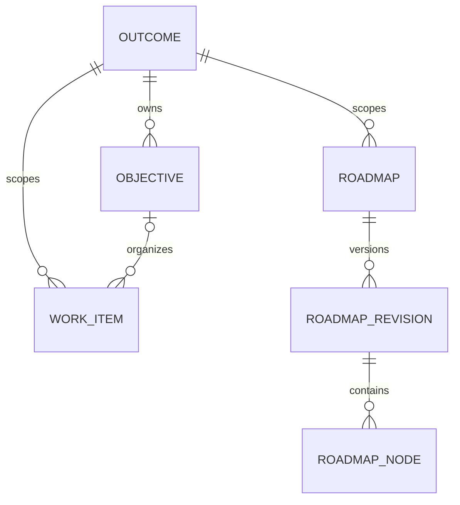

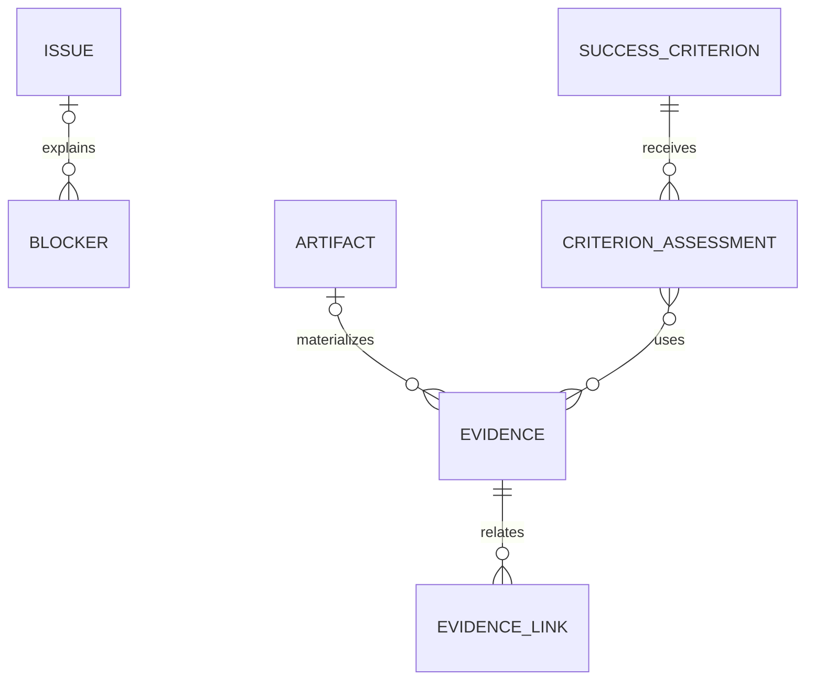

Blocker pode ter outra causa além de Issue. EvidenceLink pode apontar para proprietário/critério, Decision ou Issue. Os diagramas mostram os vínculos principais; não impõem uma única árvore.

### 24.2 Criação por HTTP

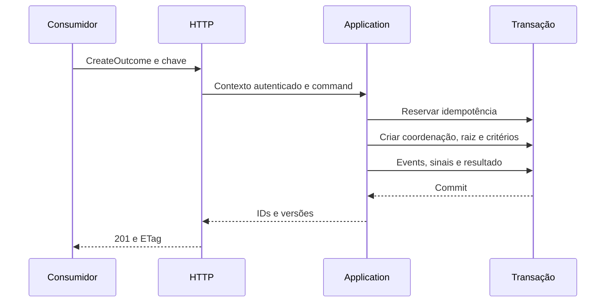

### 24.3 Atualização por MCP

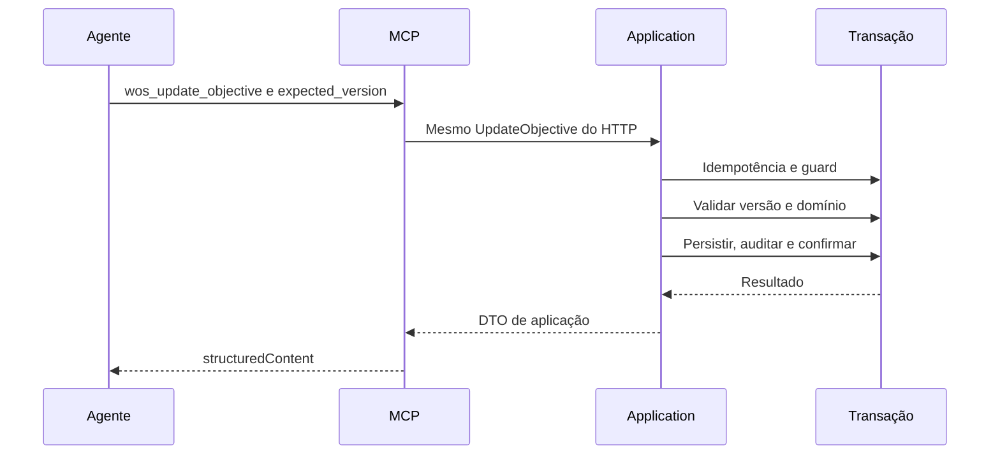

### 24.4 Disputa de aquisição

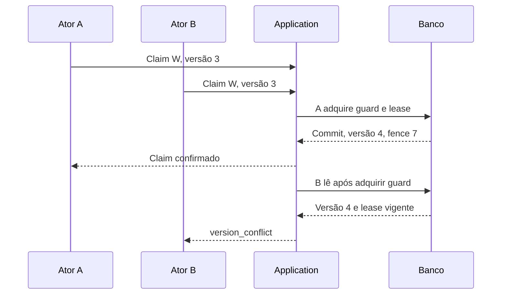

Se B usar uma versão nova mas o lease ainda pertencer a A, recebe `work_already_claimed`. A ordem exata das requisições não é presumida; um único claim vence.

### 24.5 Problema, impedimento e resolução

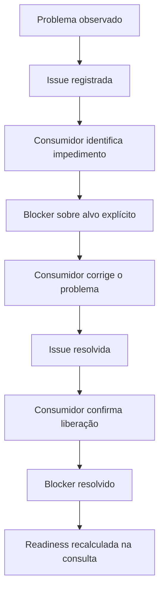

### 24.6 Comprovação e decisão

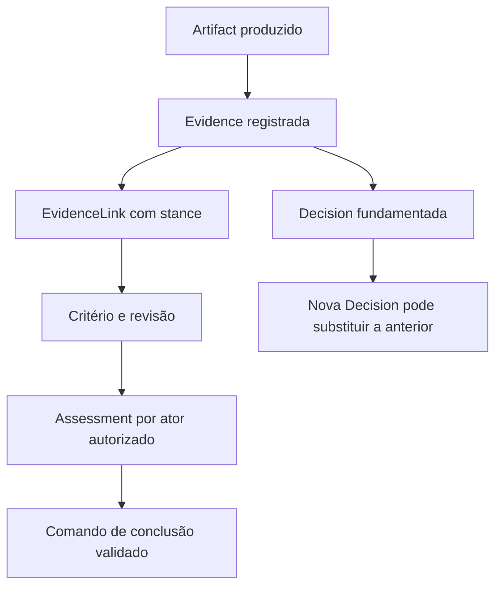

### 24.7 Trigger e consumidor externo

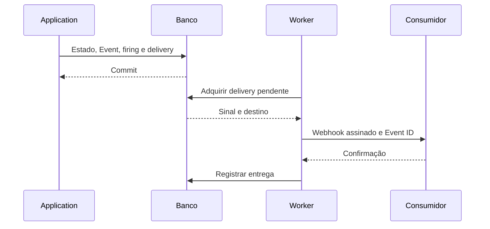

Se a confirmação se perder, a entrega pode repetir. O consumidor deduplica e mantém sua decisão de execução fora do WOS.

## 25. Exemplos completos de uso

### 25.1 Desenvolvimento multimodal da Woobe

Exemplo hipotético, sem afirmar que essas funcionalidades ou testes já existem na Woobe. IDs curtos abaixo são aliases.

**Outcome O1:** disponibilizar execução multimodal com contratos validados.

Critérios do Outcome:

- C1: interfaces e contratos por modalidade aprovados por revisão autorizada;
- C2: cenários acordados de texto, embedding e voz aprovados por avaliação externa;
- C3: compatibilidade documentada das estratégias de execução e sessão.

Objectives obrigatórios:

- OA: abstração de modelos com capabilities explícitas;
- OB: estratégias de execução selecionadas por contrato do modelo;
- OC: sessões e interfaces compatíveis com as modalidades suportadas.

Roadmap principal, revisão 1: phases `abstração`, `execução`, `compatibilidade`, `validação`; references para OA, OB e OC. Roadmap local de OB pode detalhar seus WorkItems.

| WorkItem | Vínculo | Dependência |
| --- | --- | --- |
| W1: implementar registry de estratégias | OA | Nenhuma |
| W2: implementar adapter de embedding | OB | OA achieved |
| W3: implementar adapter de voz | OB | OA achieved |
| W4: validar compatibilidade de sessões | OC | W2 done e W3 done |

Fluxo completo:

1. humano cria O1, critérios, Objectives e plano; ativa O1;
2. agente A consulta snapshot e escolhe W1;
3. A faz claim e executa trabalho na sua infraestrutura;
4. A registra Artifact e Evidence, avalia critérios do WorkItem e conclui W1;
5. revisor avalia os critérios de OA e chama AchieveObjective; agora W2/W3 podem aparecer ready;
6. agente B adquire W3 e identifica incompatibilidade;
7. B registra Issue I1; cria Blocker B1 sobre W3, com causa I1;
8. uma nova Session consulta snapshot, encontra W3 em progresso bloqueado, Issue, Decision atual e seus Artifacts;
9. ator autorizado corrige o contrato; registra Evidence; resolve I1 e confirma resolução de B1;
10. se lease antigo expirou, consumidor faz ReclaimWorkItem e recebe novo fencing token;
11. W3 é concluído; W4 passa a ready quando W2 também estiver done;
12. revisor registra assessments de OB/OC e do Outcome;
13. AchieveOutcome valida os Objectives obrigatórios e seus próprios critérios;
14. trigger configurado em `outcome.achieved` emite sinal para o backend consumidor.

WOS não chama o modelo, executa o PR ou decide a ordem escolhida pelos agentes. Todas as mutações permanecem atribuídas aos atores e principais correspondentes.

### 25.2 Jornada adaptativa da Lipo

**Outcome:** o aluno alcançar o estado-alvo de conhecimento ou habilidade definido pela Lipo.

O backend da Lipo define diagnóstico, objetivo pedagógico, disponibilidade, roadmap, ondas de estudo, critérios de domínio e adaptações. A Woobe executa capacidades agentic via integração do backend com `woobe-go-sdk`. WOS pode persistir a coordenação da jornada.

Mapeamento possível:

| Lipo | WOS |
| --- | --- |
| Estado-alvo da jornada | Outcome com ExternalContext da jornada |
| Competência/conhecimento intermediário | Objective |
| Sequência de aprendizagem | Roadmap persistido como representação de coordenação |
| Preparar material ou executar atividade definida | WorkItem quando há trabalho operacional a coordenar |
| Resultado de avaliação | Evidence com referência ao registro pedagógico |
| Decisão de reforçar uma lacuna | Decision emitida pelo backend/agente autorizado |
| Material produzido | Artifact referenciando storage da Lipo |
| Falta de material ou condição que impede continuar | Blocker |
| Problema identificado no conteúdo/processo | Issue |

A Lipo não precisa transformar todo flashcard em WorkItem. Granularidade é escolhida conforme a necessidade de coordenação, evitando copiar todo o banco pedagógico para o WOS.

Uma sessão finalizada não significa domínio. O backend pedagógico avalia desempenho e registra assessment de um critério. A próxima onda, a composição de formatos e o orçamento de tempo continuam decisões da Lipo.

Reforço de vida pode reutilizar o histórico do Outcome concluído e criar trabalho de manutenção ou um novo Outcome relacionado externamente. Não reabrir uma jornada concluída automaticamente apenas porque uma revisão espaçada foi agendada.

### 25.3 Investigação de incidente por humanos

Outcome: determinar a causa e verificar a recuperação de um incidente.

Humano cria WorkItems de investigação; serviço de monitoramento registra Evidence; engenheiro registra Decision de mitigação; logs/relatórios entram como Artifacts; Issue descreve a anomalia e Blocker representa acesso indisponível à infraestrutura.

O sistema funciona sem AgentRef, Session, Run ou LLM. Esse cenário constitui um teste de aceitação obrigatório do produto, não apenas uma possibilidade teórica.

## 26. Standalone, embedded e distribuição

### 26.1 Executável

Comandos propostos:

```bash
wos server --config ./wos.yaml
wos mcp stdio --config ./wos.local.yaml
wos migrate --config ./wos.yaml
wos version
```

`wos mcp stdio` pode compor o mesmo Core com storage local ou atuar como bridge autenticada para um WOS remoto. Os dois modos são explícitos, sem inferir silenciosamente qual banco ou servidor usar.

HTTP e MCP Streamable HTTP compartilham porta, em rotas diferentes, quando habilitados. MCP não exige um segundo servidor obrigatório.

### 26.2 Configuração proposta

```yaml
server:
  listen: "127.0.0.1:8080"
  shutdown_timeout: "15s"
http:
  enabled: true
  prefix: "/api/v1"
mcp:
  enabled: true
  path: "/mcp"
  stateless: true
storage:
  driver: "sqlite"
  sqlite:
    path: "./data/wos.db"
    busy_timeout: "5s"
auth:
  mode: "local"
  local_principal_id: "local-user"
integration:
  delivery_worker_enabled: false
  batch_size: 50
  timeout: "10s"
idempotency:
  retention: "168h"
```

Credenciais PostgreSQL e secrets de webhook usam referências de ambiente/secret manager. `wos config inspect` futuro deve produzir saída redigida, nunca valores secretos.

### 26.3 Perfis

| Perfil | Storage e autenticação | Uso |
| --- | --- | --- |
| Local | SQLite + loopback + principal local | Desenvolvimento e uso pessoal |
| Embedded | Adapter escolhido pelo host; auth definida pelo host | Aplicação Go sem rede |
| Serviço pequeno | SQLite em volume local e tokens | Uma instância standalone |
| Remoto multiusuário | PostgreSQL + tokens/OAuth resource | Vários consumidores e réplicas |
| WKS composto | WOS Core ou API integrada | Produto hospedeiro sem alterar semântica WOS |

### 26.4 Embedded mode

Aplicação importa Core e adapter público, injeta Clock, IDGenerator, Authorizer e TransactionManager, depois chama os mesmos application services.

Embedded mode não inicia HTTP, MCP ou worker por padrão. O host pode iniciar entrega de integração separadamente. Se usar o mesmo banco com outro processo, deve respeitar guards e contratos; escrever SQL diretamente fora da Application não é uma integração suportada.

Exemplo embedded deve demonstrar criar Outcome, critério, Objective, WorkItem, registrar assessment e consultar snapshot, sem importar `internal/server`.

### 26.5 Réplicas e lifecycle

PostgreSQL permite múltiplas réplicas sem estado de negócio em memória. Claims, idempotência, guards, Events e deliveries estão no banco.

Worker leases permitem concorrência e recuperação de entrega interrompida. Cada réplica usa um worker ID próprio. Nenhum leader global é obrigatório para event triggers.

Shutdown: parar de aceitar requisições; drenar comandos em andamento até deadline; parar aquisição de novas deliveries; concluir ou liberar trabalho operacional de delivery; fechar pools e exporters. Não encerrar leases de WorkItems de consumidores externos por causa do shutdown do Server.

### 26.6 Health e backups

- `/livez`: processo responde;
- `/readyz`: schema compatível, storage acessível e configuração válida;
- health interno de delivery: backlog, age e falhas, sem impedir toda leitura de domínio quando endpoint externo estiver indisponível;
- backup/restore SQLite e PostgreSQL documentados e exercitados;
- teste de restore verifica refs, Events, revision marker, idempotência e slots ativos.

### 26.7 SDKs

Primeira implementação: client Go fino e exemplos HTTP/MCP. SDKs Python/TypeScript são extensões de contrato, não novo motor de domínio.

SDK expõe DTOs, auth, timeout, paginação, erros tipados, precondições e geração opcional de chave idempotente. Retry reutiliza a mesma chave; nunca gera outra a cada tentativa da mesma operação.

## 27. Observabilidade e metas de validação

### 27.1 Instrumentação

Logs estruturados: transport, command, scope, aggregate ID, command ID, outcome revision, duração, resultado e correlation ID. Payloads documentais não entram integralmente em logs por padrão.

Traces cobrem handler, autorização, transação, guard, repositórios e entrega de integração. Domain não depende de OpenTelemetry.

Métricas:

- duração e erros por comando/query;
- tempo de espera no guard e duração da transação;
- version conflicts, disputas/expirações de lease;
- replay e conflitos de idempotência;
- tamanho de snapshot e contagem de truncamento;
- ciclos rejeitados e tamanho de grafo validado;
- pending deliveries, idade do sinal mais antigo, tentativas/exhausted;
- conexões SQL em uso e espera no pool.

Não usar Outcome ID, usuário ou Run ID como label de métrica de alta cardinalidade. Esses identificadores pertencem a logs/traces.

### 27.2 Metas iniciais propostas

Estes números são objetivos de benchmark, não resultados medidos ou promessa de capacidade de produção:

| Cenário | Dataset e carga de referência | Critério inicial |
| --- | --- | --- |
| Snapshot compacto | 100 Outcomes; 500 WorkItems por Outcome; 10.000 Events por Outcome | p95 ≤ 200 ms, resposta dentro do orçamento |
| Ready-work | Mesmo dataset, primeira página 50 | p95 ≤ 150 ms |
| Mutação comum | 32 clientes distribuídos entre Outcomes | p95 ≤ 250 ms, zero perda de atualização |
| Graph Query | Máximo 1.000 nós na resposta | p95 ≤ 500 ms; truncamento correto |
| Contenção concentrada | 32 clientes escrevendo no mesmo Outcome | Integridade e timeout corretos; medir espera do guard separadamente |

Baseline de laboratório: aplicação e PostgreSQL com recursos registrados, inicialmente 4 vCPUs/8 GiB cada, 80% leituras e 20% escritas. Publicar latência, throughput sustentado, concorrência, hardware, versão do banco e tamanho de resposta. Se a meta precisar ser ajustada, registrar o motivo e o novo baseline.

SQLite recebe benchmark próprio, com arquivo em disco local e perfil de um escritor. Não extrapolar números de SQLite para PostgreSQL ou vice-versa.

### 27.3 Otimizações ordenadas

1. eliminar N+1 e scans desnecessários;
2. medir planos de query e corrigir índices;
3. reduzir volume projetado;
4. adicionar FTS/JSONB ou projections quando justificadas;
5. reavaliar granularidade de locks apenas com testes de concorrência mantidos;
6. considerar particionamento de Events ou outros componentes depois de medir retenção real.

Redis, vector database e event bus distribuído não são requisitos do MVP.

## 28. Estratégia de testes

### 28.1 Domain unit tests

Cobrir regras, não getters:

- task done não implica Objective achieved;
- Objective achieved não implica Outcome achieved;
- critério novo/revisado não aceita assessment de revisão antiga;
- EvidenceLink não equivale a CriterionAssessment;
- Evidence retracted não sustenta uma nova conclusão;
- waiver exige permissão e razão;
- Issue resolved não elimina Blocker ativo;
- resolução de um Blocker preserva outros diretos/herdados;
- lifecycle continua explícito quando display state muda;
- cancelled não satisfaz dependência de completed;
- hierarquia de Objectives não cria dependência implícita;
- decisão aceita não recebe edição semântica;
- revisão publicada de Roadmap não é editável;
- archive não apaga resultado alcançado.

### 28.2 Application tests com memória

Fake Clock, IDGenerator determinístico, Authorizer controlado e UnitOfWork com rollback real em memória. Um fake que escreve imediatamente e apenas retorna erro não comprova atomicidade.

Testar comandos compostos, append de Events, sequência de revisão, firings, integração, replay e rollback ao falhar em qualquer etapa.

### 28.3 Contract tests de storage

Executar a mesma suíte em SQLite e PostgreSQL:

- integridade de namespace/Outcome/kind;
- constraint de versão e unicidade;
- current conclusion pertence ao proprietário;
- assessments apontam para revisão existente;
- leituras snapshot coerentes;
- ordenação de timeline e signals;
- rollback de estado/Events/outbox/idempotência;
- precisão de timestamps e valores de contexto;
- queries de readiness equivalentes.

In-memory adapter não substitui esses testes. SQLite não substitui testes reais do PostgreSQL.

### 28.4 Concorrência obrigatória

| Teste | Execução | Resultado obrigatório |
| --- | --- | --- |
| Lost update | Dois updates com mesma versão | Um confirma; outro conflita |
| Ciclo concorrente | Adicionar A→B e B→A simultaneamente | No máximo uma operação confirma |
| Claim concorrente | Muitos atores sobre mesmo WorkItem | Exatamente um lease vigente |
| Fencing | Lease expira; outro faz reclaim; antigo tenta completar | Token antigo rejeitado |
| Conclusão vs Blocker | Concluir alvo e criar Blocker simultaneamente | Ordem serializável, sem conclusão validada sobre estado incoerente |
| Critério vs assessment | Revisar critério e avaliar revision anterior | Avaliação antiga não satisfaz revisão nova |
| Plano | Dois publishers sobre o mesmo draft | Uma publicação; conflito explícito para a outra intenção |
| Chave idempotente | Muitas chamadas iguais; algumas com timeout | Uma mutação, um conjunto de Events, mesmo resultado |
| Event cursor | Escritor A lento e B concorrente | Cursor do Outcome não omite Events confirmados |
| Outbox crash | Worker envia e morre antes de registrar sucesso | Retry com mesmo Event ID; consumidor deduplica |

Usar barreiras determinísticas em testes; não depender apenas de sleeps aleatórios.

### 28.5 HTTP e MCP

Contratos de DTO, erro, versão, idempotência, autorização e limite. Para uma mesma operação, HTTP e MCP devem produzir a mesma mutação e Event, salvo detalhes do transporte.

MCP: descoberta, input/output schemas, resources, stdio, Streamable HTTP, perfil atual e compatibilidade anunciada. Testes devem usar um cliente real do SDK, não apenas invocar a função Go diretamente.

### 28.6 Migrations e restauração

Banco vazio até versão atual; upgrade do schema anterior suportado; checksum divergente rejeitado; schema incompatível bloqueia readiness. Exercitar backup/restore com dados e referências, não só conexão vazia.

### 28.7 Property tests e fuzzing

Gerar grafos e verificar que DAGs aceitos permanecem acíclicos após comandos; fuzz de cursores, JSON, strings Unicode, canonicalização contextual e invariantes de índices. Usar `go test -race` sobre componentes concorrentes.

### 28.8 Testes de independência

- programa externo importa Core/SQLite e funciona sem Server;
- cenário apenas humano, sem Agent, Session ou Run;
- static dependency check impede import de Woobe/LLM/transports no Core;
- restart de Server preserva leases, snapshots, idempotência e plano;
- novo consumidor retoma Outcome somente por contratos persistidos.

## 29. MVP e evolução

### 29.1 Escopo da primeira release funcional

Core, Server, HTTP e MCP; Outcome, Objective, WorkItem, Roadmap versionado, Issue, Blocker, Decision, Evidence, Artifact, Relations, critérios e avaliações; namespaces; token/local auth; readiness; leases; snapshot/grafo/timeline; SQLite e PostgreSQL; concorrência/idempotência/auditoria; triggers por evento com outbox e webhook genérico.

Todas essas entidades não precisam de workflows customizáveis, UI ou plugins. O MVP tem transições fixas e queries determinísticas.

### 29.2 Releases internas de desenvolvimento

| Marco | Resultado utilizável |
| --- | --- |
| M1: vertical slice local | Core + SQLite + HTTP; Outcome, Objective, WorkItem e critérios |
| M2: coordenação completa | Dependencies, Blockers, Issues, leases e registros documentais |
| M3: plano e continuidade | Roadmaps, snapshot/grafo/timeline, MCP |
| M4: standalone completo | PostgreSQL paritário, triggers/outbox, auth e empacotamento |
| Release 0.1 | Contratos, CI, exemplos e documentação validados |

M1 não será anunciado como sistema completo. Ele é uma fatia utilizável para validar rapidamente o modelo antes de expandi-lo.

### 29.3 Evolução posterior

UI, CLI de operação completa, SDKs Python/TypeScript, timers de triggers, notifications via consumidores, annotations, workflows customizados tipados, FTS otimizada, índices semânticos, relações operacionais cross-Outcome, ABAC/RLS, exports congelados e analytics.

Planner autônomo, LLM interno e execução de agents não entram por "evolução natural". Introduzi-los alteraria a responsabilidade do produto e exigiria outro boundary.

### 29.4 Ordem de validação do produto

Primeiro, provar retomada e colaboração no cenário humano. Depois, dois consumidores concorrentes por HTTP/MCP. Por fim, integração Woobe/produto sem acoplamento de domínio.

GPP pode atuar como aplicação de prova se expuser casos reais de Outcome, retomada, trabalho concorrente e evidência. A Lipo oferece outra validação, com metas e critérios pedagógicos mantidos no backend do produto.

### 29.5 Critérios da release 0.1

1. standalone inicia sem Woobe;
2. embedded externo compila e executa;
3. toda operação mutável remota possui proteção idempotente;
4. updates detectam versão antiga;
5. disputa de claim e ciclos concorrentes são protegidos;
6. SQLite/PostgreSQL passam a mesma suíte contratual;
7. HTTP/MCP usam os mesmos services;
8. snapshots são coerentes, limitados e explícitos sobre omissões;
9. Roadmaps publicados são recuperáveis e imutáveis;
10. avaliações conservam critérios e Evidence utilizados;
11. triggers geram sinais duráveis sem execução autônoma;
12. docs descrevem licença, auth, backup, limites e suporte de protocolo;
13. restart/restore não perde o estado necessário à retomada.

## 30. Ondas de implementação e commits

Ondas pequenas, ordenadas por dependência, com um resultado revisável por etapa. Os commits sugeridos são limites de integração; uma onda pode conter commits auxiliares menores quando necessário. Não criar branch ou implementar automaticamente com base neste documento.

### Onda 01 — Fundação pública do Core

**Objetivo:** estabelecer um projeto Go utilizável como biblioteca e servidor, com boundaries verificáveis.

**Arquivos/componentes:** `go.mod`, `core/domain`, `core/ports`, `cmd/wos`, `internal/server`, `docs/adr`, `README.md`.

**Mudanças:** fixar módulo real do repositório; documentar dependências; introduzir IDs, Scope, EntityRef, ActorRef, versões, Clock e erros; skeleton de composição; static dependency check; registrar direção de licença sem assumir a licença da Woobe.

**Testes:** validação de value objects, serialização de enums/IDs e programa externo que importa o Core.

**Conclusão:** `go test ./...` passa; exemplo externo compila; nenhum import proibido entra no Core; processo imprime versão e valida configuração.

**Commit:** `chore: bootstrap standalone WOS module and public core boundaries`.

### Onda 02 — Transações, memória e domínio inicial

**Objetivo:** implementar Outcome, Objective, WorkItem e critérios com regras puras.

**Arquivos/componentes:** modelos centrais, application services, ports de repository/transaction, `storage/memory`.

**Mudanças:** lifecycles fixos; ownership; critérios/revisões; assessments mínimos por attestation; conclusões explícitas; claim/complete básicos com principal e TTL; aggregates versionados; fake transacional com rollback; guard/revision marker em memória.

**Testes:** transições válidas/inválidas, conclusão sem critério negada, cancelamento, arquivamento preservando lifecycle, rollback.

**Conclusão:** cenário humano cria e ativa Outcome, organiza Objectives e WorkItems, sem banco, rede ou Agent.

**Commit:** `feat(core): implement outcome objective work item and criterion lifecycles`.

### Onda 03 — Event log e idempotência

**Objetivo:** tornar mutações auditáveis e repetíveis sem duplicação.

**Arquivos/componentes:** Event, command envelope, EventLog, IdempotencyStore, transactional pipeline.

**Mudanças:** command ID; uma revision por comando; eventos ordenados; fingerprint normalizado; resultados persistidos; distinção entre auditoria de domínio e administrativa.

**Testes:** replay igual; payload diferente; múltiplos Events no mesmo comando; nenhuma persistência após rollback; no-op explícito sem Event enganoso.

**Conclusão:** repetir CreateWorkItem devolve o mesmo ID e não gera outro Event; timeline tem ordem estável.

**Commit:** `feat(core): add transactional audit events and command idempotency`.

### Onda 04 — Persistência SQLite e migrations

**Objetivo:** entregar a primeira persistência durável local.

**Arquivos/componentes:** `storage/sqlite`, migrations de fundação, UnitOfWork SQL, repositórios centrais e de Events/idempotência.

**Mudanças:** registry/coordenação; foreign keys por conexão; writer acquisition; timestamp codec; SQL explícito; runner/checksum; restart-safe state.

**Testes:** repository contracts, rollback composto, constraint de escopo, backup/restore inicial, busy timeout e cancelamento de transação.

**Conclusão:** o cenário da Onda 02 persiste e é retomado após reiniciar o processo; nenhuma escrita ignora expected_version.

**Commit:** `feat(storage): add SQLite persistence migrations and outcome coordination guards`.

### Onda 05 — HTTP vertical slice

**Objetivo:** disponibilizar M1 por uma API pequena funcional.

**Arquivos/componentes:** routes/handlers HTTP, DTOs, error mapping, auth local, OpenAPI inicial.

**Mudanças:** endpoints de Outcome/Objective/WorkItem/criteria e assessment por attestation; claim/complete básicos; precondições; Idempotency-Key; ETag da representação persistida; middleware de correlation/deadline; primeira query de estado.

**Testes:** end-to-end humano via HTTP; versão ausente/antiga; replay; payload inválido; namespace explícito; resposta sem dependência de Agent.

**Conclusão:** binário standalone cria, edita e consulta estado durável via HTTP; documentação contém exemplos reproduzíveis.

**Commit:** `feat(http): expose versioned outcome coordination API`.

### Onda 06 — Dependências, grafo e readiness

**Objetivo:** determinar trabalho disponível sem tomar decisões autônomas.

**Arquivos/componentes:** Relation, dependency policy, readiness policy, queries SQL/memory, endpoints ready-work.

**Mudanças:** hard/advisory; DAG; validação de kinds; reabertura de dependente concluído; calendário `not_before`; ordenação e reasons; estrutura de parentesco de Objective.

**Testes:** ciclos diretos/indiretos/concorrentes; cancelled não concluído; hora exata de not_before; perda de pré-requisito; parêntesco sem dependência implícita.

**Conclusão:** readiness equivale entre memory e SQLite; duas adições concorrentes não criam ciclo.

**Commit:** `feat(core): add dependency validation and deterministic work readiness`.

### Onda 07 — Issues e Blockers

**Objetivo:** modelar problema e impedimento de forma independente.

**Arquivos/componentes:** Issue/Blocker models, repositories, propagation queries, commands compostos e endpoints.

**Mudanças:** lifecycle de Issue; alvos/causas tipados; direct/subtree; resolução explícita; duplicatas sem ciclos; bloqueio de alvo terminal; blocked projection.

**Testes:** Issue sem Blocker; Blocker externo; dois Blockers no mesmo alvo; herança; Issue resolvida mantendo Blocker; conclusão concorrente com impedimento.

**Conclusão:** snapshots explicam alvo, causa e origem herdada; resolver um impedimento não libera indevidamente outro.

**Commit:** `feat(core): separate issues from blockers and implement blocking projections`.

### Onda 08 — Leases e fencing

**Objetivo:** completar e endurecer a coordenação de aquisição introduzida na fatia inicial.

**Arquivos/componentes:** lease value object, commands Claim/Renew/Release/Reclaim, WorkItem repositories e HTTP actions.

**Mudanças:** binding ao principal; TTL; fencing crescente; versões em renovação; attention-needed; override administrativo auditável.

**Testes:** muitos claimers com uma aquisição; expiração exata; renovação por outro principal negada; reclaim; conclusão com token antigo; retry idempotente do claim.

**Conclusão:** um item possui no máximo um lease vigente e proprietário antigo não conclui após reclaim.

**Commit:** `feat(coordination): add work item leases and fencing tokens`.

### Onda 09 — Registros documentais e Decisions

**Objetivo:** preservar informação, entregáveis e escolhas com procedência.

**Arquivos/componentes:** Artifact, Evidence, EvidenceLink, Decision, schemas e repositórios.

**Mudanças:** conteúdo imutável; retração/withdrawal; stance por vínculo; alternatives/rationale; aceite e supersession atômicos; relations de procedência.

**Testes:** Artifact não conclui nada; mesma Evidence com stances distintas; retraction; Decision aceita sem edição; duas supersessions concorrentes; vínculo entre escopos negado.

**Conclusão:** M2 conserva decisões e fatos suficientes para outro consumidor entender o estado sem histórico de chat.

**Commit:** `feat(records): add evidence artifacts and explicit decision history`.

### Onda 10 — Assessments e conclusões verificáveis

**Objetivo:** consolidar achievement com todas as formas de comprovação, além da attestation inicial.

**Arquivos/componentes:** CriterionRevision/Assessment, current bindings, Conclusions, gates e DTOs.

**Mudanças:** revisão imutável do critério; resultados met/not_met/inconclusive/waived; autorização de avaliação/waiver; snapshots de obrigações; conclusão contestada; regras de Outcome obrigatório.

**Testes:** avaliação antiga invalidada por nova revisão; evidência retraída; assessment sem Evidence no modo review; waiver sem permissão; objetivos obrigatórios não alcançados; conclusão vs revisão concorrente.

**Conclusão:** somente comando autorizado conclui; histórico mostra precisamente quais critérios, revisões e assessments fundamentaram a conclusão.

**Commit:** `feat(validation): enforce versioned criterion assessments and explicit achievement`.

### Onda 11 — Roadmaps e histórico de plano

**Objetivo:** preservar replanejamento sem duplicar execução.

**Arquivos/componentes:** Roadmap/Revision/Node, repositories, slots, activation history, publish command.

**Mudanças:** drafts versionados; references/phases/milestones; scope Outcome/Objective; publicação imutável com hash; snapshot de critérios/dependências; lote explícito de alteração de dependencies.

**Testes:** publicação concorrente; tentativa de editar versão publicada; scope inválido; parent/after cycles; cancelamento de tarefa separado de retirada de nó; título/critério histórico preservado.

**Conclusão:** revisões anteriores continuam consultáveis; slot ativo é único; publicações com mudança operacional são atômicas.

**Commit:** `feat(planning): add immutable roadmap revisions and scoped activation`.

### Onda 12 — Queries de continuidade

**Objetivo:** reduzir o custo de reconstruir contexto persistente.

**Arquivos/componentes:** QueryStore, snapshots, graph builder, timeline, search/filter e cursor codec.

**Mudanças:** read snapshot coerente; omissões e orçamento; readiness reasons; active plans; current Decisions; contestations; progress metrics com denominadores; bulk loading sem N+1.

**Testes:** snapshot sob escrita concorrente; time-based changes; limite de bytes; cursor incompatível; denominador zero; ordem determinística; grafo cortado sem referências falsas.

**Conclusão:** outro consumidor retoma o cenário completo por snapshot + cursores, sem acessar a Session anterior; M3 de queries pronto.

**Commit:** `feat(queries): add coherent outcome state graph and timeline projections`.

### Onda 13 — MCP de primeira classe

**Objetivo:** expor a mesma coordenação para clientes MCP.

**Arquivos/componentes:** SDK pinado, MCP catalog/tools/resources, schemas compartilhados, stdio e HTTP endpoint.

**Mudanças:** 33 tools base e manutenção documental opcional; output schemas; envelopes de erro; argumentos explícitos de scope/versão/claim; ordem estável; limites; perfil atual stateless.

**Testes:** cliente real do SDK; stdio; HTTP; perfil 2026-07-28; compatibilidade 2025-11-25 anunciada; paridade de Events com HTTP; namespace/capability auth.

**Conclusão:** cliente MCP consulta, adquire, registra resultado e retoma um Outcome; nenhuma regra de domínio foi copiada para tools.

**Commit:** `feat(mcp): expose outcome coordination tools resources and protocol profiles`.

### Onda 14 — Paridade PostgreSQL

**Objetivo:** suportar implantação remota e múltiplas réplicas.

**Arquivos/componentes:** `storage/postgres`, migrations, SQL repositories/queries, guard row locking.

**Mudanças:** READ COMMITTED commands; REPEATABLE READ queries; placeholders/codec; timeout/pool; índices; mecanismos operacionais de claiming de deliveries preparados.

**Testes:** mesma suíte de storage; todo o conjunto de concorrência; queries snapshot; criação de ciclo simultânea; commit order; migrations e backup/restore.

**Conclusão:** SQLite e PostgreSQL cumprem o mesmo contrato; comportamento específico de um driver não vazou para Domain/Application.

**Commit:** `feat(storage): add PostgreSQL adapter with coordination contract parity`.

### Onda 15 — Autenticação, grants e contexto externo

**Objetivo:** suportar participantes remotos sem confundir autoria e acesso.

**Arquivos/componentes:** authentication adapters, Authorizer, namespace grants, context pair index, external refs, audit administrativo.

**Mudanças:** tokens opacos; principal/ActorRef; delegação; roles como convenience; permissões específicas; ExternalContext e ExecutionContext separados; protected-resource profile quando OAuth é habilitado.

**Testes:** tentativas cross-namespace; ActorRef forjado; token revogado; replay sem acesso corrente; filtros de tipo; reference externa duplicada; grants não inferidos de metadata.

**Conclusão:** leitura/escrita/remapeamento contextual são autorizados pelo namespace; modo local e remoto têm contratos explícitos.

**Commit:** `feat(auth): add namespace grants delegated actors and external context indexing`.

### Onda 16 — Triggers, Integration Events e entregas

**Objetivo:** emitir sinais duráveis a partir de regras configuradas.

**Arquivos/componentes:** Trigger, public event mapper, firing records, IntegrationStore, outbox worker, webhook adapter.

**Mudanças:** predicados limitados; versions snapshots; dedup firing; signal cursor; target endpoint policy; assinatura; worker lease; retry/exhaustion; redelivery; pausa no archive.

**Testes:** match/não match; configuração inválida; dedup; rollback perde tudo corretamente; falha após envio; resposta tardia; múltiplos workers; destination policy; nenhum trigger executa WorkItem ou LLM.

**Conclusão:** consumidor recebe sinal pelo menos uma vez com identidade estável; mutação confirmada não se perde quando a entrega falha.

**Commit:** `feat(integration): add declarative event triggers and durable webhook delivery`.

### Onda 17 — Empacotamento, SDK e exemplos

**Objetivo:** tornar o sistema instalável, incorporável e compreensível.

**Arquivos/componentes:** binary subcommands, Docker, compose, health, shutdown, client Go e `examples/`.

**Mudanças:** perfis de configuração; migration explícita; exemplos humano/embedded/produto/MCP; retries corretos do SDK; docs de licença, grants, backup e suporte MCP.

**Testes:** smoke binário/container; compose SQLite/PostgreSQL; exemplo externo de embedded; SDK com timeout/replay; shutdown sob transação; restore de estado real.

**Conclusão:** terceiro consegue executar WOS sem Woobe e retomar um Outcome com documentação publicada.

**Commit:** `feat(server): package standalone deployment embedded usage and Go client`.

### Onda 18 — Release, validação e demonstração

**Objetivo:** confirmar o contrato completo da release 0.1.

**Arquivos/componentes:** CI, contract suites, benchmark fixtures, dependency checks, changelog e guia de integração.

**Mudanças:** rodar race detector; benchmark com dataset declarado; revisar todos os schemas; validar migrations upgrade; publicar matriz funcional por banco/transport; demonstração de retomada multiator em produto de prova.

**Testes:** todas as suítes obrigatórias; falhas injetadas; concorrência concentrada; restart/restore; paridade HTTP/MCP; demonstração com consumidor externo e decisões fora do WOS.

**Conclusão:** cada critério da seção 29.5 possui evidência verificável; números de performance são medidos; funcionalidades ausentes não são apresentadas como concluídas.

**Commit:** `test: validate WOS release contracts concurrency recovery and performance`.

### 30.1 Dependências e paralelismo de implementação

- Ondas 01–05 formam a fatia local com attestation e aquisição básicas.
- Ondas 06–10 consolidam coordenação e comprovação; documentary records podem avançar em paralelo com lease hardening se as interfaces centrais já estiverem estabilizadas.
- Ondas 11–13 dependem do domínio consolidado para evitar tools e planos baseados em estados provisórios.
- Adapter PostgreSQL pode começar antes da Onda 14, mas sua conclusão exige todas as contract suites disponíveis.
- Auth e integração têm desenho desde o início; implementação completa acontece depois de provar os contratos centrais.
- Nenhuma onda encerra alegando paridade ou autonomia que não foi testada.

Esse paralelismo é de componentes do projeto; não exige múltiplos agentes de desenvolvimento nem estimativas de prazo sem conhecer a equipe.

## 31. ADRs

Decisões deste plano devem ser convertidas em arquivos de ADR no repositório. São decisões propostas para a arquitetura, não afirmações sobre código existente.

### ADR-001 — Modelo orientado a Outcomes

**Problema:** tarefas não preservam suficientemente a condição final que se pretende alcançar.

**Decisão:** Outcome é raiz semântica; Objective explicita condições intermediárias; WorkItem registra execução. Conclusões usam critérios/assessments próprios.

**Alternativas:** task-centric com tags; Outcome como string em um projeto; ontologia de Goals acoplada a agentes.

**Justificativa e consequência:** resultado permanece endereçável entre sessões e atores, com mais disciplina de modelagem do que um checklist. Não calcular achievement a partir de contagem de tarefas.

### ADR-002 — Core independente e agent-agnostic

**Problema:** dependência de Session/Run impediria uso humano ou por outra infraestrutura.

**Decisão:** ActorRef genérico; ExecutionContext externo opcional; nenhuma importação de runtime/LLM no Core.

**Alternativa:** WOS como um módulo privado da Woobe.

**Justificativa e consequência:** standalone e embedded funcionam independentemente. Woobe/WKS integram por contrato e não determinam a ontologia WOS.

### ADR-003 — Ownership e versionamento de Roadmap

**Problema:** tratar Roadmap como dono das tarefas cria duplicação e perda de identidade durante replanejamento.

**Decisão:** Roadmap referencia entidades do Outcome; revisões publicadas imutáveis; slot ativo por scope; node keys estáveis.

**Alternativas:** lista textual; atualizar plano in-place; um Roadmap obrigatório por Objective.

**Justificativa e consequência:** plano antigo permanece auditável e tarefa conserva histórico. Dependências operacionais continuam em uma fonte canônica própria.

### ADR-004 — Issue separado de Blocker

**Problema:** nem todo problema impede execução, e nem todo impedimento é defeito.

**Decisão:** Issue descreve problema; Blocker possui alvo, causa, propagação e confirmação de resolução.

**Alternativa:** campo `is_blocking` na Issue.

**Justificativa e consequência:** uma Issue pode produzir impedimentos distintos; resolver problema não libera automaticamente cada alvo. Mais um registro é necessário quando existe impedimento real.

### ADR-005 — Event log sem Event Sourcing integral

**Problema:** auditoria é obrigatória, mas replay integral aumentaria o contrato operacional inicial.

**Decisão:** estado relacional atual e Events imutáveis na mesma transação.

**Alternativas:** Event Sourcing completo; logs textuais fora da transação.

**Justificativa e consequência:** leitura operacional é direta; histórico é durável; consultas temporais arbitrárias não são prometidas sem um projeto adicional.

### ADR-006 — Storage relacional e dois adapters

**Problema:** referências, unicidade e concorrência precisam de integridade verificável.

**Decisão:** SQLite local e PostgreSQL remoto; SQL tipado; registry de referências; JSON somente para conteúdo/extensão.

**Alternativas:** graph database obrigatório; documento único por Outcome; banco próprio por entidade.

**Justificativa e consequência:** joins e índices atendem o grafo inicial; adapters diferem em locking e capacidades, mas cumprem o mesmo contrato funcional.

### ADR-007 — Versão otimista e guard do Outcome

**Problema:** versões independentes não detectam ciclos concorrentes ou validações cross-aggregate sobre estado incompatível.

**Decisão:** CAS por agregado e guard por Outcome em todas as mutações de domínio do MVP.

**Alternativas:** optimistic locking isolado; SERIALIZABLE universal; locks apenas em memória.

**Justificativa e consequência:** regras globais têm ordem transacional simples e testável. Escritas do mesmo Outcome são serializadas; medir contenção antes de granularizar locks.

### ADR-008 — Namespace separado de contexto externo

**Problema:** JSON arbitrário fornecido pelo cliente não constitui identidade autorizada.

**Decisão:** namespace explícito com grants; ExternalContext indexável do Outcome; ExecutionContext por comando.

**Alternativas:** usar `tenant_id` do body como filtro de segurança; copiar contexto completo para toda entidade.

**Justificativa e consequência:** isolamento é verificável; produtos escolhem seu mapeamento de tenancy sem alterar o Core.

### ADR-009 — MCP como adapter de primeira classe

**Problema:** agentes precisam de contratos de coordenação previsíveis, sem lógica paralela.

**Decisão:** tools/resources chamam os mesmos services do HTTP; protocolo pinado e SDK oficial; state handles explícitos.

**Alternativas:** MCP apenas como proxy informal de endpoints; Core com dependência de tipos MCP.

**Justificativa e consequência:** erros, idempotência e versões são os mesmos; evolução do protocolo fica isolada no adapter.

### ADR-010 — Core público separado do Server

**Problema:** Core inteiro em `internal/` não pode ser importado por outro módulo Go.

**Decisão:** `core/*` e `storage/*` públicos; Server/transports internos; um módulo inicialmente.

**Alternativas:** expor apenas client HTTP; múltiplos módulos desde o início; pacotes em `pkg/` sem boundary real.

**Justificativa e consequência:** embedded mode é concreto e testável. API Go pública tem compromissos de compatibilidade que devem ser documentados.

### ADR-011 — Critérios e avaliações explícitas

**Problema:** strings de critério e Evidence anexada não registram qual condição foi avaliada nem por quem.

**Decisão:** SuccessCriterion versionado, Assessment imutável e vínculos correntes; conclusão conserva assessments usados.

**Alternativas:** `done=true`; LLM avaliador interno; porcentagem de tarefas como comprovação.

**Justificativa e consequência:** consumidores avaliam; WOS verifica a estrutura e autorização dessa avaliação. Revisão semântica de critério invalida avaliações anteriores.

### ADR-012 — Leases com fencing

**Problema:** assignee não impede aquisição simultânea nem protege contra trabalhador antigo após retomada.

**Decisão:** lease com principal, claim ID, TTL e fencing token monotônico.

**Alternativas:** apenas `in_progress`; mutex local; lock sem prazo.

**Justificativa e consequência:** aquisição funciona entre réplicas e pode ser recuperada. Efeitos externos continuam sujeitos à cooperação do receptor.

### ADR-013 — Triggers emitindo sinais

**Problema:** eventos úteis precisam acordar consumidores sem tornar WOS um orchestrator.

**Decisão:** regras declarativas limitadas, firing deduplicado, Integration Event e delivery persistidos; nenhuma mutação de plano ou execução implícita.

**Alternativas:** callback síncrono dentro da transação; scripts de automação arbitrários; agente interno.

**Justificativa e consequência:** integração é durável e independente de fornecedor. Decisão e execução pertencem ao receptor.

### ADR-014 — Estado operacional derivado

**Problema:** armazenar `blocked` e `ready` junto com Blockers/dependencies cria múltiplas fontes de verdade.

**Decisão:** persistir lifecycle; derivar readiness, bloqueio, lease status e display state em read snapshot.

**Alternativa:** atualizar status de todo descendente após cada mudança.

**Justificativa e consequência:** não há fan-out obrigatório de updates. Passagem do tempo pode mudar projeção sem novo Event; query informa evaluated_at.

### ADR-015 — Principal separado de ActorRef

**Problema:** ator declarado pode representar pessoa/agente que não possui credencial própria.

**Decisão:** credencial resolve principal; ActorRef registra autoria autorizada/delegada; produtor de Evidence é outra referência quando necessário.

**Alternativas:** cadastrar obrigatoriamente todos os agentes no IAM; aceitar `actor_ref` como permissão.

**Justificativa e consequência:** atores externos são suportados sem acoplamento, com autoria auditável e controle de delegação.

## 32. Respostas às questões do brief

| Nº | Questão | Resposta desta revisão |
| --- | --- | --- |
| 1 | Aggregate roots | Outcome, Objective, WorkItem, Roadmap, Issue, Blocker, Decision, Evidence, Artifact, Relation, EvidenceLink e Trigger; critérios pertencem ao proprietário |
| 2 | Outcome gigante? | Não. Raiz semântica e guard de coordenação, sem hidratação integral do grafo |
| 3 | Roadmap versioning | Draft editável com versão; publicação imutável com revision number, hash e histórico de ativação |
| 4 | Scope de Roadmap | Outcome ou Objective; plano local opcional |
| 5 | RoadmapNode | reference/phase/milestone; node key estável e registro por revisão |
| 6 | Validação de dependências | Kinds/escopo autorizados, alvo existente, satisfação tipada e DAG |
| 7 | Ciclos | DFS/CTE sobre grafo protegido por guard transacional; cycles de parentesco e supersession também proibidos |
| 8 | Efeito de Blocker | Projeção direta/herdada; sem duplicar lifecycle nos alvos |
| 9 | Issue vs Blocker em código/banco | Agregados e tabelas diferentes; causa opcional da Issue para um impedimento com alvo |
| 10 | Evidence e critério | EvidenceLink identifica proprietário/critério e stance; Assessment registra a avaliação de uma revisão |
| 11 | Artifact e Evidence | Artifact é objeto/referência material; Evidence é observação, que pode referenciá-lo |
| 12 | Supersession de Decision | Nova aceita e antiga superseded em uma transação; sucessor direto único; conteúdo histórico preservado |
| 13 | Eventos armazenados | domain_events com envelope, payload, versões, principal e cursor do Outcome |
| 14 | Event Sourcing? | Não no MVP: estado atual + event log transacional |
| 15 | Optimistic locking | UPDATE com versão esperada; erro explícito; guard complementa invariantes globais |
| 16 | Idempotency keys | Ledger transacional por namespace/principal/command/key, hash e resposta original |
| 17 | Índice de contexto | JSON na raiz e pares escalares tipados normalizados |
| 18 | Namespaces | Boundary interno explícito, obrigatório no contrato e repositório |
| 19 | Autorização | Authorizer compartilhado; grants por principal/namespace/ação; ActorRef não concede acesso |
| 20 | HTTP/MCP compartilhados | Ambos convertem DTOs para os mesmos Commands/Queries da Application |
| 21 | Tools MCP | 33 base, duas de manutenção documental e extensões delimitadas quando justificadas |
| 22 | Resources MCP | Outcome, state, roadmap revision e timeline, com namespace explícito |
| 23 | Transações | Toda mutação, inclusive Events, signals, firings, deliveries e idempotência; composições listadas na seção 23 |
| 24 | SQLite/PostgreSQL | Contrato comum e migrations/adapters por dialeto; locking e connection setup específicos |
| 25 | Core sem banco | Memória transacional, fake Clock/IDs/Authorizer e suites de regras/application |
| 26 | Graph Query eficiente | Bulk loading de nós/edges, BFS limitada/CTEs, índices; sem N+1 ou graph DB obrigatório |
| 27 | State Snapshot | Projeção determinística em read transaction, revision marker, evaluated_at, counts e omissões |
| 28 | Filtros/paginação | Whitelist tipada e keyset cursors vinculados ao escopo/filtros; timeline por revisão/index |
| 29 | Domain Events | Fatos de comandos confirmados; detalhes internos de auditoria |
| 30 | Integration Events | Mapper público e versionado; whitelist/redaction; triggers acrescentam sinais |
| 31 | IDs | UUIDv7 por aplicação; cursor não depende de ordenação do UUID |
| 32 | Versionamento geral | API `/v1`; schema de snapshot/evento; pacote Go semver; protocolo MCP pinado; migrations numeradas |
| 33 | Metadata paralela? | Limites e JSON validado; campos de comportamento são tipados, nunca inferidos de metadata |
| 34 | Agent-agnostic | Sem dependências de runtime/LLM; teste apenas humano; refs externas opcionais |
| 35 | Integração Woobe | HTTP/MCP/client; Agent/Network/Session/Run em autoria/contexto opcional |
| 36 | MVP exato | Seção 29.1: coordenação durável completa com fixed workflows e event triggers |
| 37 | Fora do MVP | UI, workflows customizados, vector search obrigatório, triggers temporais avançados, cross-Outcome operacional, planner/runtime interno |

### 32.1 Decisões administrativas ainda dependentes do projeto real

O repositório deverá registrar URL/módulo Go reais, licença SPDX concreta, versões pinadas de dependências, ambientes de CI e política de retenção contratada. Essas informações não estavam no material fornecido e não foram inventadas.

Isso não impede implementar as regras ou contratos deste documento. Não há dependência técnica de escolher um fornecedor de cloud, LLM, IAM ou event bus para começar.

## 33. Referências técnicas

Fontes primárias consultadas para a revisão em 1 de outubro de 2026. São referências para comportamentos de infraestrutura/protocolo; as escolhas de domínio e valores de benchmark são propostas deste documento.

| ID | Referência | Uso |
| --- | --- | --- |
| T01 | [Go — Executing transactions](https://go.dev/doc/database/execute-transactions) | Unidade transacional e uso consistente de sql.Tx |
| T02 | [MCP — Publicação da especificação 2026-07-28](https://blog.modelcontextprotocol.io/posts/2026-07-28/) | Perfil atual e versão do protocolo |
| T03 | [MCP — Streamable HTTP 2026-07-28](https://modelcontextprotocol.io/specification/2026-07-28/basic/transports/streamable-http) | Transporte e metadata por requisição |
| T04 | [MCP — Tools 2026-07-28](https://modelcontextprotocol.io/specification/2026-07-28/server/tools) | Schemas, structuredContent e erros de tools |
| T05 | [SDK oficial Go — Releases](https://github.com/modelcontextprotocol/go-sdk/releases) | Configuração stateless e matriz de suporte do SDK |
| T06 | [SQLite — Isolation](https://sqlite.org/isolation.html) | Modelo de um escritor e snapshots |
| T07 | [PostgreSQL — Transaction Isolation](https://www.postgresql.org/docs/current/transaction-iso.html) | Semântica de snapshots e níveis de isolamento |
| T08 | [SQLite — Foreign Key Support](https://sqlite.org/foreignkeys.html) | Ativação de foreign keys por conexão |
| T09 | [MCP — Authorization 2026-07-28](https://modelcontextprotocol.io/specification/2026-07-28/basic/authorization) | Perfil HTTP de autorização |

### 33.1 Limites da validação desta revisão

O DDL foi executado em SQLite em memória com foreign keys habilitadas: 46 tabelas e 23 índices explícitos. Foram verificados sete casos de rejeição por constraints: Objective de outro namespace, lease incompleto, dependência ativa duplicada, kind de referência incorreto, lifecycle `ready` indevidamente persistido, assessment sem revisão de critério existente e conclusão de outro proprietário. O foreign key check final passou.

Os 15 exemplos JSON foram parseados; sumário, numeração das 34 seções, 18 ondas, 15 ADRs, catálogo base de 33 tools e fechamento dos blocos de código foram conferidos. Essas verificações do documento não substituem contract/concurrency tests, validação visual no renderer Mermaid ou execução real no PostgreSQL.

Nenhum servidor WOS, migration de produção, backend consumidor ou runtime Woobe foi implementado/testado nesta revisão. Todos os critérios de software nas ondas são exigências futuras de implementação.

## 34. Resumo dos componentes e resultado esperado

| Componente | Para que serve | O que permite realizar |
| --- | --- | --- |
| Core Domain | Entidades, value objects e invariantes | Modelar resultado, objetivos, trabalho e comprovação sem infraestrutura |
| Application | Executar Commands/Queries com autorização/transação | Compartilhar regras entre HTTP, MCP e embedded |
| Ports | Contratos de storage, tempo, IDs e autorização | Trocar infraestrutura sem modificar domínio |
| SQLite adapter | Persistência local | Executar standalone/embedded em uma instalação simples |
| PostgreSQL adapter | Persistência concorrente remota | Atender múltiplas réplicas e consumidores |
| HTTP API | Contrato de integração para aplicações | Construir backend, frontend autorizado e clients |
| MCP | Tools/resources para clientes compatíveis | Retomar, consultar e atualizar estado por agentes independentes |
| Server | Composição, configuração e lifecycle | Distribuir um executável standalone |
| Criteria e assessments | Preservar verificações explícitas | Diferenciar trabalho concluído de objetivo/resultado comprovado |
| Leases | Coordenar aquisição temporária | Evitar claims simultâneos e rejeitar consumidores antigos |
| Roadmap revisions | Preservar plano e replanejamento | Continuar trabalho com plano atual e consultar versões anteriores |
| Event log | Registrar fatos de domínio | Auditar autoria, versões, decisões e mudanças |
| Integration/outbox | Preservar sinais e entregas | Integrar consumidores sem perder eventos após commit |
| Triggers | Selecionar sinais por regra configurada | Acordar backend/automação sem executar trabalho dentro do WOS |
| Snapshots e grafo | Projetar estado coerente e limitado | Reduzir chamadas necessárias para retomar um Outcome |
| Namespace e grants | Isolar e autorizar estado | Usar o mesmo WOS para contextos externos diferentes |
| Client SDK | Facilitar acesso ao contrato remoto | Integrar aplicações com paginação, versões e retries corretos |

O resultado esperado é um WOS independente, utilizável por humanos, agentes e aplicações, que preserve uma representação coerente de **o que se pretende alcançar, qual plano foi escolhido, qual trabalho ocorreu, quais impedimentos existem e quais evidências fundamentam as conclusões**.

Uma nova sessão deve poder continuar esse trabalho apenas com namespace, Outcome ID e credenciais autorizadas. A decisão permanece no consumidor; o estado compartilhado permanece no WOS.