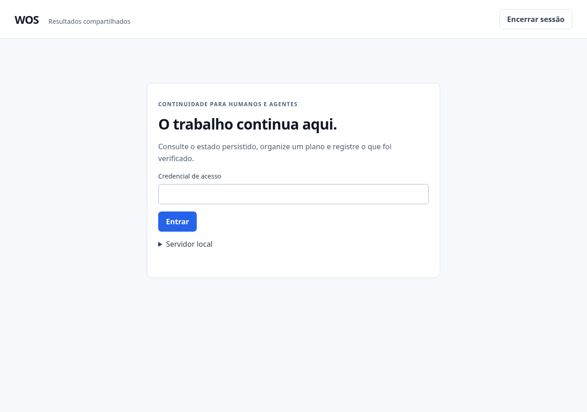
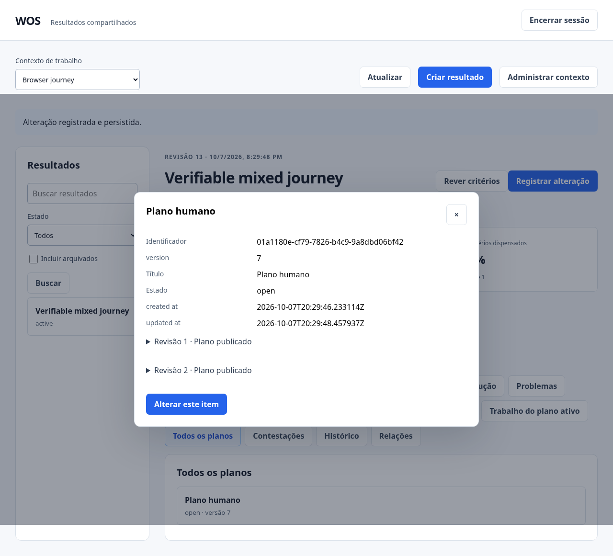
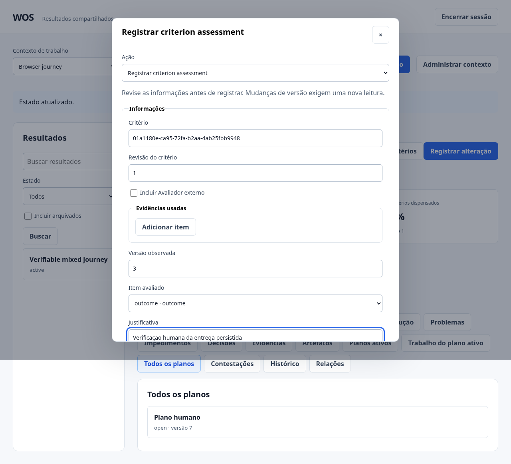
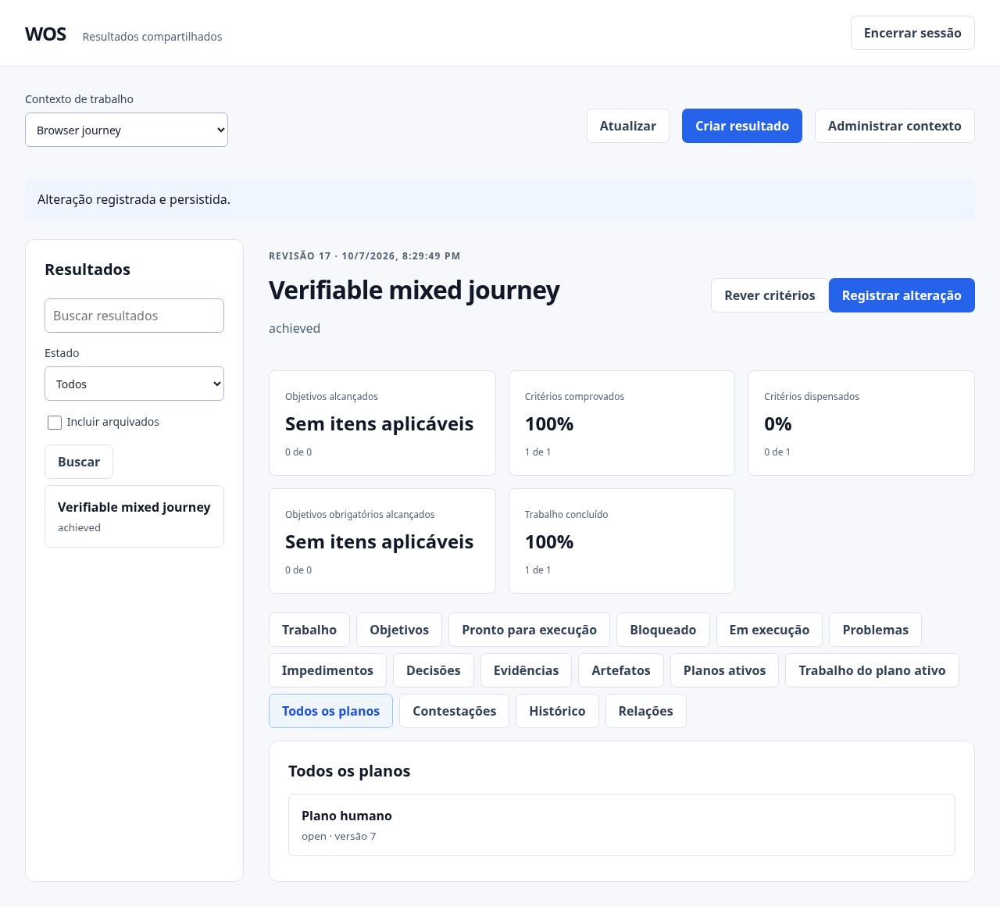
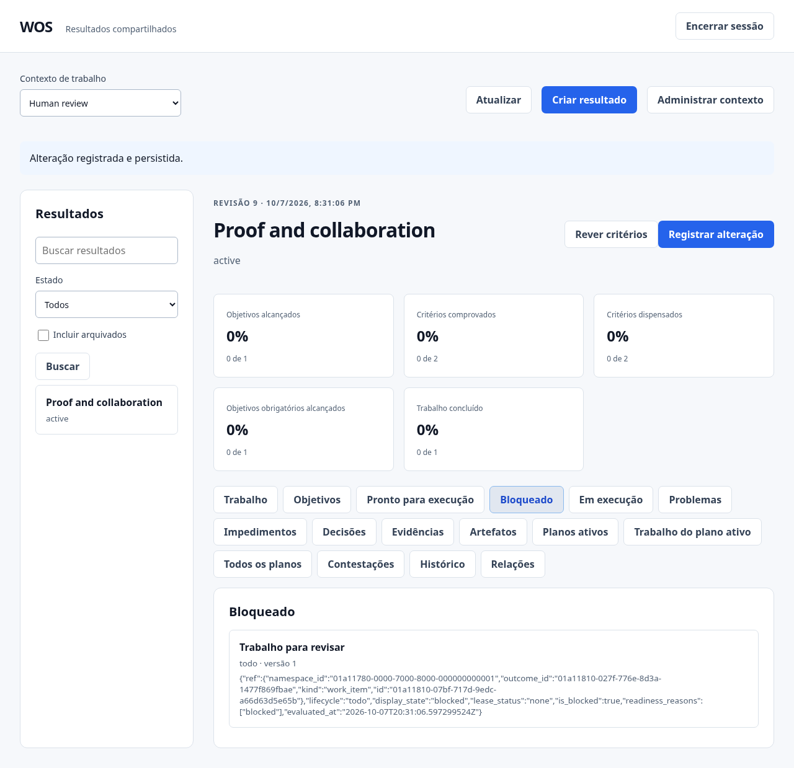
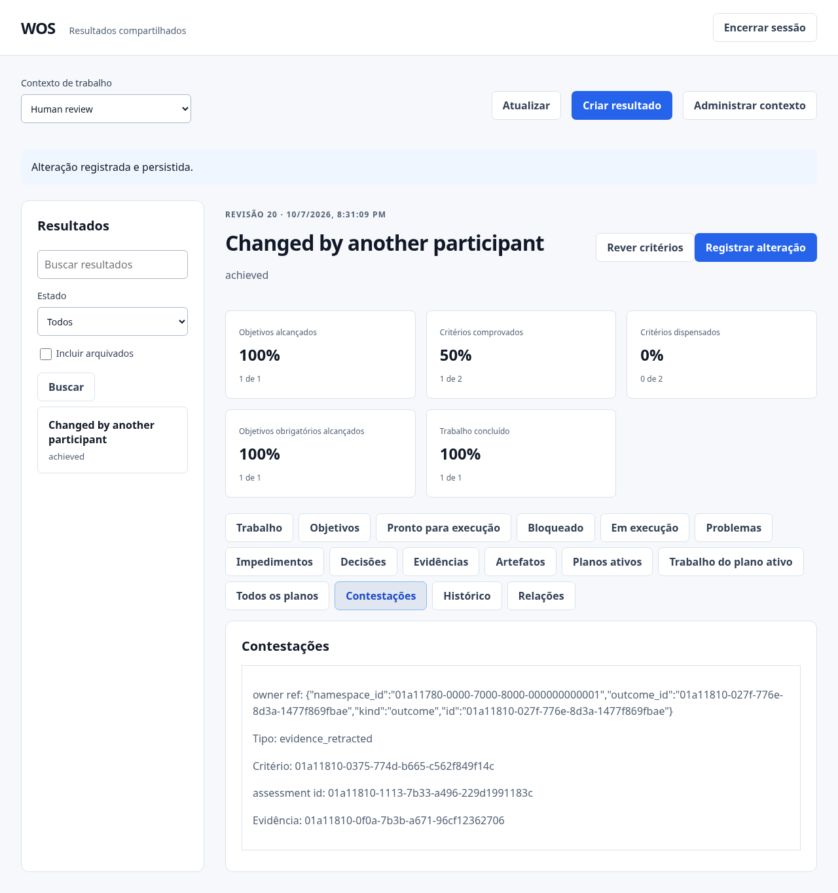

# Telas reais do WOS

Capturas de demonstração das jornadas executadas no navegador Chromium em 7 de outubro de 2026. Usam dados descartáveis e não contêm credenciais. Os títulos em inglês pertencem à fixture de teste. As duas jornadas passaram; estes arquivos documentam a interface existente e não alteram o produto.

## Acesso

## Painel do resultado e trabalho

## Plano e revisões publicadas

## Avaliação humana da entrega

## Resultado concluído

## Trabalho bloqueado

## Contestação após retirada de evidência

