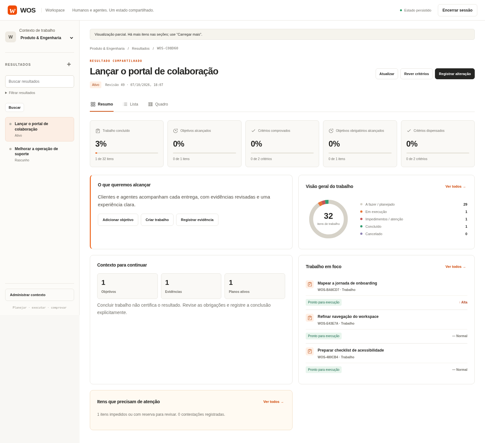
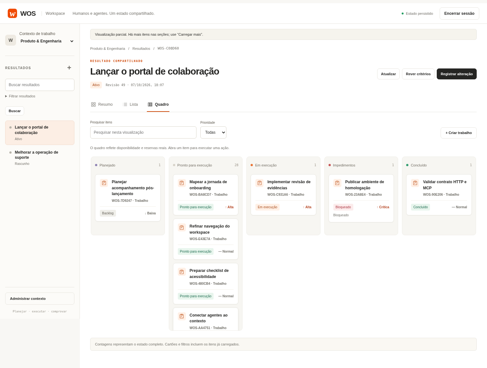
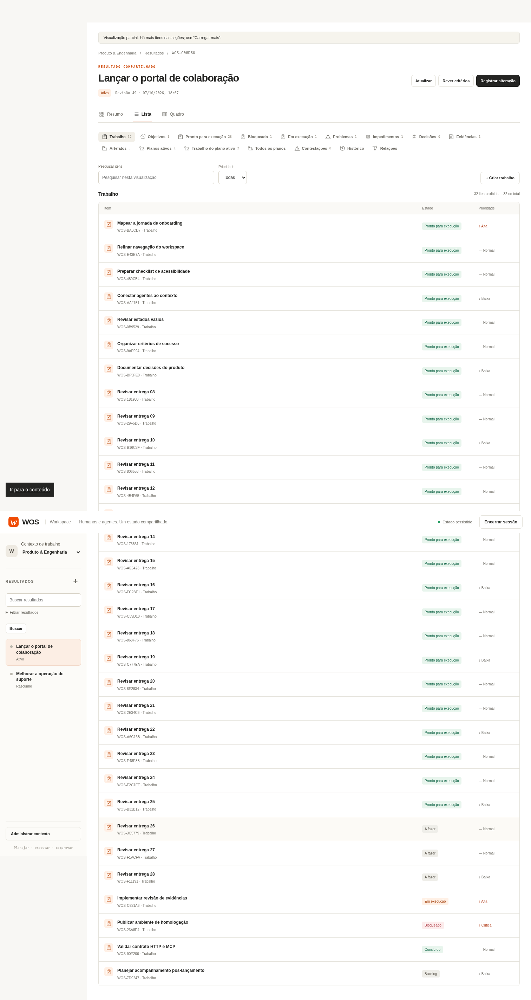
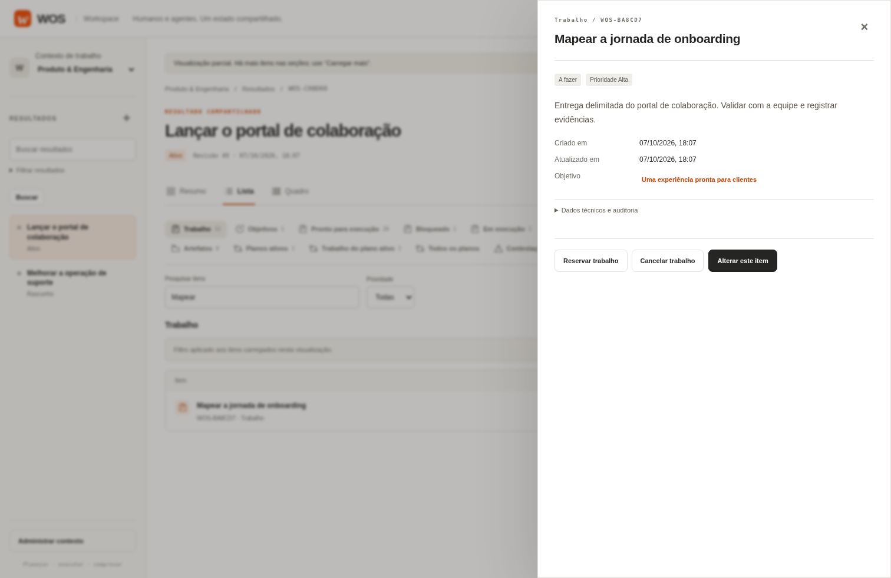
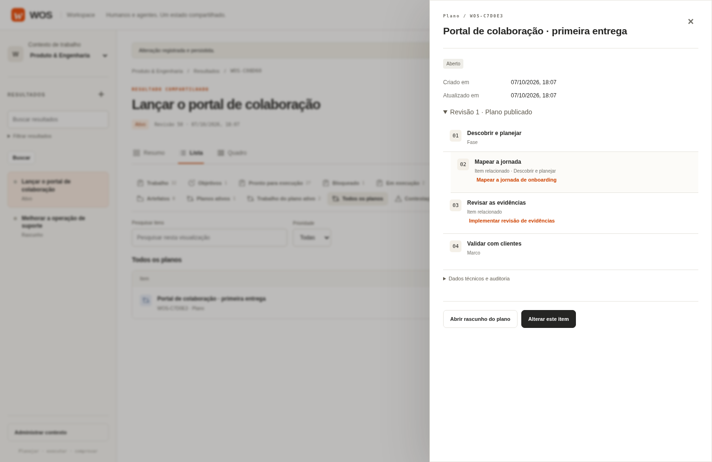
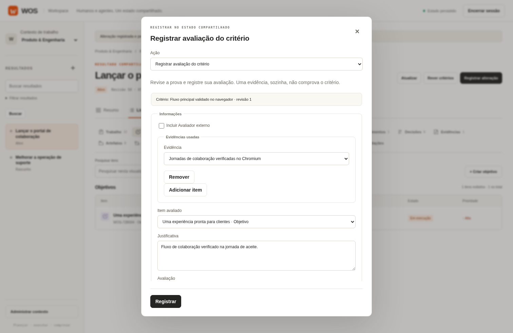
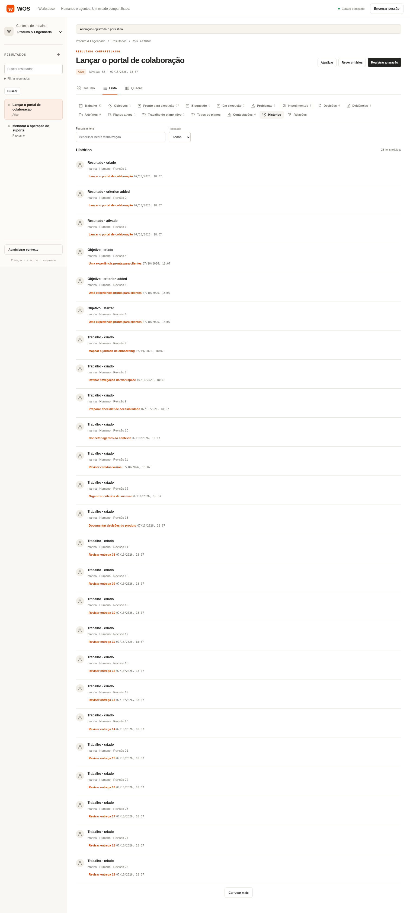
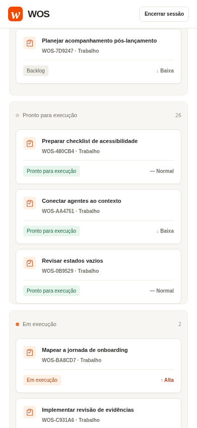
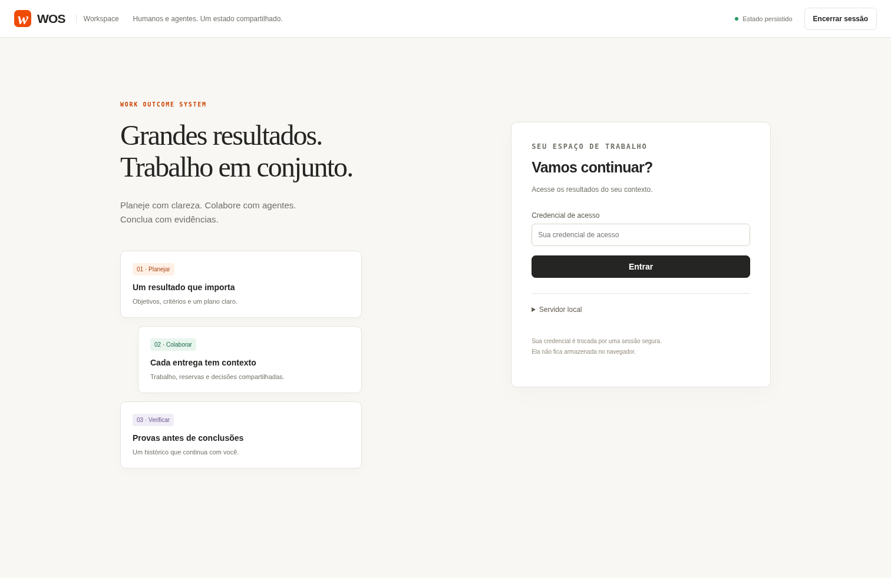

# Nova interface do WOS

Capturas reais da interface implementada, feitas em 7 de outubro de 2026. A estrutura de navegação, resumo, lista e quadro segue a referência de UX do Jira. Superfícies neutras quentes, cartões, acabamento e acento laranja seguem as imagens de referência do Guild.ai fornecidas pelo proprietário.

Os dados são descartáveis, criados pela API durante `tests/web/workspace.spec.mjs`. Reservas, impedimentos, cancelamento e publicação de plano usam comandos reais. As imagens não contêm credenciais e não são mockups. A foto do formulário de avaliação mostra uma intenção antes do envio; as jornadas separadas exercitam a avaliação e conclusão completas.

[Guia de navegação, critérios e limites](../workspace-ux.md).

## Resumo do resultado

## Quadro operacional

## Lista de itens

## Detalhe e ações do trabalho

## Plano publicado e referências

## Avaliação humana com evidências

## Histórico de participação

## Quadro no celular

## Acesso ao workspace

