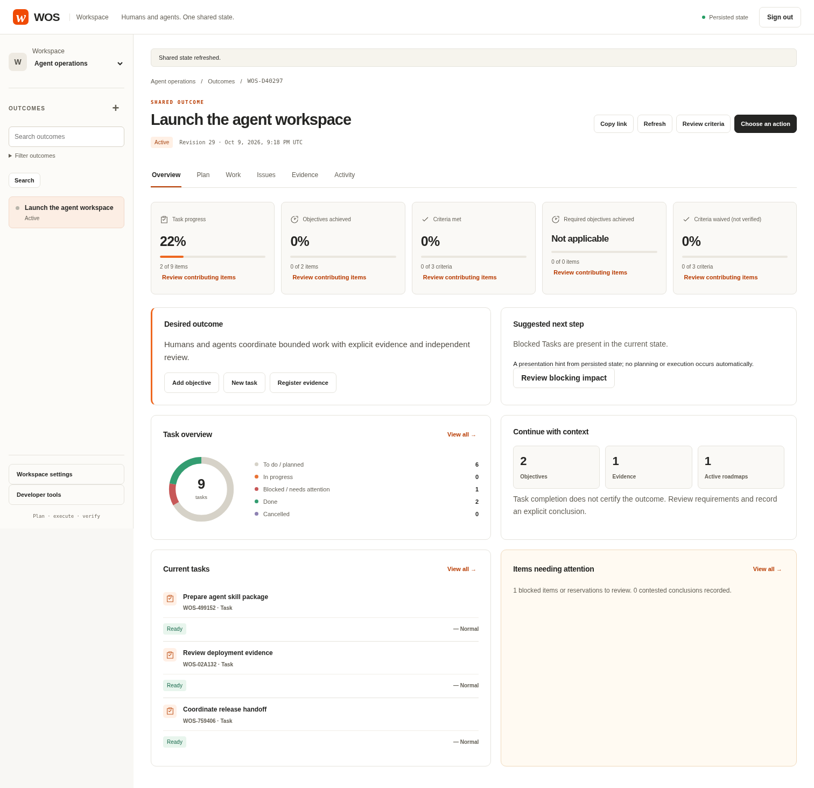
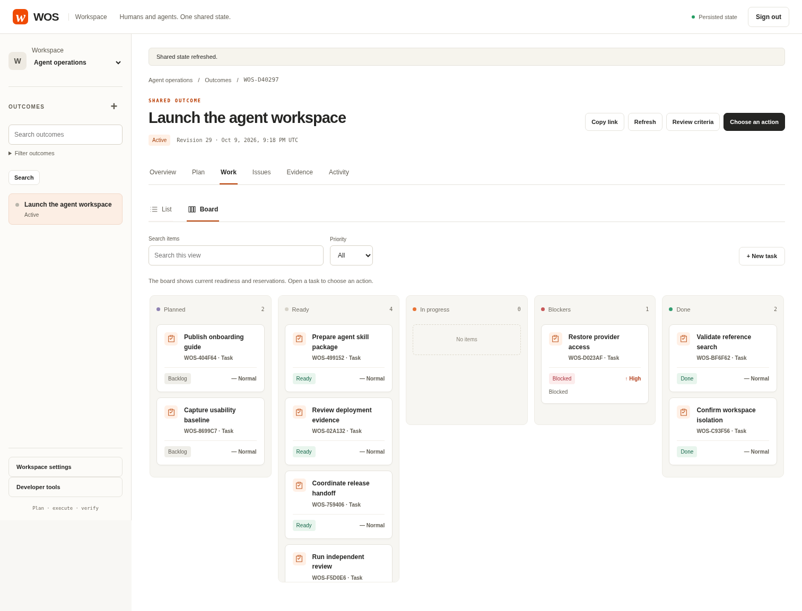
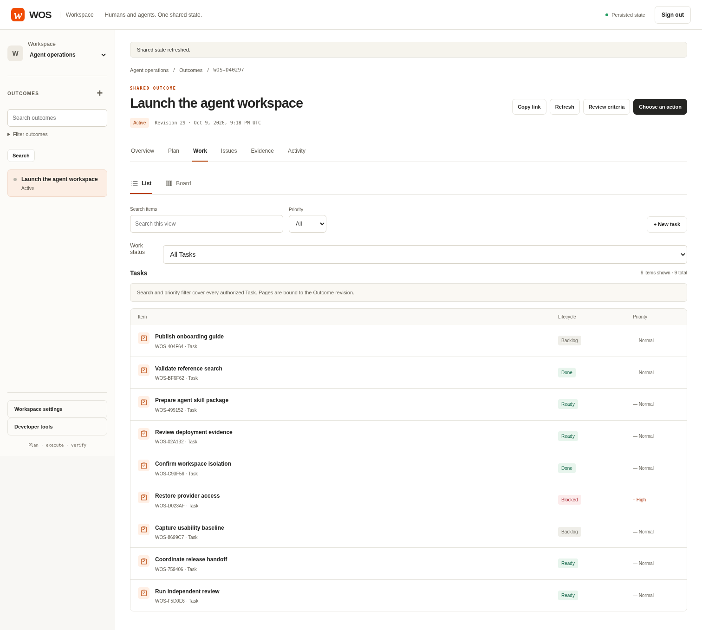
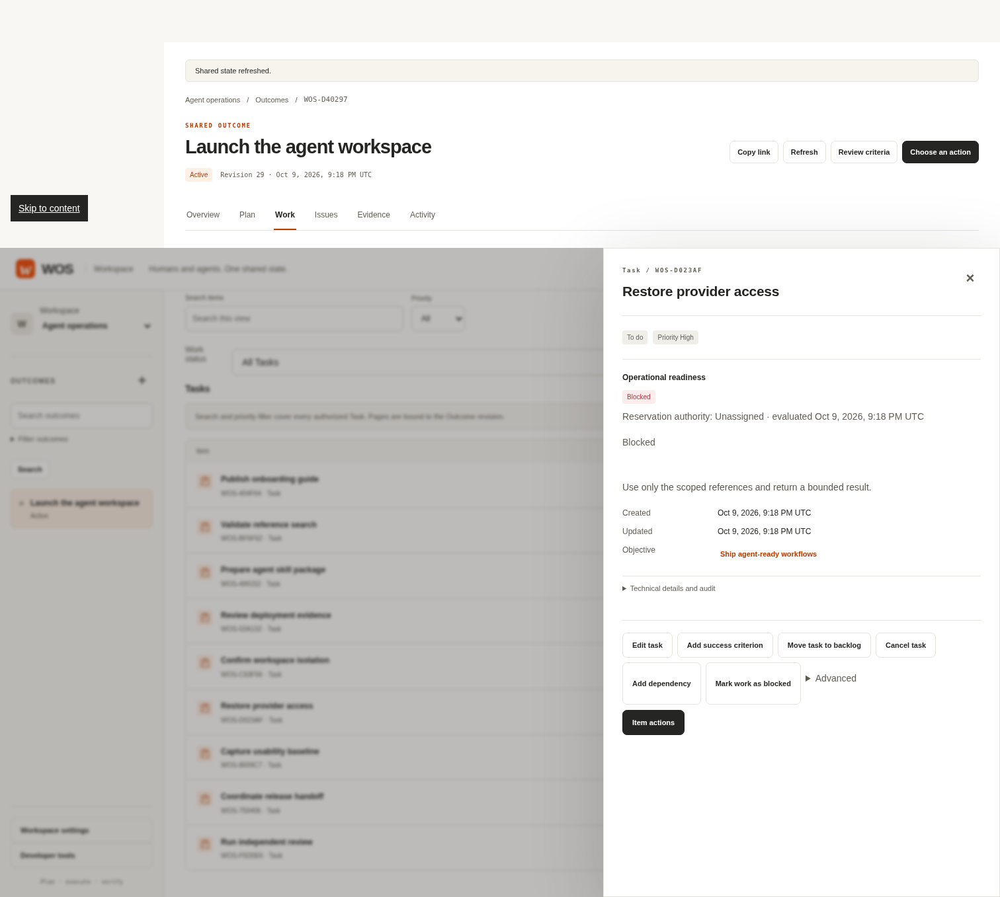
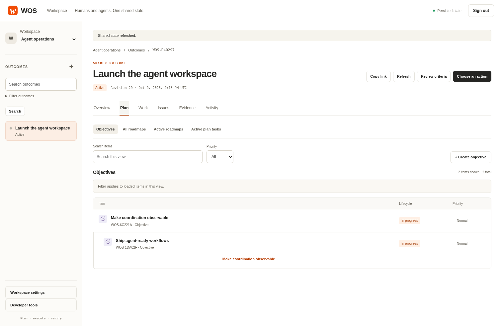
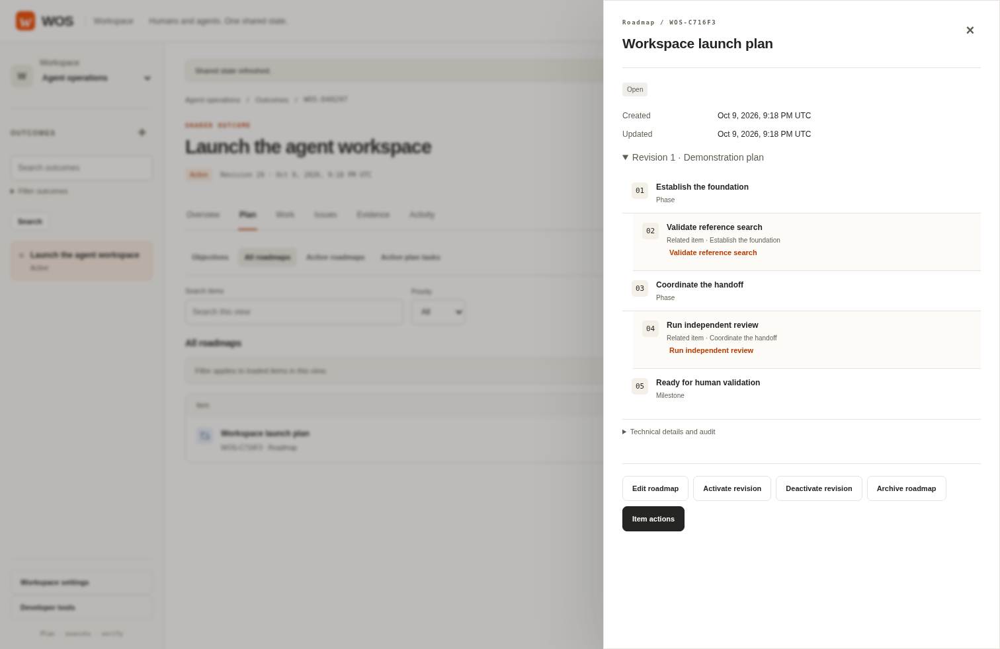
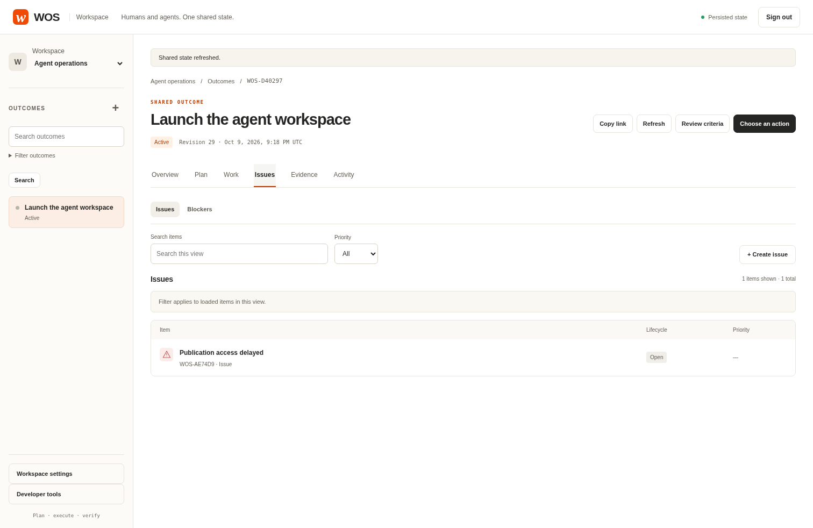
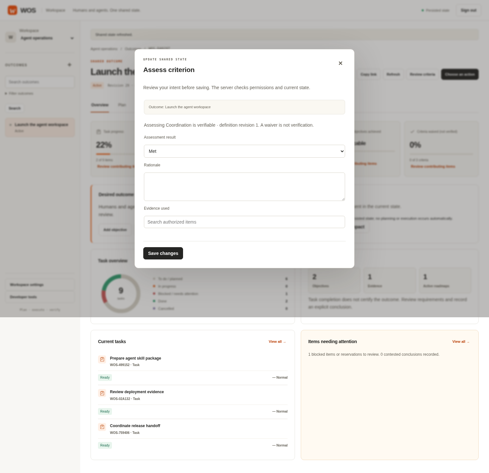
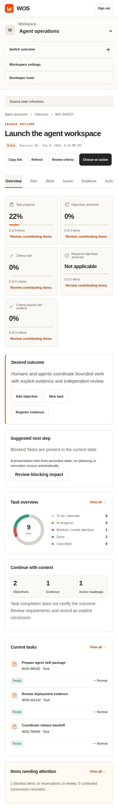
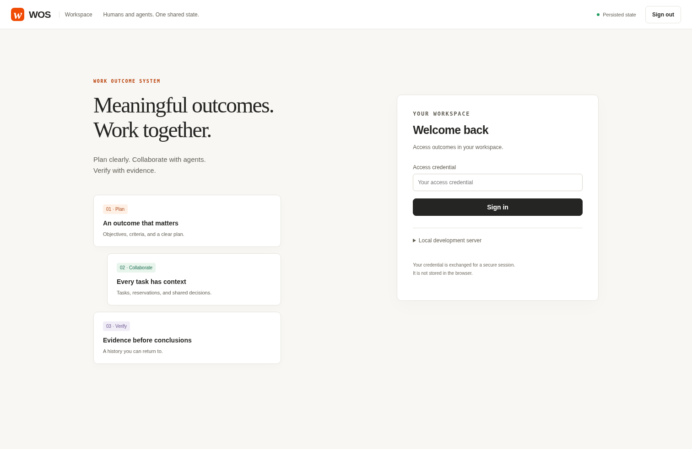

# WOS human workspace

These are real screenshots captured on October 9, 2026 from an isolated SQLite-backed WOS service with demonstration records created through the public API. Navigation follows the owner's Jira UX reference; warm neutral surfaces, orange accents and restrained cards follow the supplied Guild.ai design reference. They are not mockups and contain no access credentials.

The current implementation uses six purpose areas, dedicated human forms, typed reference search, independent verification and explicit operational authority. [User guide](../workspace-ux.md) · [Acceptance and remaining manual checks](../ux/final-acceptance.md).

## Overview

## Work board and list

## Task detail

## Objective hierarchy and Roadmap

## Issues and assessment

The assessment capture shows an unsubmitted intent. Registering its demonstration Evidence did not mark a criterion met. Separate browser journeys exercise actual assessments and immutable Roadmap publication/replanning.

## Mobile and access

## Historical captures

The Portuguese files at this directory's root were captured on October 7 and remain historical records. They are not the current official product copy or acceptance evidence. The October 9 capture manifest identifies its real-server demonstration source; representative-user and manual screen-reader validation remain pending by owner decision.
